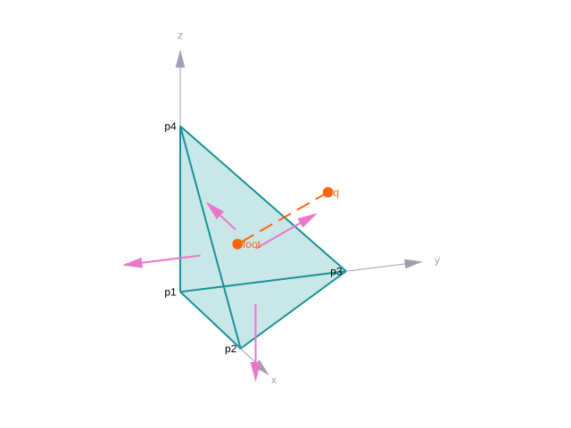
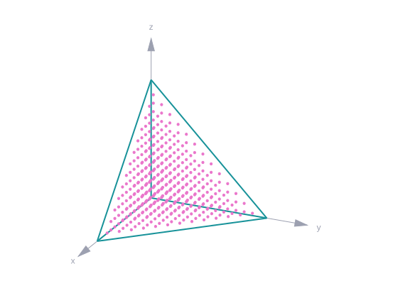

<div align="center">

# VecFor
#### Vector algebra for Fortran

[](https://github.com/szaghi/VecFor/tags)
[](https://github.com/szaghi/VecFor/issues)
[](https://github.com/szaghi/VecFor/actions/workflows/ci.yml)
[](https://github.com/szaghi/VecFor/actions/workflows/ci.yml)
[](#copyrights)

> One vector type for three-dimensional Cartesian space, in pure Fortran 2008, written as you write the maths:
> `a + b`, `2 * a`, `a .dot. b`, `a .cross. b`. Lengths, angles, face normals, distances, projections, rotations and
> mirrors, in single, double or quadruple precision, on whole arrays at once, and inside an OpenACC kernel.



<sub>The tetrahedron of the tutorial: outward face normals, a point and its foot on a face. Every figure of the docs is computed by VecFor and drawn by <a href="https://github.com/szaghi/foresight">foresight</a>.</sub>

<div>
<table>
<tr>
<td width="50%"><b>➕ The maths, as you write it</b><br><sub><code>a + b</code>, <code>-a</code>, <code>2 * a</code>, <code>a / 4</code>, <code>a .dot. b</code>, <code>a .cross. b</code>, <code>a .paral. n</code>, <code>a .ortho. n</code>, <code>R .matrix. a</code>: numbers of any integer or real kind on either side, converted for you. <a href="https://szaghi.github.io/VecFor/manual/tutorial/02-arithmetic">Arithmetic</a></sub></td>
<td width="50%"><b>📐 Lengths, angles, directions</b><br><sub><code>normL2</code>, <code>sq_norm</code>, a unit vector in place or as a copy, the angle between two vectors computed with <code>atan2</code>: accurate near 0 and 180 degrees. <a href="https://szaghi.github.io/VecFor/manual/tutorial/03-lengths-angles">Lengths and angles</a></sub></td>
</tr>
<tr>
<td width="50%"><b>🔺 Faces of a mesh</b><br><sub>The normal of a triangle or a quadrilateral, as long as the face is large or of unit length: areas, outward normals, the volume of a body by the divergence theorem. <a href="https://szaghi.github.io/VecFor/manual/tutorial/04-faces">Faces, area, volume</a></sub></td>
<td width="50%"><b>📍 Points, lines, planes</b><br><sub>The distance from a line, the signed distance from a plane, the foot of a point on it, collinear and concyclic points with a tolerance. <a href="https://szaghi.github.io/VecFor/manual/tutorial/05-point">A point and the body</a></sub></td>
</tr>
<tr>
<td width="50%"><b>🔄 Rotations and mirrors</b><br><sub>A rotation about any axis, a reflection across any plane, as a call or as a matrix computed once and applied to many vectors. <a href="https://szaghi.github.io/VecFor/manual/tutorial/07-transforms">Rotations and mirrors</a></sub></td>
<td width="50%"><b>🧮 Whole arrays at once</b><br><sub>Operators and functions are elemental: one call computes the normals of every face, or the distances of a million points. <a href="https://szaghi.github.io/VecFor/manual/tutorial/08-arrays">Many vectors at once</a></sub></td>
</tr>
<tr>
<td width="50%"><b>🎚️ Single, double, quadruple</b><br><sub><code>vector_R4P</code>, <code>vector_R8P</code>, <code>vector_R16P</code>, each with its versors and functions, from one <code>use vecfor</code>; true quadruple precision with <code>-DPENF_R16P</code>. <a href="https://szaghi.github.io/VecFor/manual/tutorial/09-precision">Precision</a></sub></td>
<td width="50%"><b>🚀 On the GPU</b><br><sub>A device-callable API for OpenACC kernels: sum, difference, scaling, dot and cross products, assignment, with the results of the operators. <a href="https://szaghi.github.io/VecFor/manual/tutorial/11-gpu">On the GPU</a></sub></td>
</tr>
<tr>
<td width="50%"><b>🛠️ Standard Fortran, small</b><br><sub>Fortran 2008, one module to use, one small dependency (<a href="https://github.com/szaghi/PENF">PENF</a>, portable kinds) fetched by <code>fobis fetch</code>; built with FoBiS or Make. <a href="https://szaghi.github.io/VecFor/guide/install">Installation</a></sub></td>
<td width="50%"><b>🔓 Multi-licensed</b><br><sub>GPL v3 for FOSS projects; BSD 2-Clause, BSD 3-Clause or MIT for closed source and commercial ones: pick the license that fits. <a href="#copyrights">Copyrights</a></sub></td>
</tr>
</table>
</div>

**[Full documentation](https://szaghi.github.io/VecFor/)** · [Gallery](https://szaghi.github.io/VecFor/#gallery) · [Tutorial](https://szaghi.github.io/VecFor/manual/tutorial/01-first-vectors) · [Cookbook](https://szaghi.github.io/VecFor/manual/cookbook) · [API reference](https://szaghi.github.io/VecFor/api/)

</div>

## Quick start

A triangle in space, its normal and area, an angle, a point above it, its distance and its foot. This is a whole
program:

```fortran
program quickstart
!< Quick start: a triangle in space, its normal and area, a point above it, its distance and its foot.
use penf, only : R8P
use vecfor, only : angle, ex, ey, ez, face_normal3, vector
implicit none
type(vector) :: a, b, c ! the corners of a triangle
type(vector) :: n       ! its normal
type(vector) :: q       ! a point
type(vector) :: foot    ! its projection onto the plane of the triangle

a = ex
b = ey
c = ez
n = face_normal3(pt1=a, pt2=b, pt3=c)                 ! as long as the triangle is large
call n%printf(prefix='normal   = ')
print '(A,F7.4)', 'area     = ', n%normL2()
print '(A,F7.4)', 'angle    = ', angle(b - a, c - a) * 180 / acos(-1._R8P)
q = 0.8_R8P * ex + 0.6_R8P * ey + 0.8_R8P * ez
print '(A,F7.4)', 'distance = ', q%distance_to_plane(pt1=a, pt2=b, pt3=c)
foot = q%projection_onto_plane(pt1=a, pt2=b, pt3=c)
print '(A,3F7.4)', 'foot     = ', foot%x, foot%y, foot%z
endprogram quickstart
```

```console
$ quickstart
normal   = +0.5, +0.5, +0.5
area     =  0.8660
angle    = 60.0000
distance =  0.6928
foot     =  0.4000 0.2000 0.4000
```

## Grows with your program

The same calls work on whole arrays. From the [tutorial](https://szaghi.github.io/VecFor/manual/tutorial/08-arrays):
the four unit normals of a tetrahedron in one call, then the volume estimated by testing 64000 grid points against its
faces, one call per face:

```fortran
normal = face_normal3(pt1=p(face(1,:)), pt2=p(face(2,:)), pt3=p(face(3,:)), norm='y')   ! four faces, one call
print '(A,4F8.4)', 'x of the normals ', normal%x
print '(A,4F8.4)', 'their lengths    ', normL2(normal)
allocate(inside(size(g)), source=.true.)
do f = 1, 4
   dist = g%distance_to_plane(pt1=p(face(1,f)), pt2=p(face(2,f)), pt3=p(face(3,f)))   ! every point, one call
   inside = inside .and. dist <= 0._R8P
enddo
print '(A,I0,A,I0)', 'points inside    ', count(inside), ' of ', size(g)
print '(A,F8.4,A,F8.4)', 'volume estimate  ', count(inside) / real(size(g), R8P), ', exact', 1._R8P / 6
```

```console
$ probe
x of the normals   0.0000  0.0000 -1.0000  0.5774
their lengths      1.0000  1.0000  1.0000  1.0000
points inside    10660 of 64000
volume estimate    0.1666, exact  0.1667
```

<p align="center"></p>

New to VecFor? The [tutorial](https://szaghi.github.io/VecFor/manual/tutorial/01-first-vectors) grows one program
around a tetrahedron, chapter by chapter; the [cookbook](https://szaghi.github.io/VecFor/manual/cookbook) has a short
recipe for each task. Every example is a compiled, runnable program in [`docs/examples/src`](docs/examples/src), shown
with its real output in the documentation.

## Install

### FoBiS

Clone, fetch PENF, and build:

```bash
git clone https://github.com/szaghi/VecFor && cd VecFor
fobis fetch                           # PENF into src/third_party
fobis build --mode static-gnu         # static/libvecfor.a, modules in static/mod
```

The archive contains PENF too: link a program with

```bash
gfortran -I static/mod my_program.f90 static/libvecfor.a -o my_program
```

As a dependency of a FoBiS project, add VecFor to the `[dependencies]` of your `fobos` and run `fobis fetch`.

### Install script or Make

Each release has an `install.sh` that downloads and builds it:

```bash
wget https://github.com/szaghi/VecFor/releases/latest/download/install.sh
bash install.sh --download wget --build fobis     # or --build make
```

With PENF fetched, the `makefile` builds `static/vecfor.a` with gfortran: `make`.

VecFor is tested on every push with gfortran; its FoBiS modes also build it with the Intel compiler and NVIDIA
nvfortran (see [Installation](https://szaghi.github.io/VecFor/guide/install)).

## Authors

- Stefano Zaghi — [@szaghi](https://github.com/szaghi)

Contributions are welcome — see the [Contributing](https://szaghi.github.io/VecFor/guide/contributing) page.

## Copyrights

This project is distributed under a multi-licensing system:

- **FOSS projects**: [GPL v3](http://www.gnu.org/licenses/gpl-3.0.html)
- **Closed source / commercial**: [BSD 2-Clause](http://opensource.org/licenses/BSD-2-Clause), [BSD 3-Clause](http://opensource.org/licenses/BSD-3-Clause), or [MIT](http://opensource.org/licenses/MIT)

> Anyone interested in using, developing, or contributing to this project is welcome — pick the license that best fits your needs.
