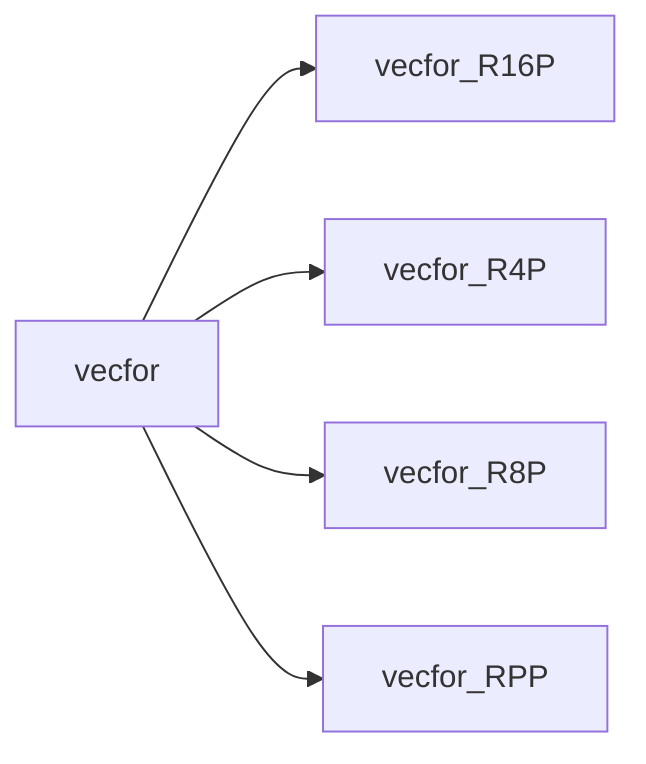

# vecfor

> VecFor, Vector algebra class for Fortran poor people.

 This derived type is useful for manipulating vectors in 3D space. The components of the vectors are reals with
 parametrized kind as defined by the library module. The components are defined in a three-dimensional cartesian frame of
 reference.
 All the vectorial math procedures (cross, dot products, parallel...) assume a three-dimensional cartesian frame of reference.
 The operators of assignment (`=`), multiplication (`*`), division (`/`), sum (`+`) and subtraction (`-`) have been overloaded.
 Furthermore the *dot* and *cross* products have been defined.
 Therefore this module provides a far-complete algebra based on Vector derived type.

**Source**: `src/lib/vecfor.F90`

**Dependencies**

