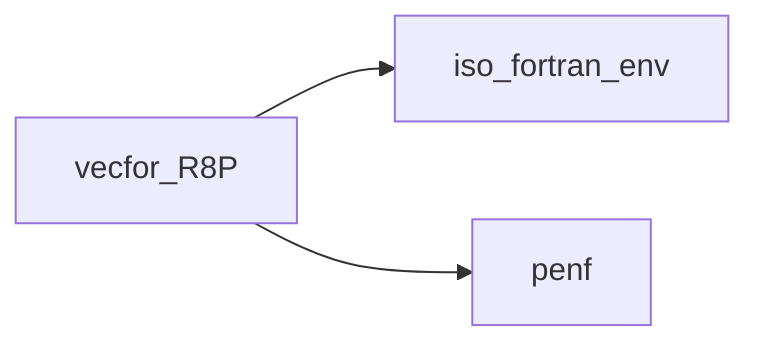
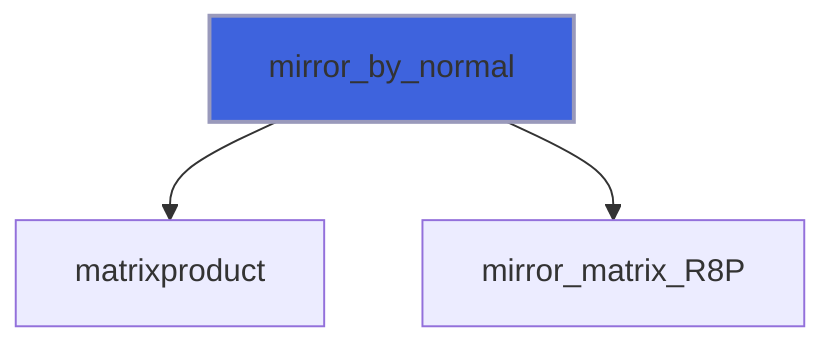
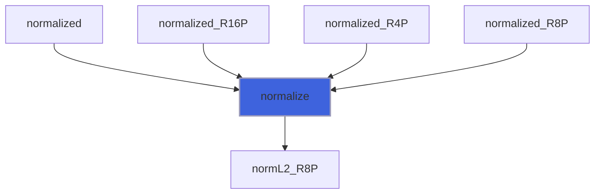
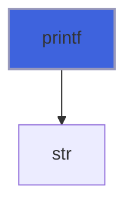
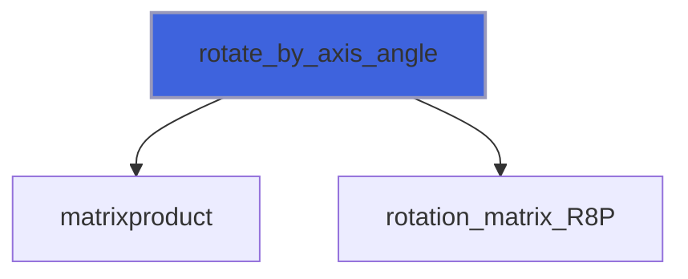
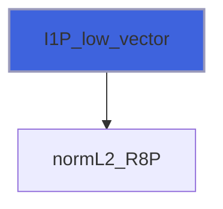
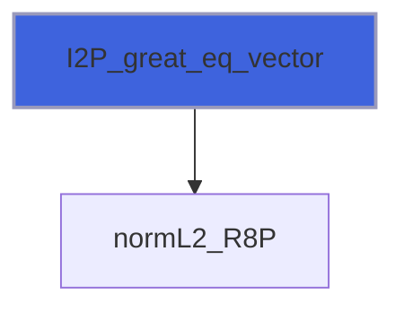
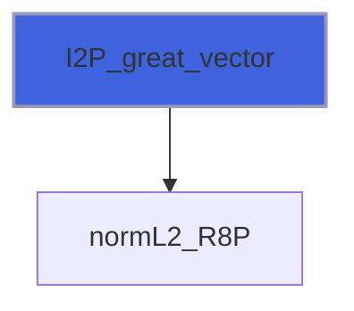
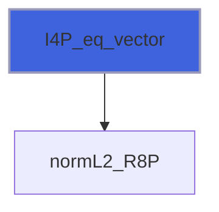

# vecfor_R8P

> VecFor, Vector algebra class for Fortran poor people, R8P kind.

**Source**: `src/lib/vecfor_R8P.F90`

**Dependencies**



## Contents

- [vector_R8P](#vector-r8p)
- [assign_I1P](#assign-i1p)
- [assign_I2P](#assign-i2p)
- [assign_I4P](#assign-i4p)
- [assign_I8P](#assign-i8p)
- [assign_R16P](#assign-r16p)
- [assign_R4P](#assign-r4p)
- [assign_R8P](#assign-r8p)
- [assign_vector](#assign-vector)
- [load_from_file](#load-from-file)
- [mirror_by_matrix](#mirror-by-matrix)
- [mirror_by_normal](#mirror-by-normal)
- [normalize](#normalize)
- [printf](#printf)
- [rotate_by_axis_angle](#rotate-by-axis-angle)
- [rotate_by_matrix](#rotate-by-matrix)
- [save_into_file](#save-into-file)
- [I1P_eq_vector](#i1p-eq-vector)
- [I1P_great_eq_vector](#i1p-great-eq-vector)
- [I1P_great_vector](#i1p-great-vector)
- [I1P_low_eq_vector](#i1p-low-eq-vector)
- [I1P_low_vector](#i1p-low-vector)
- [I1P_mul_vector](#i1p-mul-vector)
- [I1P_not_eq_vector](#i1p-not-eq-vector)
- [I1P_sub_vector](#i1p-sub-vector)
- [I1P_sum_vector](#i1p-sum-vector)
- [I2P_eq_vector](#i2p-eq-vector)
- [I2P_great_eq_vector](#i2p-great-eq-vector)
- [I2P_great_vector](#i2p-great-vector)
- [I2P_low_eq_vector](#i2p-low-eq-vector)
- [I2P_low_vector](#i2p-low-vector)
- [I2P_mul_vector](#i2p-mul-vector)
- [I2P_not_eq_vector](#i2p-not-eq-vector)
- [I2P_sub_vector](#i2p-sub-vector)
- [I2P_sum_vector](#i2p-sum-vector)
- [I4P_eq_vector](#i4p-eq-vector)
- [I4P_great_eq_vector](#i4p-great-eq-vector)
- [I4P_great_vector](#i4p-great-vector)
- [I4P_low_eq_vector](#i4p-low-eq-vector)
- [I4P_low_vector](#i4p-low-vector)
- [I4P_mul_vector](#i4p-mul-vector)
- [I4P_not_eq_vector](#i4p-not-eq-vector)
- [I4P_sub_vector](#i4p-sub-vector)
- [I4P_sum_vector](#i4p-sum-vector)
- [I8P_eq_vector](#i8p-eq-vector)
- [I8P_great_eq_vector](#i8p-great-eq-vector)
- [I8P_great_vector](#i8p-great-vector)
- [I8P_low_eq_vector](#i8p-low-eq-vector)
- [I8P_low_vector](#i8p-low-vector)
- [I8P_mul_vector](#i8p-mul-vector)
- [I8P_not_eq_vector](#i8p-not-eq-vector)
- [I8P_sub_vector](#i8p-sub-vector)
- [I8P_sum_vector](#i8p-sum-vector)
- [R16P_eq_vector](#r16p-eq-vector)
- [R16P_great_eq_vector](#r16p-great-eq-vector)
- [R16P_great_vector](#r16p-great-vector)
- [R16P_low_eq_vector](#r16p-low-eq-vector)
- [R16P_low_vector](#r16p-low-vector)
- [R16P_mul_vector](#r16p-mul-vector)
- [R16P_not_eq_vector](#r16p-not-eq-vector)
- [R16P_sub_vector](#r16p-sub-vector)
- [R16P_sum_vector](#r16p-sum-vector)
- [R4P_eq_vector](#r4p-eq-vector)
- [R4P_great_eq_vector](#r4p-great-eq-vector)
- [R4P_great_vector](#r4p-great-vector)
- [R4P_low_eq_vector](#r4p-low-eq-vector)
- [R4P_low_vector](#r4p-low-vector)
- [R4P_mul_vector](#r4p-mul-vector)
- [R4P_not_eq_vector](#r4p-not-eq-vector)
- [R4P_sub_vector](#r4p-sub-vector)
- [R4P_sum_vector](#r4p-sum-vector)
- [R8P_eq_vector](#r8p-eq-vector)
- [R8P_great_eq_vector](#r8p-great-eq-vector)
- [R8P_great_vector](#r8p-great-vector)
- [R8P_low_eq_vector](#r8p-low-eq-vector)
- [R8P_low_vector](#r8p-low-vector)
- [R8P_mul_vector](#r8p-mul-vector)
- [R8P_not_eq_vector](#r8p-not-eq-vector)
- [R8P_sub_vector](#r8p-sub-vector)
- [R8P_sum_vector](#r8p-sum-vector)
- [angle_R8P](#angle-r8p)
- [crossproduct_RPP](#crossproduct-rpp)
- [distance_to_line_R8P](#distance-to-line-r8p)
- [distance_to_plane_R8P](#distance-to-plane-r8p)
- [distance_vectorial_to_plane_R8P](#distance-vectorial-to-plane-r8p)
- [dotproduct](#dotproduct)
- [face_normal3_R8P](#face-normal3-r8p)
- [face_normal4_R8P](#face-normal4-r8p)
- [iolen_R8P](#iolen-r8p)
- [is_collinear_R8P](#is-collinear-r8p)
- [is_concyclic_R8P](#is-concyclic-r8p)
- [matrixproduct](#matrixproduct)
- [mirror_matrix_R8P](#mirror-matrix-r8p)
- [negative](#negative)
- [normL2_R8P](#norml2-r8p)
- [normalized_R8P](#normalized-r8p)
- [orthogonal](#orthogonal)
- [parallel](#parallel)
- [positive](#positive)
- [projection_onto_plane_R8P](#projection-onto-plane-r8p)
- [rotation_matrix_R8P](#rotation-matrix-r8p)
- [sq_norm_R8P](#sq-norm-r8p)
- [vector_div_I1P](#vector-div-i1p)
- [vector_div_I2P](#vector-div-i2p)
- [vector_div_I4P](#vector-div-i4p)
- [vector_div_I8P](#vector-div-i8p)
- [vector_div_R16P](#vector-div-r16p)
- [vector_div_R4P](#vector-div-r4p)
- [vector_div_R8P](#vector-div-r8p)
- [vector_div_vector](#vector-div-vector)
- [vector_eq_I1P](#vector-eq-i1p)
- [vector_eq_I2P](#vector-eq-i2p)
- [vector_eq_I4P](#vector-eq-i4p)
- [vector_eq_I8P](#vector-eq-i8p)
- [vector_eq_R16P](#vector-eq-r16p)
- [vector_eq_R4P](#vector-eq-r4p)
- [vector_eq_R8P](#vector-eq-r8p)
- [vector_eq_vector](#vector-eq-vector)
- [vector_great_I1P](#vector-great-i1p)
- [vector_great_I2P](#vector-great-i2p)
- [vector_great_I4P](#vector-great-i4p)
- [vector_great_I8P](#vector-great-i8p)
- [vector_great_R16P](#vector-great-r16p)
- [vector_great_R4P](#vector-great-r4p)
- [vector_great_R8P](#vector-great-r8p)
- [vector_great_eq_I1P](#vector-great-eq-i1p)
- [vector_great_eq_I2P](#vector-great-eq-i2p)
- [vector_great_eq_I4P](#vector-great-eq-i4p)
- [vector_great_eq_I8P](#vector-great-eq-i8p)
- [vector_great_eq_R16P](#vector-great-eq-r16p)
- [vector_great_eq_R4P](#vector-great-eq-r4p)
- [vector_great_eq_R8P](#vector-great-eq-r8p)
- [vector_great_eq_vector](#vector-great-eq-vector)
- [vector_great_vector](#vector-great-vector)
- [vector_low_I1P](#vector-low-i1p)
- [vector_low_I2P](#vector-low-i2p)
- [vector_low_I4P](#vector-low-i4p)
- [vector_low_I8P](#vector-low-i8p)
- [vector_low_R16P](#vector-low-r16p)
- [vector_low_R4P](#vector-low-r4p)
- [vector_low_R8P](#vector-low-r8p)
- [vector_low_eq_I1P](#vector-low-eq-i1p)
- [vector_low_eq_I2P](#vector-low-eq-i2p)
- [vector_low_eq_I4P](#vector-low-eq-i4p)
- [vector_low_eq_I8P](#vector-low-eq-i8p)
- [vector_low_eq_R16P](#vector-low-eq-r16p)
- [vector_low_eq_R4P](#vector-low-eq-r4p)
- [vector_low_eq_R8P](#vector-low-eq-r8p)
- [vector_low_eq_vector](#vector-low-eq-vector)
- [vector_low_vector](#vector-low-vector)
- [vector_mul_I1P](#vector-mul-i1p)
- [vector_mul_I2P](#vector-mul-i2p)
- [vector_mul_I4P](#vector-mul-i4p)
- [vector_mul_I8P](#vector-mul-i8p)
- [vector_mul_R16P](#vector-mul-r16p)
- [vector_mul_R4P](#vector-mul-r4p)
- [vector_mul_R8P](#vector-mul-r8p)
- [vector_mul_vector](#vector-mul-vector)
- [vector_not_eq_I1P](#vector-not-eq-i1p)
- [vector_not_eq_I2P](#vector-not-eq-i2p)
- [vector_not_eq_I4P](#vector-not-eq-i4p)
- [vector_not_eq_I8P](#vector-not-eq-i8p)
- [vector_not_eq_R16P](#vector-not-eq-r16p)
- [vector_not_eq_R4P](#vector-not-eq-r4p)
- [vector_not_eq_R8P](#vector-not-eq-r8p)
- [vector_not_eq_vector](#vector-not-eq-vector)
- [vector_sub_I1P](#vector-sub-i1p)
- [vector_sub_I2P](#vector-sub-i2p)
- [vector_sub_I4P](#vector-sub-i4p)
- [vector_sub_I8P](#vector-sub-i8p)
- [vector_sub_R16P](#vector-sub-r16p)
- [vector_sub_R4P](#vector-sub-r4p)
- [vector_sub_R8P](#vector-sub-r8p)
- [vector_sub_vector](#vector-sub-vector)
- [vector_sum_I1P](#vector-sum-i1p)
- [vector_sum_I2P](#vector-sum-i2p)
- [vector_sum_I4P](#vector-sum-i4p)
- [vector_sum_I8P](#vector-sum-i8p)
- [vector_sum_R16P](#vector-sum-r16p)
- [vector_sum_R4P](#vector-sum-r4p)
- [vector_sum_R8P](#vector-sum-r8p)
- [vector_sum_vector](#vector-sum-vector)

## Variables

| Name | Type | Attributes | Description |
|------|------|------------|-------------|
| `ex_R8P` | type([vector_R8P](/api/src/lib/vecfor_R8P#vector-r8p)) | parameter | X direction versor. |
| `ey_R8P` | type([vector_R8P](/api/src/lib/vecfor_R8P#vector-r8p)) | parameter | Y direction versor. |
| `ez_R8P` | type([vector_R8P](/api/src/lib/vecfor_R8P#vector-r8p)) | parameter | Z direction versor. |

## Derived Types

### vector_R8P

Vector class.

#### Components

| Name | Type | Attributes | Description |
|------|------|------------|-------------|
| `x` | real(kind=[R8P](/api/src/third_party/PENF/src/lib/penf_global_parameters_variables)) |  | Cartesian component in x direction. |
| `y` | real(kind=[R8P](/api/src/third_party/PENF/src/lib/penf_global_parameters_variables)) |  | Cartesian component in y direction. |
| `z` | real(kind=[R8P](/api/src/third_party/PENF/src/lib/penf_global_parameters_variables)) |  | Cartesian component in z direction. |

#### Type-Bound Procedures

| Name | Attributes | Description |
|------|------------|-------------|
| `I1P_eq_vector` | pass(rhs) | Operator `integer(I1P) ==`. |
| `I1P_great_eq_vector` | pass(rhs) | Operator `integer(I1P) >=`. |
| `I1P_great_vector` | pass(rhs) | Operator `integer(I1P) >`. |
| `I1P_low_eq_vector` | pass(rhs) | Operator `integer(I1P) <=`. |
| `I1P_low_vector` | pass(rhs) | Operator `integer(I1P) <`. |
| `I1P_mul_vector` | pass(rhs) | Operator `integer(I1P) *`. |
| `I1P_not_eq_vector` | pass(rhs) | Operator `integer(I1P) /=`. |
| `I1P_sub_vector` | pass(rhs) | Operator `integer(I1P) -`. |
| `I1P_sum_vector` | pass(rhs) | Operator `integer(I1P) +`. |
| `I2P_eq_vector` | pass(rhs) | Operator `integer(I2P) ==`. |
| `I2P_great_eq_vector` | pass(rhs) | Operator `integer(I2P) >=`. |
| `I2P_great_vector` | pass(rhs) | Operator `integer(I2P) >`. |
| `I2P_low_eq_vector` | pass(rhs) | Operator `integer(I2P) <=`. |
| `I2P_low_vector` | pass(rhs) | Operator `integer(I2P) <`. |
| `I2P_mul_vector` | pass(rhs) | Operator `integer(I2P) *`. |
| `I2P_not_eq_vector` | pass(rhs) | Operator `integer(I2P) /=`. |
| `I2P_sub_vector` | pass(rhs) | Operator `integer(I2P) -`. |
| `I2P_sum_vector` | pass(rhs) | Operator `integer(I2P) +`. |
| `I4P_eq_vector` | pass(rhs) | Operator `integer(I4P) ==`. |
| `I4P_great_eq_vector` | pass(rhs) | Operator `integer(I4P) >=`. |
| `I4P_great_vector` | pass(rhs) | Operator `integer(I4P) >`. |
| `I4P_low_eq_vector` | pass(rhs) | Operator `integer(I4P) <=`. |
| `I4P_low_vector` | pass(rhs) | Operator `integer(I4P) <`. |
| `I4P_mul_vector` | pass(rhs) | Operator `integer(I4P) *`. |
| `I4P_not_eq_vector` | pass(rhs) | Operator `integer(I4P) /=`. |
| `I4P_sub_vector` | pass(rhs) | Operator `integer(I4P) -`. |
| `I4P_sum_vector` | pass(rhs) | Operator `integer(I4P) +`. |
| `I8P_eq_vector` | pass(rhs) | Operator `integer(I8P) ==`. |
| `I8P_great_eq_vector` | pass(rhs) | Operator `integer(I8P) >=`. |
| `I8P_great_vector` | pass(rhs) | Operator `integer(I8P) >`. |
| `I8P_low_eq_vector` | pass(rhs) | Operator `integer(I8P) <=`. |
| `I8P_low_vector` | pass(rhs) | Operator `integer(I8P) <`. |
| `I8P_mul_vector` | pass(rhs) | Operator `integer(I8P) *`. |
| `I8P_not_eq_vector` | pass(rhs) | Operator `integer(I8P) /=`. |
| `I8P_sub_vector` | pass(rhs) | Operator `integer(I8P) -`. |
| `I8P_sum_vector` | pass(rhs) | Operator `integer(I8P) +`. |
| `R16P_eq_vector` | pass(rhs) | Operator `real(R16P) ==`. |
| `R16P_great_eq_vector` | pass(rhs) | Operator `real(R16P) >=`. |
| `R16P_great_vector` | pass(rhs) | Operator `real(R16P) >`. |
| `R16P_low_eq_vector` | pass(rhs) | Operator `real(R16P) <=`. |
| `R16P_low_vector` | pass(rhs) | Operator `real(R16P) <`. |
| `R16P_mul_vector` | pass(rhs) | Operator `real(R16P) *`. |
| `R16P_not_eq_vector` | pass(rhs) | Operator `real(R16P) /=`. |
| `R16P_sub_vector` | pass(rhs) | Operator `real(R16P) -`. |
| `R16P_sum_vector` | pass(rhs) | Operator `real(R16P) +`. |
| `R4P_eq_vector` | pass(rhs) | Operator `real(R4P) ==`. |
| `R4P_great_eq_vector` | pass(rhs) | Operator `real(R4P) >=`. |
| `R4P_great_vector` | pass(rhs) | Operator `real(R4P) >`. |
| `R4P_low_eq_vector` | pass(rhs) | Operator `real(R4P) <=`. |
| `R4P_low_vector` | pass(rhs) | Operator `real(R4P) <`. |
| `R4P_mul_vector` | pass(rhs) | Operator `real(R4P) *`. |
| `R4P_not_eq_vector` | pass(rhs) | Operator `real(R4P) /=`. |
| `R4P_sub_vector` | pass(rhs) | Operator `real(R4P) -`. |
| `R4P_sum_vector` | pass(rhs) | Operator `real(R4P) +`. |
| `R8P_eq_vector` | pass(rhs) | Operator `real(R8P) ==`. |
| `R8P_great_eq_vector` | pass(rhs) | Operator `real(R8P) >=`. |
| `R8P_great_vector` | pass(rhs) | Operator `real(R8P) >`. |
| `R8P_low_eq_vector` | pass(rhs) | Operator `real(R8P) <=`. |
| `R8P_low_vector` | pass(rhs) | Operator `real(R8P) <`. |
| `R8P_mul_vector` | pass(rhs) | Operator `real(R8P) *`. |
| `R8P_not_eq_vector` | pass(rhs) | Operator `real(R8P) /=`. |
| `R8P_sub_vector` | pass(rhs) | Operator `real(R8P) -`. |
| `R8P_sum_vector` | pass(rhs) | Operator `real(R8P) +`. |
| `angle` | pass(self) | Return the angle (rad) between two |
| `assign_I1P` | pass(lhs) | Operator `= integer(I1P)`. |
| `assign_I2P` | pass(lhs) | Operator `= integer(I2P)`. |
| `assign_I4P` | pass(lhs) | Operator `= integer(I4P)`. |
| `assign_I8P` | pass(lhs) | Operator `= integer(I8P)`. |
| `assign_R16P` | pass(lhs) | Operator `= real(R16P)`. |
| `assign_R4P` | pass(lhs) | Operator `= real(R4P)`. |
| `assign_R8P` | pass(lhs) | Operator `= real(R8P)`. |
| `assign_vector` | pass(lhs) | Operator `=`. |
| `assignment(=)` |  | Overloading `=`. |
| `crossproduct` | pass(lhs) | Compute the cross product. |
| `distance_to_line` | pass(self) | Return the distance (scalar) to |
| `distance_to_plane` | pass(self) | Return the distance (signed, scalar) |
| `distance_vectorial_to_plane` | pass(self) | Return the distance (vectorial) to |
| `dotproduct` | pass(lhs) | Compute the scalar (dot) product. |
| `face_normal3` | nopass | Return the normal of the face. |
| `face_normal4` | nopass | Return the normal of the face. |
| `iolen` | pass(self) | Compute IO length. |
| `is_collinear` | pass(self) | Return true if the point is col- |
| `is_concyclic` | pass(self) | Return true if the point is concy- |
| `load_from_file` | pass(self) | Load vector from file. |
| `matrixproduct` | pass(rhs) | Compute the matrix product. |
| `mirror` |  | Mirror vector. |
| `mirror_by_matrix` | pass(self) | Mirror vector given matrix. |
| `mirror_by_normal` | pass(self) | Mirror vector given normal of mirroring plane. |
| `negative` | pass(rhs) | Operator `-`, unary. |
| `normL2` | pass(self) | Return the norm L2 of vector. |
| `normalize` | pass(self) | Normalize a vector. |
| `normalized` | pass(self) | Return a normalized copy of vector. |
| `operator(*)` |  | Overloading `*`. |
| `operator(+)` |  | Overloading `+`. |
| `operator(-)` |  | Overloading `-`. |
| `operator(.cross.)` |  | Cross product operator. |
| `operator(.dot.)` |  | Scalar (dot) product operator. |
| `operator(.matrix.)` |  | Matrix product operator. |
| `operator(.ortho.)` |  | Component of `lhs` orthogonal to `rhs` operator. |
| `operator(.paral.)` |  | Component of `lhs` parallel to `rhs` operator. |
| `operator(/)` |  | Overloading `/`. |
| `operator(/=)` |  | Overloading `/=`. |
| `operator(<)` |  | Overloading `<`. |
| `operator(<=)` |  | Overloading `<=`. |
| `operator(==)` |  | Overloading `==`. |
| `operator(>)` |  | Overloading `>`. |
| `operator(>=)` |  | Overloading `>=`. |
| `orthogonal` | pass(lhs) | Compute the component of `lhs` orthogonal to `rhs`. |
| `parallel` | pass(lhs) | Compute the component of `lhs` parallel to `rhs`. |
| `positive` | pass(rhs) | Operator `+`, unary. |
| `printf` | pass(self) | Print vector components with a |
| `projection_onto_plane` | pass(self) | Calculate the projection of point |
| `rotate` |  | Rotate vector. |
| `rotate_by_axis_angle` | pass(self) | Rotate vector given axis and angle. |
| `rotate_by_matrix` | pass(self) | Rotate vector given matrix. |
| `save_into_file` | pass(self) | Save vector into file. |
| `sq_norm` | pass(self) | Return the square of the norm. |
| `vector_div_I1P` | pass(lhs) | Operator `/ integer(I1P)`. |
| `vector_div_I2P` | pass(lhs) | Operator `/ integer(I2P)`. |
| `vector_div_I4P` | pass(lhs) | Operator `/ integer(I4P)`. |
| `vector_div_I8P` | pass(lhs) | Operator `/ integer(I8P)`. |
| `vector_div_R16P` | pass(lhs) | Operator `/ real(R16P)`. |
| `vector_div_R4P` | pass(lhs) | Operator `/ real(R4P)`. |
| `vector_div_R8P` | pass(lhs) | Operator `/ real(R8P)`. |
| `vector_div_vector` | pass(lhs) | Operator `/`. |
| `vector_eq_I1P` | pass(lhs) | Operator `== integer(I1P)`. |
| `vector_eq_I2P` | pass(lhs) | Operator `== integer(I2P)`. |
| `vector_eq_I4P` | pass(lhs) | Operator `== integer(I4P)`. |
| `vector_eq_I8P` | pass(lhs) | Operator `== integer(I8P)`. |
| `vector_eq_R16P` | pass(lhs) | Operator `== real(R16P)`. |
| `vector_eq_R4P` | pass(lhs) | Operator `== real(R4P)`. |
| `vector_eq_R8P` | pass(lhs) | Operator `== real(R8P)`. |
| `vector_eq_vector` | pass(lhs) | Operator `==`. |
| `vector_great_I1P` | pass(lhs) | Operator `> integer(I1P)`. |
| `vector_great_I2P` | pass(lhs) | Operator `> integer(I2P)`. |
| `vector_great_I4P` | pass(lhs) | Operator `> integer(I4P)`. |
| `vector_great_I8P` | pass(lhs) | Operator `> integer(I8P)`. |
| `vector_great_R16P` | pass(lhs) | Operator `> real(R16P)`. |
| `vector_great_R4P` | pass(lhs) | Operator `> real(R4P)`. |
| `vector_great_R8P` | pass(lhs) | Operator `> real(R8P)`. |
| `vector_great_eq_I1P` | pass(lhs) | Operator `>= integer(I1P)`. |
| `vector_great_eq_I2P` | pass(lhs) | Operator `>= integer(I2P)`. |
| `vector_great_eq_I4P` | pass(lhs) | Operator `>= integer(I4P)`. |
| `vector_great_eq_I8P` | pass(lhs) | Operator `>= integer(I8P)`. |
| `vector_great_eq_R16P` | pass(lhs) | Operator `>= real(R16P)`. |
| `vector_great_eq_R4P` | pass(lhs) | Operator `>= real(R4P)`. |
| `vector_great_eq_R8P` | pass(lhs) | Operator `>= real(R8P)`. |
| `vector_great_eq_vector` | pass(lhs) | Operator `>=`. |
| `vector_great_vector` | pass(lhs) | Operator `>`. |
| `vector_low_I1P` | pass(lhs) | Operator `< integer(I1P)`. |
| `vector_low_I2P` | pass(lhs) | Operator `< integer(I2P)`. |
| `vector_low_I4P` | pass(lhs) | Operator `< integer(I4P)`. |
| `vector_low_I8P` | pass(lhs) | Operator `< integer(I8P)`. |
| `vector_low_R16P` | pass(lhs) | Operator `< real(R16P)`. |
| `vector_low_R4P` | pass(lhs) | Operator `< real(R4P)`. |
| `vector_low_R8P` | pass(lhs) | Operator `< real(R8P)`. |
| `vector_low_eq_I1P` | pass(lhs) | Operator `<= integer(I1P)`. |
| `vector_low_eq_I2P` | pass(lhs) | Operator `<= integer(I2P)`. |
| `vector_low_eq_I4P` | pass(lhs) | Operator `<= integer(I4P)`. |
| `vector_low_eq_I8P` | pass(lhs) | Operator `<= integer(I8P)`. |
| `vector_low_eq_R16P` | pass(lhs) | Operator `<= real(R16P)`. |
| `vector_low_eq_R4P` | pass(lhs) | Operator `<= real(R4P)`. |
| `vector_low_eq_R8P` | pass(lhs) | Operator `<= real(R8P)`. |
| `vector_low_eq_vector` | pass(lhs) | Operator `<=`. |
| `vector_low_vector` | pass(lhs) | Operator `<`. |
| `vector_mul_I1P` | pass(lhs) | Operator `* integer(I1P)`. |
| `vector_mul_I2P` | pass(lhs) | Operator `* integer(I2P)`. |
| `vector_mul_I4P` | pass(lhs) | Operator `* integer(I4P)`. |
| `vector_mul_I8P` | pass(lhs) | Operator `* integer(I8P)`. |
| `vector_mul_R16P` | pass(lhs) | Operator `* real(R16P)`. |
| `vector_mul_R4P` | pass(lhs) | Operator `* real(R4P)`. |
| `vector_mul_R8P` | pass(lhs) | Operator `* real(R8P)`. |
| `vector_mul_vector` | pass(lhs) | Operator `*`. |
| `vector_not_eq_I1P` | pass(lhs) | Operator `/= integer(I1P)`. |
| `vector_not_eq_I2P` | pass(lhs) | Operator `/= integer(I2P)`. |
| `vector_not_eq_I4P` | pass(lhs) | Operator `/= integer(I4P)`. |
| `vector_not_eq_I8P` | pass(lhs) | Operator `/= integer(I8P)`. |
| `vector_not_eq_R16P` | pass(lhs) | Operator `/= real(R16P)`. |
| `vector_not_eq_R4P` | pass(lhs) | Operator `/= real(R4P)`. |
| `vector_not_eq_R8P` | pass(lhs) | Operator `/= real(R8P)`. |
| `vector_not_eq_vector` | pass(lhs) | Operator `/=`. |
| `vector_sub_I1P` | pass(lhs) | Operator `- integer(I1P)`. |
| `vector_sub_I2P` | pass(lhs) | Operator `- integer(I2P)`. |
| `vector_sub_I4P` | pass(lhs) | Operator `- integer(I4P)`. |
| `vector_sub_I8P` | pass(lhs) | Operator `- integer(I8P)`. |
| `vector_sub_R16P` | pass(lhs) | Operator `- real(R16P)`. |
| `vector_sub_R4P` | pass(lhs) | Operator `- real(R4P)`. |
| `vector_sub_R8P` | pass(lhs) | Operator `- real(R8P)`. |
| `vector_sub_vector` | pass(lhs) | Operator `-`. |
| `vector_sum_I1P` | pass(lhs) | Operator `+ integer(I1P)`. |
| `vector_sum_I2P` | pass(lhs) | Operator `+ integer(I2P)`. |
| `vector_sum_I4P` | pass(lhs) | Operator `+ integer(I4P)`. |
| `vector_sum_I8P` | pass(lhs) | Operator `+ integer(I8P)`. |
| `vector_sum_R16P` | pass(lhs) | Operator `+ real(R16P)`. |
| `vector_sum_R4P` | pass(lhs) | Operator `+ real(R4P)`. |
| `vector_sum_R8P` | pass(lhs) | Operator `+ real(R8P)`. |
| `vector_sum_vector` | pass(lhs) | Operator `+`. |

## Subroutines

### assign_I1P

Operator `= integer(I4P)`.

```fortran
 type(vector_R8P) :: pt
 pt = 1_I1P
 print "(3(F3.1,1X))", abs(pt%x), abs(pt%y), abs(pt%z)
```

**Attributes**: elemental

```fortran
subroutine assign_I1P(lhs, rhs)
```

**Arguments**

| Name | Type | Intent | Attributes | Description |
|------|------|--------|------------|-------------|
| `lhs` | class([vector_R8P](/api/src/lib/vecfor_R8P#vector-r8p)) | inout |  | Left hand side. |
| `rhs` | integer(kind=[I1P](/api/src/third_party/PENF/src/lib/penf_global_parameters_variables)) | in |  | Right hand side. |

### assign_I2P

Operator `= integer(I4P)`.

```fortran
 type(vector_R8P) :: pt
 pt = 1_I2P
 print "(3(F3.1,1X))", abs(pt%x), abs(pt%y), abs(pt%z)
```

**Attributes**: elemental

```fortran
subroutine assign_I2P(lhs, rhs)
```

**Arguments**

| Name | Type | Intent | Attributes | Description |
|------|------|--------|------------|-------------|
| `lhs` | class([vector_R8P](/api/src/lib/vecfor_R8P#vector-r8p)) | inout |  | Left hand side. |
| `rhs` | integer(kind=[I2P](/api/src/third_party/PENF/src/lib/penf_global_parameters_variables)) | in |  | Right hand side. |

### assign_I4P

Operator `= integer(I4P)`.

```fortran
 type(vector_R8P) :: pt
 pt = 1_I4P
 print "(3(F3.1,1X))", abs(pt%x), abs(pt%y), abs(pt%z)
```

**Attributes**: elemental

```fortran
subroutine assign_I4P(lhs, rhs)
```

**Arguments**

| Name | Type | Intent | Attributes | Description |
|------|------|--------|------------|-------------|
| `lhs` | class([vector_R8P](/api/src/lib/vecfor_R8P#vector-r8p)) | inout |  | Left hand side. |
| `rhs` | integer(kind=[I4P](/api/src/third_party/PENF/src/lib/penf_global_parameters_variables)) | in |  | Right hand side. |

### assign_I8P

Operator `= integer(I8P)`.

```fortran
 type(vector_R8P) :: pt
 pt = 1_I8P
 print "(3(F3.1,1X))", abs(pt%x), abs(pt%y), abs(pt%z)
```

**Attributes**: elemental

```fortran
subroutine assign_I8P(lhs, rhs)
```

**Arguments**

| Name | Type | Intent | Attributes | Description |
|------|------|--------|------------|-------------|
| `lhs` | class([vector_R8P](/api/src/lib/vecfor_R8P#vector-r8p)) | inout |  | Left hand side. |
| `rhs` | integer(kind=[I8P](/api/src/third_party/PENF/src/lib/penf_global_parameters_variables)) | in |  | Right hand side. |

### assign_R16P

Operator `= real(R16P)`.

```fortran
 type(vector_R8P) :: pt
 pt = 1._R16P
 print "(3(F3.1,1X))", abs(pt%x), abs(pt%y), abs(pt%z)
```

**Attributes**: elemental

```fortran
subroutine assign_R16P(lhs, rhs)
```

**Arguments**

| Name | Type | Intent | Attributes | Description |
|------|------|--------|------------|-------------|
| `lhs` | class([vector_R8P](/api/src/lib/vecfor_R8P#vector-r8p)) | inout |  | Left hand side. |
| `rhs` | real(kind=[R16P](/api/src/third_party/PENF/src/lib/penf_global_parameters_variables)) | in |  | Right hand side. |

### assign_R4P

Operator `= real(R4P)`.

```fortran
 type(vector_R8P) :: pt
 pt = 1._R4P
 print "(3(F3.1,1X))", abs(pt%x), abs(pt%y), abs(pt%z)
```

**Attributes**: elemental

```fortran
subroutine assign_R4P(lhs, rhs)
```

**Arguments**

| Name | Type | Intent | Attributes | Description |
|------|------|--------|------------|-------------|
| `lhs` | class([vector_R8P](/api/src/lib/vecfor_R8P#vector-r8p)) | inout |  | Left hand side. |
| `rhs` | real(kind=[R4P](/api/src/third_party/PENF/src/lib/penf_global_parameters_variables)) | in |  | Right hand side. |

### assign_R8P

Operator `= real(R8P)`.

```fortran
 type(vector_R8P) :: pt
 pt = 1._R8P
 print "(3(F3.1,1X))", abs(pt%x), abs(pt%y), abs(pt%z)
```

**Attributes**: elemental

```fortran
subroutine assign_R8P(lhs, rhs)
```

**Arguments**

| Name | Type | Intent | Attributes | Description |
|------|------|--------|------------|-------------|
| `lhs` | class([vector_R8P](/api/src/lib/vecfor_R8P#vector-r8p)) | inout |  | Left hand side. |
| `rhs` | real(kind=[R8P](/api/src/third_party/PENF/src/lib/penf_global_parameters_variables)) | in |  | Right hand side. |

### assign_vector

Operator `=`

```fortran
 type(vector_R8P) :: pt
 pt = 1 * ex_R8P + 2 * ey_R8P + 3 * ez_R8P
 print "(3(F3.1,1X))", abs(pt%x), abs(pt%y), abs(pt%z)
```

**Attributes**: pure

```fortran
subroutine assign_vector(lhs, rhs)
```

**Arguments**

| Name | Type | Intent | Attributes | Description |
|------|------|--------|------------|-------------|
| `lhs` | class([vector_R8P](/api/src/lib/vecfor_R8P#vector-r8p)) | inout |  | Left hand side. |
| `rhs` | type([vector_R8P](/api/src/lib/vecfor_R8P#vector-r8p)) | in |  | Right hand side. |

### load_from_file

Load vector from file.

```fortran
 type(vector_R8P) :: pt
 pt = 1 * ex_R8P + 2 * ey_R8P + 3 * ez_R8P
 open(unit=10, form='unformatted', status='scratch')
 call pt%save_into_file(unit=10)
 rewind(unit=10)
 call pt%load_from_file(unit=10)
 close(unit=10)
 print "(3(F3.1,1X))", pt%x, pt%y, pt%z
```

```fortran
subroutine load_from_file(self, unit, fmt, pos, iostat, iomsg)
```

**Arguments**

| Name | Type | Intent | Attributes | Description |
|------|------|--------|------------|-------------|
| `self` | class([vector_R8P](/api/src/lib/vecfor_R8P#vector-r8p)) | inout |  | Vector. |
| `unit` | integer(kind=[I4P](/api/src/third_party/PENF/src/lib/penf_global_parameters_variables)) | in |  | Logic unit. |
| `fmt` | character(len=*) | in | optional | IO format. |
| `pos` | integer(kind=[I8P](/api/src/third_party/PENF/src/lib/penf_global_parameters_variables)) | in | optional | Position specifier. |
| `iostat` | integer(kind=[I4P](/api/src/third_party/PENF/src/lib/penf_global_parameters_variables)) | out | optional | IO error. |
| `iomsg` | character(len=*) | out | optional | IO error message. |

### mirror_by_matrix

Mirror vector given matrix (of mirroring).

**Attributes**: pure

```fortran
subroutine mirror_by_matrix(self, matrix)
```

**Arguments**

| Name | Type | Intent | Attributes | Description |
|------|------|--------|------------|-------------|
| `self` | class([vector_R8P](/api/src/lib/vecfor_R8P#vector-r8p)) | inout |  | Vector. |
| `matrix` | real(kind=[R8P](/api/src/third_party/PENF/src/lib/penf_global_parameters_variables)) | in |  | Mirroring matrix. |

**Call graph**


### mirror_by_normal

Mirror vector given normal of mirroring plane.

**Attributes**: pure

```fortran
subroutine mirror_by_normal(self, normal)
```

**Arguments**

| Name | Type | Intent | Attributes | Description |
|------|------|--------|------------|-------------|
| `self` | class([vector_R8P](/api/src/lib/vecfor_R8P#vector-r8p)) | inout |  | Vector. |
| `normal` | type([vector_R8P](/api/src/lib/vecfor_R8P#vector-r8p)) | in |  | Normal of mirroring plane. |

**Call graph**



### normalize

Normalize vector.

 The normalization is made by means of norm L2. If the norm L2 of the vector is less than the parameter smallRPP the
 normalization value is set to `normL2 + smallRPP`.

```fortran
 type(vector_R8P) :: pt
 pt = ex_R8P + ey_R8P
 call pt%normalize
 print "(3(F4.2,1X))", abs(pt%x), abs(pt%y), abs(pt%z)
```

**Attributes**: elemental

```fortran
subroutine normalize(self)
```

**Arguments**

| Name | Type | Intent | Attributes | Description |
|------|------|--------|------------|-------------|
| `self` | class([vector_R8P](/api/src/lib/vecfor_R8P#vector-r8p)) | inout |  | Vector. |

**Call graph**



### printf

Print in a pretty ascii format the components of type Vector.

```fortran
 type(vector_R8P) :: pt
 pt = ex_R8P + ey_R8P
 call pt%printf(prefix='[x, y, z] = ', sep=', ')
```

```fortran
subroutine printf(self, unit, prefix, sep, suffix, iostat, iomsg)
```

**Arguments**

| Name | Type | Intent | Attributes | Description |
|------|------|--------|------------|-------------|
| `self` | class([vector_R8P](/api/src/lib/vecfor_R8P#vector-r8p)) | in |  | Vector. |
| `unit` | integer(kind=[I4P](/api/src/third_party/PENF/src/lib/penf_global_parameters_variables)) | in | optional | Logic unit. |
| `prefix` | character(len=*) | in | optional | Prefix string. |
| `sep` | character(len=*) | in | optional | Components separator. |
| `suffix` | character(len=*) | in | optional | Suffix string. |
| `iostat` | integer(kind=[I4P](/api/src/third_party/PENF/src/lib/penf_global_parameters_variables)) | out | optional | IO error. |
| `iomsg` | character(len=*) | out | optional | IO error message. |

**Call graph**



### rotate_by_axis_angle

Rotate vector given axis and angle.

 Angle must be in radiants.

**Attributes**: pure

```fortran
subroutine rotate_by_axis_angle(self, axis, angle)
```

**Arguments**

| Name | Type | Intent | Attributes | Description |
|------|------|--------|------------|-------------|
| `self` | class([vector_R8P](/api/src/lib/vecfor_R8P#vector-r8p)) | inout |  | Vector. |
| `axis` | type([vector_R8P](/api/src/lib/vecfor_R8P#vector-r8p)) | in |  | Axis of rotation. |
| `angle` | real(kind=[R8P](/api/src/third_party/PENF/src/lib/penf_global_parameters_variables)) | in |  | Angle of rotation. |

**Call graph**



### rotate_by_matrix

Rotate vector given matrix (of ratation).

**Attributes**: pure

```fortran
subroutine rotate_by_matrix(self, matrix)
```

**Arguments**

| Name | Type | Intent | Attributes | Description |
|------|------|--------|------------|-------------|
| `self` | class([vector_R8P](/api/src/lib/vecfor_R8P#vector-r8p)) | inout |  | Vector. |
| `matrix` | real(kind=[R8P](/api/src/third_party/PENF/src/lib/penf_global_parameters_variables)) | in |  | Rotation matrix. |

**Call graph**


### save_into_file

Save vector into file.

```fortran
 type(vector_R8P) :: pt
 pt = 1 * ex_R8P + 2 * ey_R8P + 3 * ez_R8P
 open(unit=10, form='unformatted', status='scratch')
 call pt%save_into_file(unit=10)
 rewind(unit=10)
 call pt%load_from_file(unit=10)
 close(unit=10)
 print "(3(F3.1,1X))", pt%x, pt%y, pt%z
```

```fortran
subroutine save_into_file(self, unit, fmt, pos, iostat, iomsg)
```

**Arguments**

| Name | Type | Intent | Attributes | Description |
|------|------|--------|------------|-------------|
| `self` | class([vector_R8P](/api/src/lib/vecfor_R8P#vector-r8p)) | in |  | Vector data. |
| `unit` | integer(kind=[I4P](/api/src/third_party/PENF/src/lib/penf_global_parameters_variables)) | in |  | Logic unit. |
| `fmt` | character(len=*) | in | optional | IO format. |
| `pos` | integer(kind=[I8P](/api/src/third_party/PENF/src/lib/penf_global_parameters_variables)) | in | optional | Position specifier. |
| `iostat` | integer(kind=[I4P](/api/src/third_party/PENF/src/lib/penf_global_parameters_variables)) | out | optional | IO error. |
| `iomsg` | character(len=*) | out | optional | IO error message. |

## Functions

### I1P_eq_vector

Operator `integer(I1P) ==`.

```fortran
 type(vector_R8P) :: pt
 pt = 4 * ex_R8P + 3 * ey_R8P
 print "(L1)", 5_I1P == pt
```

**Attributes**: elemental

**Returns**: `logical`

```fortran
function I1P_eq_vector(lhs, rhs) result(opr)
```

**Arguments**

| Name | Type | Intent | Attributes | Description |
|------|------|--------|------------|-------------|
| `lhs` | integer(kind=[I1P](/api/src/third_party/PENF/src/lib/penf_global_parameters_variables)) | in |  | Left hand side. |
| `rhs` | class([vector_R8P](/api/src/lib/vecfor_R8P#vector-r8p)) | in |  | Right hand side. |

**Call graph**


### I1P_great_eq_vector

Operator `integer(I1P) >=`.

```fortran
 type(vector_R8P) :: pt
 pt = ex_R8P + ey_R8P + ez_R8P
 print "(L1)", 4_I1P >= pt
```

**Attributes**: elemental

**Returns**: `logical`

```fortran
function I1P_great_eq_vector(lhs, rhs) result(opr)
```

**Arguments**

| Name | Type | Intent | Attributes | Description |
|------|------|--------|------------|-------------|
| `lhs` | integer(kind=[I1P](/api/src/third_party/PENF/src/lib/penf_global_parameters_variables)) | in |  | Left hand side. |
| `rhs` | class([vector_R8P](/api/src/lib/vecfor_R8P#vector-r8p)) | in |  | Right hand side. |

**Call graph**


### I1P_great_vector

Operator `integer(I1P) >`.

```fortran
 type(vector_R8P) :: pt
 pt = ex_R8P + ey_R8P + ez_R8P
 print "(L1)", 4_I1P > pt
```

**Attributes**: elemental

**Returns**: `logical`

```fortran
function I1P_great_vector(lhs, rhs) result(opr)
```

**Arguments**

| Name | Type | Intent | Attributes | Description |
|------|------|--------|------------|-------------|
| `lhs` | integer(kind=[I1P](/api/src/third_party/PENF/src/lib/penf_global_parameters_variables)) | in |  | Left hand side. |
| `rhs` | class([vector_R8P](/api/src/lib/vecfor_R8P#vector-r8p)) | in |  | Right hand side. |

**Call graph**


### I1P_low_eq_vector

Operator `integer(I1P) <=`.

```fortran
 type(vector_R8P) :: pt
 pt = ex_R8P + ey_R8P + ez_R8P
 print "(L1)", 1_I1P <= pt
```

**Attributes**: elemental

**Returns**: `logical`

```fortran
function I1P_low_eq_vector(lhs, rhs) result(opr)
```

**Arguments**

| Name | Type | Intent | Attributes | Description |
|------|------|--------|------------|-------------|
| `lhs` | integer(kind=[I1P](/api/src/third_party/PENF/src/lib/penf_global_parameters_variables)) | in |  | Left hand side. |
| `rhs` | class([vector_R8P](/api/src/lib/vecfor_R8P#vector-r8p)) | in |  | Right hand side. |

**Call graph**


### I1P_low_vector

Operator `integer(I1P) <`.

```fortran
 type(vector_R8P) :: pt
 pt = ex_R8P + ey_R8P + ez_R8P
 print "(L1)", 1_I1P < pt
```

**Attributes**: elemental

**Returns**: `logical`

```fortran
function I1P_low_vector(lhs, rhs) result(opr)
```

**Arguments**

| Name | Type | Intent | Attributes | Description |
|------|------|--------|------------|-------------|
| `lhs` | integer(kind=[I1P](/api/src/third_party/PENF/src/lib/penf_global_parameters_variables)) | in |  | Left hand side. |
| `rhs` | class([vector_R8P](/api/src/lib/vecfor_R8P#vector-r8p)) | in |  | Right hand side. |

**Call graph**



### I1P_mul_vector

Operator `integer(I1P) *`.

```fortran
 type(vector_R8P) :: pt(0:1)
 pt(1) = 1 * ex_R8P + 2 * ey_R8P + 1 * ez_R8P
 pt(0) = 2_I1P * pt(1)
 print "(3(F3.1,1X))", abs(pt(0)%x), abs(pt(0)%y), abs(pt(0)%z)
```

**Attributes**: elemental

**Returns**: type([vector_R8P](/api/src/lib/vecfor_R8P#vector-r8p))

```fortran
function I1P_mul_vector(lhs, rhs) result(opr)
```

**Arguments**

| Name | Type | Intent | Attributes | Description |
|------|------|--------|------------|-------------|
| `lhs` | integer(kind=[I1P](/api/src/third_party/PENF/src/lib/penf_global_parameters_variables)) | in |  | Left hand side. |
| `rhs` | class([vector_R8P](/api/src/lib/vecfor_R8P#vector-r8p)) | in |  | Right hand side. |

### I1P_not_eq_vector

Operator `integer(I1P) /=`.

```fortran
 type(vector_R8P) :: pt
 pt = ex_R8P + ey_R8P + ez_R8P
 print "(L1)", 1_I1P /= pt
```

**Attributes**: elemental

**Returns**: `logical`

```fortran
function I1P_not_eq_vector(lhs, rhs) result(opr)
```

**Arguments**

| Name | Type | Intent | Attributes | Description |
|------|------|--------|------------|-------------|
| `lhs` | integer(kind=[I1P](/api/src/third_party/PENF/src/lib/penf_global_parameters_variables)) | in |  | Left hand side. |
| `rhs` | class([vector_R8P](/api/src/lib/vecfor_R8P#vector-r8p)) | in |  | Right hand side. |

**Call graph**


### I1P_sub_vector

Operator `integer(I1P) -`.

```fortran
 type(vector_R8P) :: pt(0:1)
 pt(1) = 1 * ex_R8P + 2 * ey_R8P + 1 * ez_R8P
 pt(0) = 2_I1P - pt(1)
 print "(3(F3.1,1X))", pt(0)%x, pt(0)%y, pt(0)%z
```

**Attributes**: elemental

**Returns**: type([vector_R8P](/api/src/lib/vecfor_R8P#vector-r8p))

```fortran
function I1P_sub_vector(lhs, rhs) result(opr)
```

**Arguments**

| Name | Type | Intent | Attributes | Description |
|------|------|--------|------------|-------------|
| `lhs` | integer(kind=[I1P](/api/src/third_party/PENF/src/lib/penf_global_parameters_variables)) | in |  | Left hand side. |
| `rhs` | class([vector_R8P](/api/src/lib/vecfor_R8P#vector-r8p)) | in |  | Right hand side. |

### I1P_sum_vector

Operator `integer(I1P) +`.

```fortran
 type(vector_R8P) :: pt(0:1)
 pt(1) = 1 * ex_R8P + 2 * ey_R8P + 1 * ez_R8P
 pt(0) = 2_I1P + pt(1)
 print "(3(F3.1,1X))", abs(pt(0)%x), abs(pt(0)%y), abs(pt(0)%z)
```

**Attributes**: elemental

**Returns**: type([vector_R8P](/api/src/lib/vecfor_R8P#vector-r8p))

```fortran
function I1P_sum_vector(lhs, rhs) result(opr)
```

**Arguments**

| Name | Type | Intent | Attributes | Description |
|------|------|--------|------------|-------------|
| `lhs` | integer(kind=[I1P](/api/src/third_party/PENF/src/lib/penf_global_parameters_variables)) | in |  | Left hand side. |
| `rhs` | class([vector_R8P](/api/src/lib/vecfor_R8P#vector-r8p)) | in |  | Right hand side. |

### I2P_eq_vector

Operator `integer(I2P) ==`.

```fortran
 type(vector_R8P) :: pt
 pt = 4 * ex_R8P + 3 * ey_R8P
 print "(L1)", 5_I2P == pt
```

**Attributes**: elemental

**Returns**: `logical`

```fortran
function I2P_eq_vector(lhs, rhs) result(opr)
```

**Arguments**

| Name | Type | Intent | Attributes | Description |
|------|------|--------|------------|-------------|
| `lhs` | integer(kind=[I2P](/api/src/third_party/PENF/src/lib/penf_global_parameters_variables)) | in |  | Left hand side. |
| `rhs` | class([vector_R8P](/api/src/lib/vecfor_R8P#vector-r8p)) | in |  | Right hand side. |

**Call graph**


### I2P_great_eq_vector

Operator `integer(I2P) >=`.

```fortran
 type(vector_R8P) :: pt
 pt = ex_R8P + ey_R8P + ez_R8P
 print "(L1)", 4_I2P >= pt
```

**Attributes**: elemental

**Returns**: `logical`

```fortran
function I2P_great_eq_vector(lhs, rhs) result(opr)
```

**Arguments**

| Name | Type | Intent | Attributes | Description |
|------|------|--------|------------|-------------|
| `lhs` | integer(kind=[I2P](/api/src/third_party/PENF/src/lib/penf_global_parameters_variables)) | in |  | Left hand side. |
| `rhs` | class([vector_R8P](/api/src/lib/vecfor_R8P#vector-r8p)) | in |  | Right hand side. |

**Call graph**



### I2P_great_vector

Operator `integer(I2P) >`.

```fortran
 type(vector_R8P) :: pt
 pt = ex_R8P + ey_R8P + ez_R8P
 print "(L1)", 4_I2P > pt
```

**Attributes**: elemental

**Returns**: `logical`

```fortran
function I2P_great_vector(lhs, rhs) result(opr)
```

**Arguments**

| Name | Type | Intent | Attributes | Description |
|------|------|--------|------------|-------------|
| `lhs` | integer(kind=[I2P](/api/src/third_party/PENF/src/lib/penf_global_parameters_variables)) | in |  | Left hand side. |
| `rhs` | class([vector_R8P](/api/src/lib/vecfor_R8P#vector-r8p)) | in |  | Right hand side. |

**Call graph**



### I2P_low_eq_vector

Operator `integer(I2P) <=`.

```fortran
 type(vector_R8P) :: pt
 pt = ex_R8P + ey_R8P + ez_R8P
 print "(L1)", 1_I2P <= pt
```

**Attributes**: elemental

**Returns**: `logical`

```fortran
function I2P_low_eq_vector(lhs, rhs) result(opr)
```

**Arguments**

| Name | Type | Intent | Attributes | Description |
|------|------|--------|------------|-------------|
| `lhs` | integer(kind=[I2P](/api/src/third_party/PENF/src/lib/penf_global_parameters_variables)) | in |  | Left hand side. |
| `rhs` | class([vector_R8P](/api/src/lib/vecfor_R8P#vector-r8p)) | in |  | Right hand side. |

**Call graph**


### I2P_low_vector

Operator `integer(I2P) <`.

```fortran
 type(vector_R8P) :: pt
 pt = ex_R8P + ey_R8P + ez_R8P
 print "(L1)", 1_I2P < pt
```

**Attributes**: elemental

**Returns**: `logical`

```fortran
function I2P_low_vector(lhs, rhs) result(opr)
```

**Arguments**

| Name | Type | Intent | Attributes | Description |
|------|------|--------|------------|-------------|
| `lhs` | integer(kind=[I2P](/api/src/third_party/PENF/src/lib/penf_global_parameters_variables)) | in |  | Left hand side. |
| `rhs` | class([vector_R8P](/api/src/lib/vecfor_R8P#vector-r8p)) | in |  | Right hand side. |

**Call graph**


### I2P_mul_vector

Operator `integer(I2P) *`.

```fortran
 type(vector_R8P) :: pt(0:1)
 pt(1) = 1 * ex_R8P + 2 * ey_R8P + 1 * ez_R8P
 pt(0) = 2_I2P * pt(1)
 print "(3(F3.1,1X))", abs(pt(0)%x), abs(pt(0)%y), abs(pt(0)%z)
```

**Attributes**: elemental

**Returns**: type([vector_R8P](/api/src/lib/vecfor_R8P#vector-r8p))

```fortran
function I2P_mul_vector(lhs, rhs) result(opr)
```

**Arguments**

| Name | Type | Intent | Attributes | Description |
|------|------|--------|------------|-------------|
| `lhs` | integer(kind=[I2P](/api/src/third_party/PENF/src/lib/penf_global_parameters_variables)) | in |  | Left hand side. |
| `rhs` | class([vector_R8P](/api/src/lib/vecfor_R8P#vector-r8p)) | in |  | Right hand side. |

### I2P_not_eq_vector

Operator `integer(I2P) /=`.

```fortran
 type(vector_R8P) :: pt
 pt = ex_R8P + ey_R8P + ez_R8P
 print "(L1)", 1_I2P /= pt
```

**Attributes**: elemental

**Returns**: `logical`

```fortran
function I2P_not_eq_vector(lhs, rhs) result(opr)
```

**Arguments**

| Name | Type | Intent | Attributes | Description |
|------|------|--------|------------|-------------|
| `lhs` | integer(kind=[I2P](/api/src/third_party/PENF/src/lib/penf_global_parameters_variables)) | in |  | Left hand side. |
| `rhs` | class([vector_R8P](/api/src/lib/vecfor_R8P#vector-r8p)) | in |  | Right hand side. |

**Call graph**


### I2P_sub_vector

Operator `integer(I2P) -`.

```fortran
 type(vector_R8P) :: pt(0:1)
 pt(1) = 1 * ex_R8P + 2 * ey_R8P + 1 * ez_R8P
 pt(0) = 2_I2P - pt(1)
 print "(3(F3.1,1X))", pt(0)%x, pt(0)%y, pt(0)%z
```

**Attributes**: elemental

**Returns**: type([vector_R8P](/api/src/lib/vecfor_R8P#vector-r8p))

```fortran
function I2P_sub_vector(lhs, rhs) result(opr)
```

**Arguments**

| Name | Type | Intent | Attributes | Description |
|------|------|--------|------------|-------------|
| `lhs` | integer(kind=[I2P](/api/src/third_party/PENF/src/lib/penf_global_parameters_variables)) | in |  | Left hand side. |
| `rhs` | class([vector_R8P](/api/src/lib/vecfor_R8P#vector-r8p)) | in |  | Right hand side. |

### I2P_sum_vector

Operator `integer(I2P) +`.

```fortran
 type(vector_R8P) :: pt(0:1)
 pt(1) = 1 * ex_R8P + 2 * ey_R8P + 1 * ez_R8P
 pt(0) = 2_I2P + pt(1)
 print "(3(F3.1,1X))", abs(pt(0)%x), abs(pt(0)%y), abs(pt(0)%z)
```

**Attributes**: elemental

**Returns**: type([vector_R8P](/api/src/lib/vecfor_R8P#vector-r8p))

```fortran
function I2P_sum_vector(lhs, rhs) result(opr)
```

**Arguments**

| Name | Type | Intent | Attributes | Description |
|------|------|--------|------------|-------------|
| `lhs` | integer(kind=[I2P](/api/src/third_party/PENF/src/lib/penf_global_parameters_variables)) | in |  | Left hand side. |
| `rhs` | class([vector_R8P](/api/src/lib/vecfor_R8P#vector-r8p)) | in |  | Right hand side. |

### I4P_eq_vector

Operator `integer(I4P) ==`.

```fortran
 type(vector_R8P) :: pt
 pt = 4 * ex_R8P + 3 * ey_R8P
 print "(L1)", 5_I4P == pt
```

**Attributes**: elemental

**Returns**: `logical`

```fortran
function I4P_eq_vector(lhs, rhs) result(opr)
```

**Arguments**

| Name | Type | Intent | Attributes | Description |
|------|------|--------|------------|-------------|
| `lhs` | integer(kind=[I4P](/api/src/third_party/PENF/src/lib/penf_global_parameters_variables)) | in |  | Left hand side. |
| `rhs` | class([vector_R8P](/api/src/lib/vecfor_R8P#vector-r8p)) | in |  | Right hand side. |

**Call graph**



### I4P_great_eq_vector

Operator `integer(I4P) >=`.

```fortran
 type(vector_R8P) :: pt
 pt = ex_R8P + ey_R8P + ez_R8P
 print "(L1)", 4_I4P >= pt
```

**Attributes**: elemental

**Returns**: `logical`

```fortran
function I4P_great_eq_vector(lhs, rhs) result(opr)
```

**Arguments**

| Name | Type | Intent | Attributes | Description |
|------|------|--------|------------|-------------|
| `lhs` | integer(kind=[I4P](/api/src/third_party/PENF/src/lib/penf_global_parameters_variables)) | in |  | Left hand side. |
| `rhs` | class([vector_R8P](/api/src/lib/vecfor_R8P#vector-r8p)) | in |  | Right hand side. |

**Call graph**

```mermaid
flowchart TD
  I4P_great_eq_vector["I4P_great_eq_vector"] --> normL2_R8P["normL2_R8P"]
  style I4P_great_eq_vector fill:#3e63dd,stroke:#99b,stroke-width:2px
```

### I4P_great_vector

Operator `integer(I4P) >`.

```fortran
 type(vector_R8P) :: pt
 pt = ex_R8P + ey_R8P + ez_R8P
 print "(L1)", 4_I4P > pt
```

**Attributes**: elemental

**Returns**: `logical`

```fortran
function I4P_great_vector(lhs, rhs) result(opr)
```

**Arguments**

| Name | Type | Intent | Attributes | Description |
|------|------|--------|------------|-------------|
| `lhs` | integer(kind=[I4P](/api/src/third_party/PENF/src/lib/penf_global_parameters_variables)) | in |  | Left hand side. |
| `rhs` | class([vector_R8P](/api/src/lib/vecfor_R8P#vector-r8p)) | in |  | Right hand side. |

**Call graph**

```mermaid
flowchart TD
  I4P_great_vector["I4P_great_vector"] --> normL2_R8P["normL2_R8P"]
  style I4P_great_vector fill:#3e63dd,stroke:#99b,stroke-width:2px
```

### I4P_low_eq_vector

Operator `integer(I4P) <=`.

```fortran
 type(vector_R8P) :: pt
 pt = ex_R8P + ey_R8P + ez_R8P
 print "(L1)", 1_I4P <= pt
```

**Attributes**: elemental

**Returns**: `logical`

```fortran
function I4P_low_eq_vector(lhs, rhs) result(opr)
```

**Arguments**

| Name | Type | Intent | Attributes | Description |
|------|------|--------|------------|-------------|
| `lhs` | integer(kind=[I4P](/api/src/third_party/PENF/src/lib/penf_global_parameters_variables)) | in |  | Left hand side. |
| `rhs` | class([vector_R8P](/api/src/lib/vecfor_R8P#vector-r8p)) | in |  | Right hand side. |

**Call graph**

```mermaid
flowchart TD
  I4P_low_eq_vector["I4P_low_eq_vector"] --> normL2_R8P["normL2_R8P"]
  style I4P_low_eq_vector fill:#3e63dd,stroke:#99b,stroke-width:2px
```

### I4P_low_vector

Operator `integer(I4P) <`.

```fortran
 type(vector_R8P) :: pt
 pt = ex_R8P + ey_R8P + ez_R8P
 print "(L1)", 1_I4P < pt
```

**Attributes**: elemental

**Returns**: `logical`

```fortran
function I4P_low_vector(lhs, rhs) result(opr)
```

**Arguments**

| Name | Type | Intent | Attributes | Description |
|------|------|--------|------------|-------------|
| `lhs` | integer(kind=[I4P](/api/src/third_party/PENF/src/lib/penf_global_parameters_variables)) | in |  | Left hand side. |
| `rhs` | class([vector_R8P](/api/src/lib/vecfor_R8P#vector-r8p)) | in |  | Right hand side. |

**Call graph**

```mermaid
flowchart TD
  I4P_low_vector["I4P_low_vector"] --> normL2_R8P["normL2_R8P"]
  style I4P_low_vector fill:#3e63dd,stroke:#99b,stroke-width:2px
```

### I4P_mul_vector

Operator `integer(I4P) *`.

```fortran
 type(vector_R8P) :: pt(0:1)
 pt(1) = 1 * ex_R8P + 2 * ey_R8P + 1 * ez_R8P
 pt(0) = 2_I4P * pt(1)
 print "(3(F3.1,1X))", abs(pt(0)%x), abs(pt(0)%y), abs(pt(0)%z)
```

**Attributes**: elemental

**Returns**: type([vector_R8P](/api/src/lib/vecfor_R8P#vector-r8p))

```fortran
function I4P_mul_vector(lhs, rhs) result(opr)
```

**Arguments**

| Name | Type | Intent | Attributes | Description |
|------|------|--------|------------|-------------|
| `lhs` | integer(kind=[I4P](/api/src/third_party/PENF/src/lib/penf_global_parameters_variables)) | in |  | Left hand side. |
| `rhs` | class([vector_R8P](/api/src/lib/vecfor_R8P#vector-r8p)) | in |  | Right hand side. |

### I4P_not_eq_vector

Operator `integer(I4P) /=`.

```fortran
 type(vector_R8P) :: pt
 pt = ex_R8P + ey_R8P + ez_R8P
 print "(L1)", 1_I4P /= pt
```

**Attributes**: elemental

**Returns**: `logical`

```fortran
function I4P_not_eq_vector(lhs, rhs) result(opr)
```

**Arguments**

| Name | Type | Intent | Attributes | Description |
|------|------|--------|------------|-------------|
| `lhs` | integer(kind=[I4P](/api/src/third_party/PENF/src/lib/penf_global_parameters_variables)) | in |  | Left hand side. |
| `rhs` | class([vector_R8P](/api/src/lib/vecfor_R8P#vector-r8p)) | in |  | Right hand side. |

**Call graph**

```mermaid
flowchart TD
  I4P_not_eq_vector["I4P_not_eq_vector"] --> normL2_R8P["normL2_R8P"]
  style I4P_not_eq_vector fill:#3e63dd,stroke:#99b,stroke-width:2px
```

### I4P_sub_vector

Operator `integer(I4P) -`.

```fortran
 type(vector_R8P) :: pt(0:1)
 pt(1) = 1 * ex_R8P + 2 * ey_R8P + 1 * ez_R8P
 pt(0) = 2_I4P - pt(1)
 print "(3(F3.1,1X))", pt(0)%x, pt(0)%y, pt(0)%z
```

**Attributes**: elemental

**Returns**: type([vector_R8P](/api/src/lib/vecfor_R8P#vector-r8p))

```fortran
function I4P_sub_vector(lhs, rhs) result(opr)
```

**Arguments**

| Name | Type | Intent | Attributes | Description |
|------|------|--------|------------|-------------|
| `lhs` | integer(kind=[I4P](/api/src/third_party/PENF/src/lib/penf_global_parameters_variables)) | in |  | Left hand side. |
| `rhs` | class([vector_R8P](/api/src/lib/vecfor_R8P#vector-r8p)) | in |  | Right hand side. |

### I4P_sum_vector

Operator `integer(I4P) +`.

```fortran
 type(vector_R8P) :: pt(0:1)
 pt(1) = 1 * ex_R8P + 2 * ey_R8P + 1 * ez_R8P
 pt(0) = 2_I4P + pt(1)
 print "(3(F3.1,1X))", abs(pt(0)%x), abs(pt(0)%y), abs(pt(0)%z)
```

**Attributes**: elemental

**Returns**: type([vector_R8P](/api/src/lib/vecfor_R8P#vector-r8p))

```fortran
function I4P_sum_vector(lhs, rhs) result(opr)
```

**Arguments**

| Name | Type | Intent | Attributes | Description |
|------|------|--------|------------|-------------|
| `lhs` | integer(kind=[I4P](/api/src/third_party/PENF/src/lib/penf_global_parameters_variables)) | in |  | Left hand side. |
| `rhs` | class([vector_R8P](/api/src/lib/vecfor_R8P#vector-r8p)) | in |  | Right hand side. |

### I8P_eq_vector

Operator `integer(I8P) ==`.

```fortran
 type(vector_R8P) :: pt
 pt = 4 * ex_R8P + 3 * ey_R8P
 print "(L1)", 5_I8P == pt
```

**Attributes**: elemental

**Returns**: `logical`

```fortran
function I8P_eq_vector(lhs, rhs) result(opr)
```

**Arguments**

| Name | Type | Intent | Attributes | Description |
|------|------|--------|------------|-------------|
| `lhs` | integer(kind=[I8P](/api/src/third_party/PENF/src/lib/penf_global_parameters_variables)) | in |  | Left hand side. |
| `rhs` | class([vector_R8P](/api/src/lib/vecfor_R8P#vector-r8p)) | in |  | Right hand side. |

**Call graph**

```mermaid
flowchart TD
  I8P_eq_vector["I8P_eq_vector"] --> normL2_R8P["normL2_R8P"]
  style I8P_eq_vector fill:#3e63dd,stroke:#99b,stroke-width:2px
```

### I8P_great_eq_vector

Operator `integer(I8P) >=`.

```fortran
 type(vector_R8P) :: pt
 pt = ex_R8P + ey_R8P + ez_R8P
 print "(L1)", 4_I8P >= pt
```

**Attributes**: elemental

**Returns**: `logical`

```fortran
function I8P_great_eq_vector(lhs, rhs) result(opr)
```

**Arguments**

| Name | Type | Intent | Attributes | Description |
|------|------|--------|------------|-------------|
| `lhs` | integer(kind=[I8P](/api/src/third_party/PENF/src/lib/penf_global_parameters_variables)) | in |  | Left hand side. |
| `rhs` | class([vector_R8P](/api/src/lib/vecfor_R8P#vector-r8p)) | in |  | Right hand side. |

**Call graph**

```mermaid
flowchart TD
  I8P_great_eq_vector["I8P_great_eq_vector"] --> normL2_R8P["normL2_R8P"]
  style I8P_great_eq_vector fill:#3e63dd,stroke:#99b,stroke-width:2px
```

### I8P_great_vector

Operator `integer(I8P) >`.

```fortran
 type(vector_R8P) :: pt
 pt = ex_R8P + ey_R8P + ez_R8P
 print "(L1)", 4_I8P > pt
```

**Attributes**: elemental

**Returns**: `logical`

```fortran
function I8P_great_vector(lhs, rhs) result(opr)
```

**Arguments**

| Name | Type | Intent | Attributes | Description |
|------|------|--------|------------|-------------|
| `lhs` | integer(kind=[I8P](/api/src/third_party/PENF/src/lib/penf_global_parameters_variables)) | in |  | Left hand side. |
| `rhs` | class([vector_R8P](/api/src/lib/vecfor_R8P#vector-r8p)) | in |  | Right hand side. |

**Call graph**

```mermaid
flowchart TD
  I8P_great_vector["I8P_great_vector"] --> normL2_R8P["normL2_R8P"]
  style I8P_great_vector fill:#3e63dd,stroke:#99b,stroke-width:2px
```

### I8P_low_eq_vector

Operator `integer(I8P) <=`.

```fortran
 type(vector_R8P) :: pt
 pt = ex_R8P + ey_R8P + ez_R8P
 print "(L1)", 1_I8P <= pt
```

**Attributes**: elemental

**Returns**: `logical`

```fortran
function I8P_low_eq_vector(lhs, rhs) result(opr)
```

**Arguments**

| Name | Type | Intent | Attributes | Description |
|------|------|--------|------------|-------------|
| `lhs` | integer(kind=[I8P](/api/src/third_party/PENF/src/lib/penf_global_parameters_variables)) | in |  | Left hand side. |
| `rhs` | class([vector_R8P](/api/src/lib/vecfor_R8P#vector-r8p)) | in |  | Right hand side. |

**Call graph**

```mermaid
flowchart TD
  I8P_low_eq_vector["I8P_low_eq_vector"] --> normL2_R8P["normL2_R8P"]
  style I8P_low_eq_vector fill:#3e63dd,stroke:#99b,stroke-width:2px
```

### I8P_low_vector

Operator `integer(I8P) <`.

```fortran
 type(vector_R8P) :: pt
 pt = ex_R8P + ey_R8P + ez_R8P
 print "(L1)", 1_I8P < pt
```

**Attributes**: elemental

**Returns**: `logical`

```fortran
function I8P_low_vector(lhs, rhs) result(opr)
```

**Arguments**

| Name | Type | Intent | Attributes | Description |
|------|------|--------|------------|-------------|
| `lhs` | integer(kind=[I8P](/api/src/third_party/PENF/src/lib/penf_global_parameters_variables)) | in |  | Left hand side. |
| `rhs` | class([vector_R8P](/api/src/lib/vecfor_R8P#vector-r8p)) | in |  | Right hand side. |

**Call graph**

```mermaid
flowchart TD
  I8P_low_vector["I8P_low_vector"] --> normL2_R8P["normL2_R8P"]
  style I8P_low_vector fill:#3e63dd,stroke:#99b,stroke-width:2px
```

### I8P_mul_vector

Operator `integer(I8P) *`.

```fortran
 type(vector_R8P) :: pt(0:1)
 pt(1) = 1 * ex_R8P + 2 * ey_R8P + 1 * ez_R8P
 pt(0) = 2_I8P * pt(1)
 print "(3(F3.1,1X))", abs(pt(0)%x), abs(pt(0)%y), abs(pt(0)%z)
```

**Attributes**: elemental

**Returns**: type([vector_R8P](/api/src/lib/vecfor_R8P#vector-r8p))

```fortran
function I8P_mul_vector(lhs, rhs) result(opr)
```

**Arguments**

| Name | Type | Intent | Attributes | Description |
|------|------|--------|------------|-------------|
| `lhs` | integer(kind=[I8P](/api/src/third_party/PENF/src/lib/penf_global_parameters_variables)) | in |  | Left hand side. |
| `rhs` | class([vector_R8P](/api/src/lib/vecfor_R8P#vector-r8p)) | in |  | Right hand side. |

### I8P_not_eq_vector

Operator `integer(I8P) /=`.

```fortran
 type(vector_R8P) :: pt
 pt = ex_R8P + ey_R8P + ez_R8P
 print "(L1)", 1_I8P /= pt
```

**Attributes**: elemental

**Returns**: `logical`

```fortran
function I8P_not_eq_vector(lhs, rhs) result(opr)
```

**Arguments**

| Name | Type | Intent | Attributes | Description |
|------|------|--------|------------|-------------|
| `lhs` | integer(kind=[I8P](/api/src/third_party/PENF/src/lib/penf_global_parameters_variables)) | in |  | Left hand side. |
| `rhs` | class([vector_R8P](/api/src/lib/vecfor_R8P#vector-r8p)) | in |  | Right hand side. |

**Call graph**

```mermaid
flowchart TD
  I8P_not_eq_vector["I8P_not_eq_vector"] --> normL2_R8P["normL2_R8P"]
  style I8P_not_eq_vector fill:#3e63dd,stroke:#99b,stroke-width:2px
```

### I8P_sub_vector

Operator `integer(I8P) -`.

```fortran
 type(vector_R8P) :: pt(0:1)
 pt(1) = 1 * ex_R8P + 2 * ey_R8P + 1 * ez_R8P
 pt(0) = 2_I8P - pt(1)
 print "(3(F3.1,1X))", pt(0)%x, pt(0)%y, pt(0)%z
```

**Attributes**: elemental

**Returns**: type([vector_R8P](/api/src/lib/vecfor_R8P#vector-r8p))

```fortran
function I8P_sub_vector(lhs, rhs) result(opr)
```

**Arguments**

| Name | Type | Intent | Attributes | Description |
|------|------|--------|------------|-------------|
| `lhs` | integer(kind=[I8P](/api/src/third_party/PENF/src/lib/penf_global_parameters_variables)) | in |  | Left hand side. |
| `rhs` | class([vector_R8P](/api/src/lib/vecfor_R8P#vector-r8p)) | in |  | Right hand side. |

### I8P_sum_vector

Operator `integer(I8P) +`.

```fortran
 type(vector_R8P) :: pt(0:1)
 pt(1) = 1 * ex_R8P + 2 * ey_R8P + 1 * ez_R8P
 pt(0) = 2_I8P + pt(1)
 print "(3(F3.1,1X))", abs(pt(0)%x), abs(pt(0)%y), abs(pt(0)%z)
```

**Attributes**: elemental

**Returns**: type([vector_R8P](/api/src/lib/vecfor_R8P#vector-r8p))

```fortran
function I8P_sum_vector(lhs, rhs) result(opr)
```

**Arguments**

| Name | Type | Intent | Attributes | Description |
|------|------|--------|------------|-------------|
| `lhs` | integer(kind=[I8P](/api/src/third_party/PENF/src/lib/penf_global_parameters_variables)) | in |  | Left hand side. |
| `rhs` | class([vector_R8P](/api/src/lib/vecfor_R8P#vector-r8p)) | in |  | Right hand side. |

### R16P_eq_vector

Operator `real(R16P) ==`.

```fortran
 type(vector_R8P) :: pt
 pt = 4 * ex_R8P + 3 * ey_R8P
 print "(L1)", 5._R16P == pt
```

**Attributes**: elemental

**Returns**: `logical`

```fortran
function R16P_eq_vector(lhs, rhs) result(opr)
```

**Arguments**

| Name | Type | Intent | Attributes | Description |
|------|------|--------|------------|-------------|
| `lhs` | real(kind=[R16P](/api/src/third_party/PENF/src/lib/penf_global_parameters_variables)) | in |  | Left hand side. |
| `rhs` | class([vector_R8P](/api/src/lib/vecfor_R8P#vector-r8p)) | in |  | Right hand side. |

**Call graph**

```mermaid
flowchart TD
  R16P_eq_vector["R16P_eq_vector"] --> normL2_R8P["normL2_R8P"]
  style R16P_eq_vector fill:#3e63dd,stroke:#99b,stroke-width:2px
```

### R16P_great_eq_vector

Operator `real(R16P) >=`.

```fortran
 type(vector_R8P) :: pt
 pt = ex_R8P + ey_R8P + ez_R8P
 print "(L1)", 4._R16P >= pt
```

**Attributes**: elemental

**Returns**: `logical`

```fortran
function R16P_great_eq_vector(lhs, rhs) result(opr)
```

**Arguments**

| Name | Type | Intent | Attributes | Description |
|------|------|--------|------------|-------------|
| `lhs` | real(kind=[R16P](/api/src/third_party/PENF/src/lib/penf_global_parameters_variables)) | in |  | Left hand side. |
| `rhs` | class([vector_R8P](/api/src/lib/vecfor_R8P#vector-r8p)) | in |  | Right hand side. |

**Call graph**

```mermaid
flowchart TD
  R16P_great_eq_vector["R16P_great_eq_vector"] --> normL2_R8P["normL2_R8P"]
  style R16P_great_eq_vector fill:#3e63dd,stroke:#99b,stroke-width:2px
```

### R16P_great_vector

Operator `real(R16P) >`.

```fortran
 type(vector_R8P) :: pt
 pt = ex_R8P + ey_R8P + ez_R8P
 print "(L1)", 4._R16P > pt
```

**Attributes**: elemental

**Returns**: `logical`

```fortran
function R16P_great_vector(lhs, rhs) result(opr)
```

**Arguments**

| Name | Type | Intent | Attributes | Description |
|------|------|--------|------------|-------------|
| `lhs` | real(kind=[R16P](/api/src/third_party/PENF/src/lib/penf_global_parameters_variables)) | in |  | Left hand side. |
| `rhs` | class([vector_R8P](/api/src/lib/vecfor_R8P#vector-r8p)) | in |  | Right hand side. |

**Call graph**

```mermaid
flowchart TD
  R16P_great_vector["R16P_great_vector"] --> normL2_R8P["normL2_R8P"]
  style R16P_great_vector fill:#3e63dd,stroke:#99b,stroke-width:2px
```

### R16P_low_eq_vector

Operator `real(R16P) <=`.

```fortran
 type(vector_R8P) :: pt
 pt = ex_R8P + ey_R8P + ez_R8P
 print "(L1)", 1._R16P <= pt
```

**Attributes**: elemental

**Returns**: `logical`

```fortran
function R16P_low_eq_vector(lhs, rhs) result(opr)
```

**Arguments**

| Name | Type | Intent | Attributes | Description |
|------|------|--------|------------|-------------|
| `lhs` | real(kind=[R16P](/api/src/third_party/PENF/src/lib/penf_global_parameters_variables)) | in |  | Left hand side. |
| `rhs` | class([vector_R8P](/api/src/lib/vecfor_R8P#vector-r8p)) | in |  | Right hand side. |

**Call graph**

```mermaid
flowchart TD
  R16P_low_eq_vector["R16P_low_eq_vector"] --> normL2_R8P["normL2_R8P"]
  style R16P_low_eq_vector fill:#3e63dd,stroke:#99b,stroke-width:2px
```

### R16P_low_vector

Operator `real(R16P) <`.

```fortran
 type(vector_R8P) :: pt
 pt = ex_R8P + ey_R8P + ez_R8P
 print "(L1)", 1._R16P < pt
```

**Attributes**: elemental

**Returns**: `logical`

```fortran
function R16P_low_vector(lhs, rhs) result(opr)
```

**Arguments**

| Name | Type | Intent | Attributes | Description |
|------|------|--------|------------|-------------|
| `lhs` | real(kind=[R16P](/api/src/third_party/PENF/src/lib/penf_global_parameters_variables)) | in |  | Left hand side. |
| `rhs` | class([vector_R8P](/api/src/lib/vecfor_R8P#vector-r8p)) | in |  | Right hand side. |

**Call graph**

```mermaid
flowchart TD
  R16P_low_vector["R16P_low_vector"] --> normL2_R8P["normL2_R8P"]
  style R16P_low_vector fill:#3e63dd,stroke:#99b,stroke-width:2px
```

### R16P_mul_vector

Operator `real(R16P) *`.

```fortran
 type(vector_R8P) :: pt(0:1)
 pt(1) = 1 * ex_R8P + 2 * ey_R8P + 1 * ez_R8P
 pt(0) = 2._R16P * pt(1)
 print "(3(F3.1,1X))", abs(pt(0)%x), abs(pt(0)%y), abs(pt(0)%z)
```

**Attributes**: elemental

**Returns**: type([vector_R8P](/api/src/lib/vecfor_R8P#vector-r8p))

```fortran
function R16P_mul_vector(lhs, rhs) result(opr)
```

**Arguments**

| Name | Type | Intent | Attributes | Description |
|------|------|--------|------------|-------------|
| `lhs` | real(kind=[R16P](/api/src/third_party/PENF/src/lib/penf_global_parameters_variables)) | in |  | Left hand side. |
| `rhs` | class([vector_R8P](/api/src/lib/vecfor_R8P#vector-r8p)) | in |  | Right hand side. |

### R16P_not_eq_vector

Operator `real(R16P) /=`.

```fortran
 type(vector_R8P) :: pt
 pt = ex_R8P + ey_R8P + ez_R8P
 print "(L1)", 1._R16P /= pt
```

**Attributes**: elemental

**Returns**: `logical`

```fortran
function R16P_not_eq_vector(lhs, rhs) result(opr)
```

**Arguments**

| Name | Type | Intent | Attributes | Description |
|------|------|--------|------------|-------------|
| `lhs` | real(kind=[R16P](/api/src/third_party/PENF/src/lib/penf_global_parameters_variables)) | in |  | Left hand side. |
| `rhs` | class([vector_R8P](/api/src/lib/vecfor_R8P#vector-r8p)) | in |  | Right hand side. |

**Call graph**

```mermaid
flowchart TD
  R16P_not_eq_vector["R16P_not_eq_vector"] --> normL2_R8P["normL2_R8P"]
  style R16P_not_eq_vector fill:#3e63dd,stroke:#99b,stroke-width:2px
```

### R16P_sub_vector

Operator `real(R16P) -`.

```fortran
 type(vector_R8P) :: pt(0:1)
 pt(1) = 1 * ex_R8P + 2 * ey_R8P + 1 * ez_R8P
 pt(0) = 2._R16P - pt(1)
 print "(3(F3.1,1X))", pt(0)%x, pt(0)%y, pt(0)%z
```

**Attributes**: elemental

**Returns**: type([vector_R8P](/api/src/lib/vecfor_R8P#vector-r8p))

```fortran
function R16P_sub_vector(lhs, rhs) result(opr)
```

**Arguments**

| Name | Type | Intent | Attributes | Description |
|------|------|--------|------------|-------------|
| `lhs` | real(kind=[R16P](/api/src/third_party/PENF/src/lib/penf_global_parameters_variables)) | in |  | Left hand side. |
| `rhs` | class([vector_R8P](/api/src/lib/vecfor_R8P#vector-r8p)) | in |  | Right hand side. |

### R16P_sum_vector

Operator `real(R16P) +`.

```fortran
 type(vector_R8P) :: pt(0:1)
 pt(1) = 1 * ex_R8P + 2 * ey_R8P + 1 * ez_R8P
 pt(0) = 2._R16P + pt(1)
 print "(3(F3.1,1X))", abs(pt(0)%x), abs(pt(0)%y), abs(pt(0)%z)
```

**Attributes**: elemental

**Returns**: type([vector_R8P](/api/src/lib/vecfor_R8P#vector-r8p))

```fortran
function R16P_sum_vector(lhs, rhs) result(opr)
```

**Arguments**

| Name | Type | Intent | Attributes | Description |
|------|------|--------|------------|-------------|
| `lhs` | real(kind=[R16P](/api/src/third_party/PENF/src/lib/penf_global_parameters_variables)) | in |  | Left hand side. |
| `rhs` | class([vector_R8P](/api/src/lib/vecfor_R8P#vector-r8p)) | in |  | Right hand side. |

### R4P_eq_vector

Operator `real(R4P) ==`.

```fortran
 type(vector_R8P) :: pt
 pt = 4 * ex_R8P + 3 * ey_R8P
 print "(L1)", 5._R4P == pt
```

**Attributes**: elemental

**Returns**: `logical`

```fortran
function R4P_eq_vector(lhs, rhs) result(opr)
```

**Arguments**

| Name | Type | Intent | Attributes | Description |
|------|------|--------|------------|-------------|
| `lhs` | real(kind=[R4P](/api/src/third_party/PENF/src/lib/penf_global_parameters_variables)) | in |  | Left hand side. |
| `rhs` | class([vector_R8P](/api/src/lib/vecfor_R8P#vector-r8p)) | in |  | Right hand side. |

**Call graph**

```mermaid
flowchart TD
  R4P_eq_vector["R4P_eq_vector"] --> normL2_R8P["normL2_R8P"]
  style R4P_eq_vector fill:#3e63dd,stroke:#99b,stroke-width:2px
```

### R4P_great_eq_vector

Operator `real(R4P) >=`.

```fortran
 type(vector_R8P) :: pt
 pt = ex_R8P + ey_R8P + ez_R8P
 print "(L1)", 4._R4P >= pt
```

**Attributes**: elemental

**Returns**: `logical`

```fortran
function R4P_great_eq_vector(lhs, rhs) result(opr)
```

**Arguments**

| Name | Type | Intent | Attributes | Description |
|------|------|--------|------------|-------------|
| `lhs` | real(kind=[R4P](/api/src/third_party/PENF/src/lib/penf_global_parameters_variables)) | in |  | Left hand side. |
| `rhs` | class([vector_R8P](/api/src/lib/vecfor_R8P#vector-r8p)) | in |  | Right hand side. |

**Call graph**

```mermaid
flowchart TD
  R4P_great_eq_vector["R4P_great_eq_vector"] --> normL2_R8P["normL2_R8P"]
  style R4P_great_eq_vector fill:#3e63dd,stroke:#99b,stroke-width:2px
```

### R4P_great_vector

Operator `real(R4P) >`.

```fortran
 type(vector_R8P) :: pt
 pt = ex_R8P + ey_R8P + ez_R8P
 print "(L1)", 4._R4P > pt
```

**Attributes**: elemental

**Returns**: `logical`

```fortran
function R4P_great_vector(lhs, rhs) result(opr)
```

**Arguments**

| Name | Type | Intent | Attributes | Description |
|------|------|--------|------------|-------------|
| `lhs` | real(kind=[R4P](/api/src/third_party/PENF/src/lib/penf_global_parameters_variables)) | in |  | Left hand side. |
| `rhs` | class([vector_R8P](/api/src/lib/vecfor_R8P#vector-r8p)) | in |  | Right hand side. |

**Call graph**

```mermaid
flowchart TD
  R4P_great_vector["R4P_great_vector"] --> normL2_R8P["normL2_R8P"]
  style R4P_great_vector fill:#3e63dd,stroke:#99b,stroke-width:2px
```

### R4P_low_eq_vector

Operator `real(R4P) <=`.

```fortran
 type(vector_R8P) :: pt
 pt = ex_R8P + ey_R8P + ez_R8P
 print "(L1)", 1._R4P <= pt
```

**Attributes**: elemental

**Returns**: `logical`

```fortran
function R4P_low_eq_vector(lhs, rhs) result(opr)
```

**Arguments**

| Name | Type | Intent | Attributes | Description |
|------|------|--------|------------|-------------|
| `lhs` | real(kind=[R4P](/api/src/third_party/PENF/src/lib/penf_global_parameters_variables)) | in |  | Left hand side. |
| `rhs` | class([vector_R8P](/api/src/lib/vecfor_R8P#vector-r8p)) | in |  | Right hand side. |

**Call graph**

```mermaid
flowchart TD
  R4P_low_eq_vector["R4P_low_eq_vector"] --> normL2_R8P["normL2_R8P"]
  style R4P_low_eq_vector fill:#3e63dd,stroke:#99b,stroke-width:2px
```

### R4P_low_vector

Operator `real(R4P) <`.

```fortran
 type(vector_R8P) :: pt
 pt = ex_R8P + ey_R8P + ez_R8P
 print "(L1)", 1._R4P < pt
```

**Attributes**: elemental

**Returns**: `logical`

```fortran
function R4P_low_vector(lhs, rhs) result(opr)
```

**Arguments**

| Name | Type | Intent | Attributes | Description |
|------|------|--------|------------|-------------|
| `lhs` | real(kind=[R4P](/api/src/third_party/PENF/src/lib/penf_global_parameters_variables)) | in |  | Left hand side. |
| `rhs` | class([vector_R8P](/api/src/lib/vecfor_R8P#vector-r8p)) | in |  | Right hand side. |

**Call graph**

```mermaid
flowchart TD
  R4P_low_vector["R4P_low_vector"] --> normL2_R8P["normL2_R8P"]
  style R4P_low_vector fill:#3e63dd,stroke:#99b,stroke-width:2px
```

### R4P_mul_vector

Operator `real(R4P) *`.

```fortran
 type(vector_R8P) :: pt(0:1)
 pt(1) = 1 * ex_R8P + 2 * ey_R8P + 1 * ez_R8P
 pt(0) = 2._R4P * pt(1)
 print "(3(F3.1,1X))", abs(pt(0)%x), abs(pt(0)%y), abs(pt(0)%z)
```

**Attributes**: elemental

**Returns**: type([vector_R8P](/api/src/lib/vecfor_R8P#vector-r8p))

```fortran
function R4P_mul_vector(lhs, rhs) result(opr)
```

**Arguments**

| Name | Type | Intent | Attributes | Description |
|------|------|--------|------------|-------------|
| `lhs` | real(kind=[R4P](/api/src/third_party/PENF/src/lib/penf_global_parameters_variables)) | in |  | Left hand side. |
| `rhs` | class([vector_R8P](/api/src/lib/vecfor_R8P#vector-r8p)) | in |  | Right hand side. |

### R4P_not_eq_vector

Operator `real(R4P) /=`.

```fortran
 type(vector_R8P) :: pt
 pt = ex_R8P + ey_R8P + ez_R8P
 print "(L1)", 1._R4P /= pt
```

**Attributes**: elemental

**Returns**: `logical`

```fortran
function R4P_not_eq_vector(lhs, rhs) result(opr)
```

**Arguments**

| Name | Type | Intent | Attributes | Description |
|------|------|--------|------------|-------------|
| `lhs` | real(kind=[R4P](/api/src/third_party/PENF/src/lib/penf_global_parameters_variables)) | in |  | Left hand side. |
| `rhs` | class([vector_R8P](/api/src/lib/vecfor_R8P#vector-r8p)) | in |  | Right hand side. |

**Call graph**

```mermaid
flowchart TD
  R4P_not_eq_vector["R4P_not_eq_vector"] --> normL2_R8P["normL2_R8P"]
  style R4P_not_eq_vector fill:#3e63dd,stroke:#99b,stroke-width:2px
```

### R4P_sub_vector

Operator `real(R4P) -`.

```fortran
 type(vector_R8P) :: pt(0:1)
 pt(1) = 1 * ex_R8P + 2 * ey_R8P + 1 * ez_R8P
 pt(0) = 2._R4P - pt(1)
 print "(3(F3.1,1X))", pt(0)%x, pt(0)%y, pt(0)%z
```

**Attributes**: elemental

**Returns**: type([vector_R8P](/api/src/lib/vecfor_R8P#vector-r8p))

```fortran
function R4P_sub_vector(lhs, rhs) result(opr)
```

**Arguments**

| Name | Type | Intent | Attributes | Description |
|------|------|--------|------------|-------------|
| `lhs` | real(kind=[R4P](/api/src/third_party/PENF/src/lib/penf_global_parameters_variables)) | in |  | Left hand side. |
| `rhs` | class([vector_R8P](/api/src/lib/vecfor_R8P#vector-r8p)) | in |  | Right hand side. |

### R4P_sum_vector

Operator `real(R4P) +`.

```fortran
 type(vector_R8P) :: pt(0:1)
 pt(1) = 1 * ex_R8P + 2 * ey_R8P + 1 * ez_R8P
 pt(0) = 2._R4P + pt(1)
 print "(3(F3.1,1X))", abs(pt(0)%x), abs(pt(0)%y), abs(pt(0)%z)
```

**Attributes**: elemental

**Returns**: type([vector_R8P](/api/src/lib/vecfor_R8P#vector-r8p))

```fortran
function R4P_sum_vector(lhs, rhs) result(opr)
```

**Arguments**

| Name | Type | Intent | Attributes | Description |
|------|------|--------|------------|-------------|
| `lhs` | real(kind=[R4P](/api/src/third_party/PENF/src/lib/penf_global_parameters_variables)) | in |  | Left hand side. |
| `rhs` | class([vector_R8P](/api/src/lib/vecfor_R8P#vector-r8p)) | in |  | Right hand side. |

### R8P_eq_vector

Operator `real(R8P) ==`.

```fortran
 type(vector_R8P) :: pt
 pt = 4 * ex_R8P + 3 * ey_R8P
 print "(L1)", 5._R8P == pt
```

**Attributes**: elemental

**Returns**: `logical`

```fortran
function R8P_eq_vector(lhs, rhs) result(opr)
```

**Arguments**

| Name | Type | Intent | Attributes | Description |
|------|------|--------|------------|-------------|
| `lhs` | real(kind=[R8P](/api/src/third_party/PENF/src/lib/penf_global_parameters_variables)) | in |  | Left hand side. |
| `rhs` | class([vector_R8P](/api/src/lib/vecfor_R8P#vector-r8p)) | in |  | Right hand side. |

**Call graph**

```mermaid
flowchart TD
  R8P_eq_vector["R8P_eq_vector"] --> normL2_R8P["normL2_R8P"]
  style R8P_eq_vector fill:#3e63dd,stroke:#99b,stroke-width:2px
```

### R8P_great_eq_vector

Operator `real(R8P) >=`.

```fortran
 type(vector_R8P) :: pt
 pt = ex_R8P + ey_R8P + ez_R8P
 print "(L1)", 4._R8P >= pt
```

**Attributes**: elemental

**Returns**: `logical`

```fortran
function R8P_great_eq_vector(lhs, rhs) result(opr)
```

**Arguments**

| Name | Type | Intent | Attributes | Description |
|------|------|--------|------------|-------------|
| `lhs` | real(kind=[R8P](/api/src/third_party/PENF/src/lib/penf_global_parameters_variables)) | in |  | Left hand side. |
| `rhs` | class([vector_R8P](/api/src/lib/vecfor_R8P#vector-r8p)) | in |  | Right hand side. |

**Call graph**

```mermaid
flowchart TD
  R8P_great_eq_vector["R8P_great_eq_vector"] --> normL2_R8P["normL2_R8P"]
  style R8P_great_eq_vector fill:#3e63dd,stroke:#99b,stroke-width:2px
```

### R8P_great_vector

Operator `real(R8P) >`.

```fortran
 type(vector_R8P) :: pt
 pt = ex_R8P + ey_R8P + ez_R8P
 print "(L1)", 4._R8P > pt
```

**Attributes**: elemental

**Returns**: `logical`

```fortran
function R8P_great_vector(lhs, rhs) result(opr)
```

**Arguments**

| Name | Type | Intent | Attributes | Description |
|------|------|--------|------------|-------------|
| `lhs` | real(kind=[R8P](/api/src/third_party/PENF/src/lib/penf_global_parameters_variables)) | in |  | Left hand side. |
| `rhs` | class([vector_R8P](/api/src/lib/vecfor_R8P#vector-r8p)) | in |  | Right hand side. |

**Call graph**

```mermaid
flowchart TD
  R8P_great_vector["R8P_great_vector"] --> normL2_R8P["normL2_R8P"]
  style R8P_great_vector fill:#3e63dd,stroke:#99b,stroke-width:2px
```

### R8P_low_eq_vector

Operator `real(R8P) <=`.

```fortran
 type(vector_R8P) :: pt
 pt = ex_R8P + ey_R8P + ez_R8P
 print "(L1)", 1._R8P <= pt
```

**Attributes**: elemental

**Returns**: `logical`

```fortran
function R8P_low_eq_vector(lhs, rhs) result(opr)
```

**Arguments**

| Name | Type | Intent | Attributes | Description |
|------|------|--------|------------|-------------|
| `lhs` | real(kind=[R8P](/api/src/third_party/PENF/src/lib/penf_global_parameters_variables)) | in |  | Left hand side. |
| `rhs` | class([vector_R8P](/api/src/lib/vecfor_R8P#vector-r8p)) | in |  | Right hand side. |

**Call graph**

```mermaid
flowchart TD
  R8P_low_eq_vector["R8P_low_eq_vector"] --> normL2_R8P["normL2_R8P"]
  style R8P_low_eq_vector fill:#3e63dd,stroke:#99b,stroke-width:2px
```

### R8P_low_vector

Operator `real(R8P) <`.

```fortran
 type(vector_R8P) :: pt
 pt = ex_R8P + ey_R8P + ez_R8P
 print "(L1)", 1._R8P < pt
```

**Attributes**: elemental

**Returns**: `logical`

```fortran
function R8P_low_vector(lhs, rhs) result(opr)
```

**Arguments**

| Name | Type | Intent | Attributes | Description |
|------|------|--------|------------|-------------|
| `lhs` | real(kind=[R8P](/api/src/third_party/PENF/src/lib/penf_global_parameters_variables)) | in |  | Left hand side. |
| `rhs` | class([vector_R8P](/api/src/lib/vecfor_R8P#vector-r8p)) | in |  | Right hand side. |

**Call graph**

```mermaid
flowchart TD
  R8P_low_vector["R8P_low_vector"] --> normL2_R8P["normL2_R8P"]
  style R8P_low_vector fill:#3e63dd,stroke:#99b,stroke-width:2px
```

### R8P_mul_vector

Operator `real(R8P) *`.

```fortran
 type(vector_R8P) :: pt(0:1)
 pt(1) = 1 * ex_R8P + 2 * ey_R8P + 1 * ez_R8P
 pt(0) = 2._R8P * pt(1)
 print "(3(F3.1,1X))", abs(pt(0)%x), abs(pt(0)%y), abs(pt(0)%z)
```

**Attributes**: elemental

**Returns**: type([vector_R8P](/api/src/lib/vecfor_R8P#vector-r8p))

```fortran
function R8P_mul_vector(lhs, rhs) result(opr)
```

**Arguments**

| Name | Type | Intent | Attributes | Description |
|------|------|--------|------------|-------------|
| `lhs` | real(kind=[R8P](/api/src/third_party/PENF/src/lib/penf_global_parameters_variables)) | in |  | Left hand side. |
| `rhs` | class([vector_R8P](/api/src/lib/vecfor_R8P#vector-r8p)) | in |  | Right hand side. |

### R8P_not_eq_vector

Operator `real(R8P) /=`.

```fortran
 type(vector_R8P) :: pt
 pt = ex_R8P + ey_R8P + ez_R8P
 print "(L1)", 1._R8P /= pt
```

**Attributes**: elemental

**Returns**: `logical`

```fortran
function R8P_not_eq_vector(lhs, rhs) result(opr)
```

**Arguments**

| Name | Type | Intent | Attributes | Description |
|------|------|--------|------------|-------------|
| `lhs` | real(kind=[R8P](/api/src/third_party/PENF/src/lib/penf_global_parameters_variables)) | in |  | Left hand side. |
| `rhs` | class([vector_R8P](/api/src/lib/vecfor_R8P#vector-r8p)) | in |  | Right hand side. |

**Call graph**

```mermaid
flowchart TD
  R8P_not_eq_vector["R8P_not_eq_vector"] --> normL2_R8P["normL2_R8P"]
  style R8P_not_eq_vector fill:#3e63dd,stroke:#99b,stroke-width:2px
```

### R8P_sub_vector

Operator `real(R8P) -`.

```fortran
 type(vector_R8P) :: pt(0:1)
 pt(1) = 1 * ex_R8P + 2 * ey_R8P + 1 * ez_R8P
 pt(0) = 2._R8P - pt(1)
 print "(3(F3.1,1X))", pt(0)%x, pt(0)%y, pt(0)%z
```

**Attributes**: elemental

**Returns**: type([vector_R8P](/api/src/lib/vecfor_R8P#vector-r8p))

```fortran
function R8P_sub_vector(lhs, rhs) result(opr)
```

**Arguments**

| Name | Type | Intent | Attributes | Description |
|------|------|--------|------------|-------------|
| `lhs` | real(kind=[R8P](/api/src/third_party/PENF/src/lib/penf_global_parameters_variables)) | in |  | Left hand side. |
| `rhs` | class([vector_R8P](/api/src/lib/vecfor_R8P#vector-r8p)) | in |  | Right hand side. |

### R8P_sum_vector

Operator `real(R8P) +`.

```fortran
 type(vector_R8P) :: pt(0:1)
 pt(1) = 1 * ex_R8P + 2 * ey_R8P + 1 * ez_R8P
 pt(0) = 2._R8P + pt(1)
 print "(3(F3.1,1X))", abs(pt(0)%x), abs(pt(0)%y), abs(pt(0)%z)
```

**Attributes**: elemental

**Returns**: type([vector_R8P](/api/src/lib/vecfor_R8P#vector-r8p))

```fortran
function R8P_sum_vector(lhs, rhs) result(opr)
```

**Arguments**

| Name | Type | Intent | Attributes | Description |
|------|------|--------|------------|-------------|
| `lhs` | real(kind=[R8P](/api/src/third_party/PENF/src/lib/penf_global_parameters_variables)) | in |  | Left hand side. |
| `rhs` | class([vector_R8P](/api/src/lib/vecfor_R8P#vector-r8p)) | in |  | Right hand side. |

### angle_R8P

Calculate the angle (rad) between two vectors.

```fortran
 type(vector_R8P) :: pt(1:2)
 real(R8P)        :: a

 pt(1) = ex_R8P
 pt(2) = 2 * ex_R8P
 a = pt(1)%angle(pt(2))
 print "(F3.1)", a
```


```fortran
 type(vector_R8P) :: pt(1:2)
 real(R8P)        :: a

 pt(1) = ex_R8P
 pt(2) = ey_R8P
 a = angle_R8P(pt(1), pt(2))
 print "(F4.2)", a
```

**Attributes**: elemental

**Returns**: real(kind=[R8P](/api/src/third_party/PENF/src/lib/penf_global_parameters_variables))

```fortran
function angle_R8P(self, other) result(angle_)
```

**Arguments**

| Name | Type | Intent | Attributes | Description |
|------|------|--------|------------|-------------|
| `self` | class([vector_R8P](/api/src/lib/vecfor_R8P#vector-r8p)) | in |  | The first vector. |
| `other` | type([vector_R8P](/api/src/lib/vecfor_R8P#vector-r8p)) | in |  | Other vector. |

**Call graph**

```mermaid
flowchart TD
  angle_R8P["angle_R8P"] --> normL2_R8P["normL2_R8P"]
  angle_R8P["angle_R8P"] --> normalized["normalized"]
  style angle_R8P fill:#3e63dd,stroke:#99b,stroke-width:2px
```

### crossproduct_RPP

Compute the cross product. */
 Left hand side. */
 Right hand side. */
 Cross product vector. */

 Compute the scalar (dot) product. */
 Left hand side. */
 Right hand side. */
 Dot product. */

 Compute the cross product.

 $$ \vec V=\left({y_1 z_2 - z_1 y_2}\right)\vec i +
           \left({z_1 x_2 - x_1 z_2}\right)\vec j +
           \left({x_1 y_2 - y_1 x_2}\right)\vec k $$
 where \( x_i \), \( y_i \) and \( z_i \) \( i=1,2 \) are the components of the vectors.

```fortran
 type(vector_R8P) :: pt(0:2)
 pt(1) = 2 * ex_R8P
 pt(2) = ex_R8P
 pt(0) = pt(1).cross.pt(2)
 print "(3(F3.1,1X))", abs(pt(0)%x), abs(pt(0)%y), abs(pt(0)%z)
```

**Attributes**: elemental

**Returns**: type([vector_R8P](/api/src/lib/vecfor_R8P#vector-r8p))

```fortran
function crossproduct_RPP(lhs, rhs) result(cross)
```

**Arguments**

| Name | Type | Intent | Attributes | Description |
|------|------|--------|------------|-------------|
| `lhs` | class([vector_R8P](/api/src/lib/vecfor_R8P#vector-r8p)) | in |  | Left hand side. |
| `rhs` | type([vector_R8P](/api/src/lib/vecfor_R8P#vector-r8p)) | in |  | Right hand side. |

**Call graph**

```mermaid
flowchart TD
  crossproduct_RPP["crossproduct_RPP"] --> crossproduct["crossproduct"]
  crossproduct_RPP["crossproduct_RPP"] --> dotproduct["dotproduct"]
  style crossproduct_RPP fill:#3e63dd,stroke:#99b,stroke-width:2px
```

### distance_to_line_R8P

Calculate the distance (scalar) to line defined by the 2 points.

 The convention for the points numeration is the following:
```
         . self
         ^
         |
         |
 1.-------------.2
```

```fortran
 type(vector_R8P) :: pt(0:2)
 real(R8P)        :: d

 pt(0) = 5.3 * ez_R8P
 pt(1) = ex_R8P
 pt(2) = ey_R8P
 d = pt(0)%distance_to_line(pt1=pt(1), pt2=pt(2))
 print "(F3.1)", d
```


```fortran
 type(vector_R8P) :: pt(0:2)
 real(R8P)        :: d

 pt(0) = 5.3 * ez_R8P
 pt(1) = ex_R8P
 pt(2) = ey_R8P
 d = distance_to_line_R8P(pt(0), pt1=pt(1), pt2=pt(2))
 print "(F3.1)", d
```

**Attributes**: elemental

**Returns**: real(kind=[R8P](/api/src/third_party/PENF/src/lib/penf_global_parameters_variables))

```fortran
function distance_to_line_R8P(self, pt1, pt2) result(distance)
```

**Arguments**

| Name | Type | Intent | Attributes | Description |
|------|------|--------|------------|-------------|
| `self` | class([vector_R8P](/api/src/lib/vecfor_R8P#vector-r8p)) | in |  | The point from which computing the distance. |
| `pt1` | type([vector_R8P](/api/src/lib/vecfor_R8P#vector-r8p)) | in |  | First line point. |
| `pt2` | type([vector_R8P](/api/src/lib/vecfor_R8P#vector-r8p)) | in |  | Second line point. |

**Call graph**

```mermaid
flowchart TD
  distance_to_line_R8P["distance_to_line_R8P"] --> normL2_R8P["normL2_R8P"]
  style distance_to_line_R8P fill:#3e63dd,stroke:#99b,stroke-width:2px
```

### distance_to_plane_R8P

Calculate the distance (signed, scalar) to plane defined by the 3 points.

 The convention for the points numeration is the following:
```
 3.----.2
   \   |
    \ *---------> . self
     \ |
      \|
       .1
```

```fortran
 type(vector_R8P) :: pt(0:3)
 real(R8P)        :: d

 pt(0) = 5.3 * ez_R8P
 pt(1) = ex_R8P
 pt(2) = ey_R8P
 pt(3) = ex_R8P - ey_R8P
 d = pt(0)%distance_to_plane(pt1=pt(1), pt2=pt(2), pt3=pt(3))
 print "(F3.1)", d
```


```fortran
 type(vector_R8P) :: pt(0:3)
 real(R8P)        :: d

 pt(0) = 5.3 * ez_R8P
 pt(1) = ex_R8P
 pt(2) = ey_R8P
 pt(3) = ex_R8P - ey_R8P
 d = distance_to_plane_R8P(pt(0), pt1=pt(1), pt2=pt(2), pt3=pt(3))
 print "(F3.1)", d
```

**Attributes**: elemental

**Returns**: real(kind=[R8P](/api/src/third_party/PENF/src/lib/penf_global_parameters_variables))

```fortran
function distance_to_plane_R8P(self, pt1, pt2, pt3) result(distance)
```

**Arguments**

| Name | Type | Intent | Attributes | Description |
|------|------|--------|------------|-------------|
| `self` | class([vector_R8P](/api/src/lib/vecfor_R8P#vector-r8p)) | in |  | The point from which computing the distance. |
| `pt1` | type([vector_R8P](/api/src/lib/vecfor_R8P#vector-r8p)) | in |  | First plane point. |
| `pt2` | type([vector_R8P](/api/src/lib/vecfor_R8P#vector-r8p)) | in |  | Second plane point. |
| `pt3` | type([vector_R8P](/api/src/lib/vecfor_R8P#vector-r8p)) | in |  | Third plane point. |

**Call graph**

```mermaid
flowchart TD
  distance_to_plane_R8P["distance_to_plane_R8P"] --> face_normal3_R8P["face_normal3_R8P"]
  style distance_to_plane_R8P fill:#3e63dd,stroke:#99b,stroke-width:2px
```

### distance_vectorial_to_plane_R8P

Calculate the distance (vectorial) to plane defined by the 3 points.

 The convention for the points numeration is the following:
```
 3.----.2
   \   |
    \ *---------> . self
     \ |
      \|
       .1
```

```fortran
 type(vector_R8P) :: pt(0:3)

 pt(0) = 5.3 * ez_R8P
 pt(1) = ex_R8P
 pt(2) = ey_R8P
 pt(3) = ex_R8P - ey_R8P
 pt(0) = pt(0)%distance_vectorial_to_plane(pt1=pt(1), pt2=pt(2), pt3=pt(3))
 print "(3(F3.1,1X))", pt(0)%x, pt(0)%y, pt(0)%z
```


```fortran
 type(vector_R8P) :: pt(0:3)

 pt(0) = 5.3 * ez_R8P
 pt(1) = ex_R8P
 pt(2) = ey_R8P
 pt(3) = ex_R8P - ey_R8P
 pt(0) = distance_vectorial_to_plane_R8P(pt(0), pt1=pt(1), pt2=pt(2), pt3=pt(3))
 print "(3(F3.1,1X))", pt(0)%x, pt(0)%y, pt(0)%z
```

**Attributes**: elemental

**Returns**: type([vector_R8P](/api/src/lib/vecfor_R8P#vector-r8p))

```fortran
function distance_vectorial_to_plane_R8P(self, pt1, pt2, pt3) result(distance)
```

**Arguments**

| Name | Type | Intent | Attributes | Description |
|------|------|--------|------------|-------------|
| `self` | class([vector_R8P](/api/src/lib/vecfor_R8P#vector-r8p)) | in |  | The point from which computing the distance. |
| `pt1` | type([vector_R8P](/api/src/lib/vecfor_R8P#vector-r8p)) | in |  | First plane point. |
| `pt2` | type([vector_R8P](/api/src/lib/vecfor_R8P#vector-r8p)) | in |  | Second plane point. |
| `pt3` | type([vector_R8P](/api/src/lib/vecfor_R8P#vector-r8p)) | in |  | Third plane point. |

**Call graph**

```mermaid
flowchart TD
  distance_vectorial_to_plane_R8P["distance_vectorial_to_plane_R8P"] --> face_normal3_R8P["face_normal3_R8P"]
  style distance_vectorial_to_plane_R8P fill:#3e63dd,stroke:#99b,stroke-width:2px
```

### dotproduct

Compute the scalar (dot) product.

 $$ {\rm D}= x_1 \cdot x_2 + y_1 \cdot y_2 + z_1 \cdot z_2 $$
 where \( x_i \), \( y_i \) and \( z_i \) \( i=1,2 \) are the components of the vectors.

```fortran
 type(vector_R8P) :: pt(1:2)
 pt(1) = ex_R8P
 pt(2) = ey_R8P
 print "(F3.1)", pt(1).dot.pt(2)
```

**Attributes**: elemental

**Returns**: real(kind=[R8P](/api/src/third_party/PENF/src/lib/penf_global_parameters_variables))

```fortran
function dotproduct(lhs, rhs) result(dot)
```

**Arguments**

| Name | Type | Intent | Attributes | Description |
|------|------|--------|------------|-------------|
| `lhs` | class([vector_R8P](/api/src/lib/vecfor_R8P#vector-r8p)) | in |  | Left hand side. |
| `rhs` | type([vector_R8P](/api/src/lib/vecfor_R8P#vector-r8p)) | in |  | Right hand side. |

**Call graph**

```mermaid
flowchart TD
  crossproduct_RPP["crossproduct_RPP"] --> dotproduct["dotproduct"]
  crossproduct_RPP["crossproduct_RPP"] --> dotproduct["dotproduct"]
  crossproduct_RPP["crossproduct_RPP"] --> dotproduct["dotproduct"]
  crossproduct_RPP["crossproduct_RPP"] --> dotproduct["dotproduct"]
  style dotproduct fill:#3e63dd,stroke:#99b,stroke-width:2px
```

### face_normal3_R8P

Calculate the normal of the face defined by the 3 points.

 The convention for the points numeration is the following:
```
 3.----.2
   \   |
    \  |
     \ |
      \|
       .1
```
 The normal is calculated by the cross product of the side s12 for the side s13: s12 x s13.
 The normal is normalized if the variable *norm* is passed (with any value).

```fortran
 type(vector_R8P) :: pt(0:3)

 pt(1) = ex_R8P
 pt(2) = ey_R8P
 pt(3) = ex_R8P - ey_R8P
 pt(0) = pt(1)%face_normal3(pt1=pt(1), pt2=pt(2), pt3=pt(3), norm='y')
 print "(3(F3.1,1X))", abs(pt(0)%x), abs(pt(0)%y), abs(pt(0)%z)
```


```fortran
 type(vector_R8P) :: pt(0:3)

 pt(1) = ex_R8P
 pt(2) = ey_R8P
 pt(3) = ex_R8P - ey_R8P
 pt(0) = face_normal3_R8P(pt1=pt(1), pt2=pt(2), pt3=pt(3), norm='y')
 print "(3(F3.1,1X))", abs(pt(0)%x), abs(pt(0)%y), abs(pt(0)%z)
```

**Attributes**: elemental

**Returns**: type([vector_R8P](/api/src/lib/vecfor_R8P#vector-r8p))

```fortran
function face_normal3_R8P(pt1, pt2, pt3, norm) result(normal)
```

**Arguments**

| Name | Type | Intent | Attributes | Description |
|------|------|--------|------------|-------------|
| `pt1` | type([vector_R8P](/api/src/lib/vecfor_R8P#vector-r8p)) | in |  | First face point. |
| `pt2` | type([vector_R8P](/api/src/lib/vecfor_R8P#vector-r8p)) | in |  | Second face point. |
| `pt3` | type([vector_R8P](/api/src/lib/vecfor_R8P#vector-r8p)) | in |  | Third face point. |
| `norm` | character(len=1) | in | optional | If 'norm' is passed as argument the normal is normalized. |

**Call graph**

```mermaid
flowchart TD
  distance_to_plane_R8P["distance_to_plane_R8P"] --> face_normal3_R8P["face_normal3_R8P"]
  distance_vectorial_to_plane_R8P["distance_vectorial_to_plane_R8P"] --> face_normal3_R8P["face_normal3_R8P"]
  face_normal3_R8P["face_normal3_R8P"] --> normalized_R8P["normalized_R8P"]
  style face_normal3_R8P fill:#3e63dd,stroke:#99b,stroke-width:2px
```

### face_normal4_R8P

Calculate the normal of the face defined by 4 points.

 The convention for the points numeration is the following:
```
 3.----------.2
  |          |
  |          |
  |          |
  |          |
 4.----------.1
```
 The normal is calculated by the cross product of the diagonal d13 for the diagonal d24: d13 x d24.
 The normal is normalized if the variable *norm* is passed (with any value).

```fortran
 type(vector_R8P) :: pt(0:4)

 pt(1) = ex_R8P
 pt(2) = ey_R8P
 pt(3) = ex_R8P - ey_R8P
 pt(4) = ex_R8P + ey_R8P
 pt(0) = pt(1)%face_normal4(pt1=pt(1), pt2=pt(2), pt3=pt(3), pt4=pt(4), norm='y')
 print "(3(F3.1,1X))", abs(pt(0)%x), abs(pt(0)%y), abs(pt(0)%z)
```


```fortran
 type(vector_R8P) :: pt(0:4)

 pt(1) = ex_R8P
 pt(2) = ey_R8P
 pt(3) = ex_R8P - ey_R8P
 pt(4) = ex_R8P + ey_R8P
 pt(0) = face_normal4_R8P(pt1=pt(1), pt2=pt(2), pt3=pt(3), pt4=pt(4), norm='y')
 print "(3(F3.1,1X))", abs(pt(0)%x), abs(pt(0)%y), abs(pt(0)%z)
```

**Attributes**: elemental

**Returns**: type([vector_R8P](/api/src/lib/vecfor_R8P#vector-r8p))

```fortran
function face_normal4_R8P(pt1, pt2, pt3, pt4, norm) result(normal)
```

**Arguments**

| Name | Type | Intent | Attributes | Description |
|------|------|--------|------------|-------------|
| `pt1` | type([vector_R8P](/api/src/lib/vecfor_R8P#vector-r8p)) | in |  | First face point. |
| `pt2` | type([vector_R8P](/api/src/lib/vecfor_R8P#vector-r8p)) | in |  | Second face point. |
| `pt3` | type([vector_R8P](/api/src/lib/vecfor_R8P#vector-r8p)) | in |  | Third face point. |
| `pt4` | type([vector_R8P](/api/src/lib/vecfor_R8P#vector-r8p)) | in |  | Fourth face point. |
| `norm` | character(len=1) | in | optional | If 'norm' is passed as argument the normal is normalized. |

**Call graph**

```mermaid
flowchart TD
  face_normal4_R8P["face_normal4_R8P"] --> normalized_R8P["normalized_R8P"]
  style face_normal4_R8P fill:#3e63dd,stroke:#99b,stroke-width:2px
```

### iolen_R8P

Compute IO length.

```fortran
 use penf, only : byte_size
 type(vector_R8P) :: pt
 print*, pt%iolen()/byte_size(pt%x)
```


```fortran
 use penf, only : byte_size
 type(vector_R8P) :: pt
 print*, iolen_R8P(pt)/byte_size(pt%x)
```

**Returns**: integer(kind=[I4P](/api/src/third_party/PENF/src/lib/penf_global_parameters_variables))

```fortran
function iolen_R8P(self) result(iolen_)
```

**Arguments**

| Name | Type | Intent | Attributes | Description |
|------|------|--------|------------|-------------|
| `self` | class([vector_R8P](/api/src/lib/vecfor_R8P#vector-r8p)) | in |  | Vector. |

### is_collinear_R8P

Return true if the point is collinear with other two given points.

```fortran
 type(vector_R8P) :: pt(0:2)

 pt(0) = 3 * ex_R8P
 pt(1) = 1 * ex_R8P
 pt(2) = 2 * ex_R8P
 print "(L1)", pt(0)%is_collinear(pt1=pt(1), pt2=pt(2))
```


```fortran
 type(vector_R8P) :: pt(0:2)

 pt(0) = 3 * ex_R8P
 pt(1) = 1 * ex_R8P
 pt(2) = 2 * ex_R8P
 print "(L1)", is_collinear_R8P(pt(0), pt1=pt(1), pt2=pt(2))
```

**Attributes**: elemental

**Returns**: `logical`

```fortran
function is_collinear_R8P(self, pt1, pt2, tolerance) result(is_collinear_)
```

**Arguments**

| Name | Type | Intent | Attributes | Description |
|------|------|--------|------------|-------------|
| `self` | class([vector_R8P](/api/src/lib/vecfor_R8P#vector-r8p)) | in |  | Vector. |
| `pt1` | type([vector_R8P](/api/src/lib/vecfor_R8P#vector-r8p)) | in |  | First line point. |
| `pt2` | type([vector_R8P](/api/src/lib/vecfor_R8P#vector-r8p)) | in |  | Second line point. |
| `tolerance` | real(kind=[R8P](/api/src/third_party/PENF/src/lib/penf_global_parameters_variables)) | in | optional | Tolerance for collinearity check. |

**Call graph**

```mermaid
flowchart TD
  is_collinear_R8P["is_collinear_R8P"] --> distance_to_line["distance_to_line"]
  style is_collinear_R8P fill:#3e63dd,stroke:#99b,stroke-width:2px
```

### is_concyclic_R8P

Return true if the point is concyclic with other three given points.

 Based on Ptolemy's Theorem.

```fortran
 type(vector_R8P) :: pt(0:3)

 pt(0) = -1 * ey_R8P
 pt(1) =  1 * ex_R8P
 pt(2) =  1 * ey_R8P
 pt(3) = -1 * ex_R8P
 print "(L1)", pt(0)%is_concyclic(pt1=pt(1), pt2=pt(2), pt3=pt(3))
```


```fortran
 type(vector_R8P) :: pt(0:3)

 pt(0) = -1 * ey_R8P
 pt(1) =  1 * ex_R8P
 pt(2) =  1 * ey_R8P
 pt(3) = -1 * ex_R8P
 print "(L1)", is_concyclic_R8P(pt(0), pt1=pt(1), pt2=pt(2), pt3=pt(3))
```

**Attributes**: elemental

**Returns**: `logical`

```fortran
function is_concyclic_R8P(self, pt1, pt2, pt3, tolerance) result(is_concyclic_)
```

**Arguments**

| Name | Type | Intent | Attributes | Description |
|------|------|--------|------------|-------------|
| `self` | class([vector_R8P](/api/src/lib/vecfor_R8P#vector-r8p)) | in |  | Vector. |
| `pt1` | type([vector_R8P](/api/src/lib/vecfor_R8P#vector-r8p)) | in |  | First arc point. |
| `pt2` | type([vector_R8P](/api/src/lib/vecfor_R8P#vector-r8p)) | in |  | Second arc point. |
| `pt3` | type([vector_R8P](/api/src/lib/vecfor_R8P#vector-r8p)) | in |  | Third arc point. |
| `tolerance` | real(kind=[R8P](/api/src/third_party/PENF/src/lib/penf_global_parameters_variables)) | in | optional | Tolerance for concyclicity check. |

**Call graph**

```mermaid
flowchart TD
  is_concyclic_R8P["is_concyclic_R8P"] --> sq_norm_R8P["sq_norm_R8P"]
  style is_concyclic_R8P fill:#3e63dd,stroke:#99b,stroke-width:2px
```

### matrixproduct

Compute the matrix product.

```fortran
 type(vector_R8P) :: pt(2)
 real(R8P)        :: I(3,3)
 pt(1) = 2 * ex_R8P
 I = 0._RPP
 I(1,1) = 1._RPP
 I(2,2) = 1._RPP
 I(3,3) = 1._RPP
 pt(2) = I.matrix.pt(1)
 print "(3(F3.1,1X))", abs(pt(2)%x), abs(pt(2)%y), abs(pt(2)%z)
```

**Attributes**: pure

**Returns**: type([vector_R8P](/api/src/lib/vecfor_R8P#vector-r8p))

```fortran
function matrixproduct(lhs, rhs) result(opr)
```

**Arguments**

| Name | Type | Intent | Attributes | Description |
|------|------|--------|------------|-------------|
| `lhs` | real(kind=[R8P](/api/src/third_party/PENF/src/lib/penf_global_parameters_variables)) | in |  | Left hand side. |
| `rhs` | class([vector_R8P](/api/src/lib/vecfor_R8P#vector-r8p)) | in |  | Right hand side. |

**Call graph**

```mermaid
flowchart TD
  mirror_by_matrix["mirror_by_matrix"] --> matrixproduct["matrixproduct"]
  mirror_by_matrix["mirror_by_matrix"] --> matrixproduct["matrixproduct"]
  mirror_by_matrix["mirror_by_matrix"] --> matrixproduct["matrixproduct"]
  mirror_by_matrix["mirror_by_matrix"] --> matrixproduct["matrixproduct"]
  mirror_by_normal["mirror_by_normal"] --> matrixproduct["matrixproduct"]
  mirror_by_normal["mirror_by_normal"] --> matrixproduct["matrixproduct"]
  mirror_by_normal["mirror_by_normal"] --> matrixproduct["matrixproduct"]
  mirror_by_normal["mirror_by_normal"] --> matrixproduct["matrixproduct"]
  rotate_by_axis_angle["rotate_by_axis_angle"] --> matrixproduct["matrixproduct"]
  rotate_by_axis_angle["rotate_by_axis_angle"] --> matrixproduct["matrixproduct"]
  rotate_by_axis_angle["rotate_by_axis_angle"] --> matrixproduct["matrixproduct"]
  rotate_by_axis_angle["rotate_by_axis_angle"] --> matrixproduct["matrixproduct"]
  rotate_by_matrix["rotate_by_matrix"] --> matrixproduct["matrixproduct"]
  rotate_by_matrix["rotate_by_matrix"] --> matrixproduct["matrixproduct"]
  rotate_by_matrix["rotate_by_matrix"] --> matrixproduct["matrixproduct"]
  rotate_by_matrix["rotate_by_matrix"] --> matrixproduct["matrixproduct"]
  style matrixproduct fill:#3e63dd,stroke:#99b,stroke-width:2px
```

### mirror_matrix_R8P

Return the mirror matrix (Householder's matrix) given normal of the mirroring plane.

**Attributes**: pure

**Returns**: real(kind=[R8P](/api/src/third_party/PENF/src/lib/penf_global_parameters_variables))

```fortran
function mirror_matrix_R8P(normal) result(matrix)
```

**Arguments**

| Name | Type | Intent | Attributes | Description |
|------|------|--------|------------|-------------|
| `normal` | type([vector_R8P](/api/src/lib/vecfor_R8P#vector-r8p)) | in |  | Normal of mirroring plane. |

**Call graph**

```mermaid
flowchart TD
  mirror_by_normal["mirror_by_normal"] --> mirror_matrix_R8P["mirror_matrix_R8P"]
  mirror_matrix_R8P["mirror_matrix_R8P"] --> normalized_R8P["normalized_R8P"]
  style mirror_matrix_R8P fill:#3e63dd,stroke:#99b,stroke-width:2px
```

### negative

Operator `-` unary.

```fortran
 type(vector_R8P) :: pt(0:1)
 pt(1) = 1 * ex_R8P + 2 * ey_R8P + 1 * ez_R8P
 pt(0) = - pt(1)
 print "(3(F4.1,1X))", pt(0)%x, pt(0)%y, pt(0)%z
```

**Attributes**: elemental

**Returns**: type([vector_R8P](/api/src/lib/vecfor_R8P#vector-r8p))

```fortran
function negative(rhs) result(opr)
```

**Arguments**

| Name | Type | Intent | Attributes | Description |
|------|------|--------|------------|-------------|
| `rhs` | class([vector_R8P](/api/src/lib/vecfor_R8P#vector-r8p)) | in |  | Right hand side. |

### normL2_R8P

Return the norm L2 of vector.

 The norm L2 if defined as \( N = \sqrt {x^2  + y^2  + z^2 } \).

```fortran
 type(vector_R8P) :: pt
 pt = ex_R8P + ey_R8P
 print "(F4.2)", pt%normL2()
```


```fortran
 type(vector_R8P) :: pt
 pt = ex_R8P + ey_R8P
 print "(F4.2)", normL2_R8P(pt)
```

**Attributes**: elemental

**Returns**: real(kind=[R8P](/api/src/third_party/PENF/src/lib/penf_global_parameters_variables))

```fortran
function normL2_R8P(self) result(norm)
```

**Arguments**

| Name | Type | Intent | Attributes | Description |
|------|------|--------|------------|-------------|
| `self` | class([vector_R8P](/api/src/lib/vecfor_R8P#vector-r8p)) | in |  | Vector. |

**Call graph**

```mermaid
flowchart TD
  I1P_eq_vector["I1P_eq_vector"] --> normL2_R8P["normL2_R8P"]
  I1P_great_eq_vector["I1P_great_eq_vector"] --> normL2_R8P["normL2_R8P"]
  I1P_great_vector["I1P_great_vector"] --> normL2_R8P["normL2_R8P"]
  I1P_low_eq_vector["I1P_low_eq_vector"] --> normL2_R8P["normL2_R8P"]
  I1P_low_vector["I1P_low_vector"] --> normL2_R8P["normL2_R8P"]
  I1P_not_eq_vector["I1P_not_eq_vector"] --> normL2_R8P["normL2_R8P"]
  I2P_eq_vector["I2P_eq_vector"] --> normL2_R8P["normL2_R8P"]
  I2P_great_eq_vector["I2P_great_eq_vector"] --> normL2_R8P["normL2_R8P"]
  I2P_great_vector["I2P_great_vector"] --> normL2_R8P["normL2_R8P"]
  I2P_low_eq_vector["I2P_low_eq_vector"] --> normL2_R8P["normL2_R8P"]
  I2P_low_vector["I2P_low_vector"] --> normL2_R8P["normL2_R8P"]
  I2P_not_eq_vector["I2P_not_eq_vector"] --> normL2_R8P["normL2_R8P"]
  I4P_eq_vector["I4P_eq_vector"] --> normL2_R8P["normL2_R8P"]
  I4P_great_eq_vector["I4P_great_eq_vector"] --> normL2_R8P["normL2_R8P"]
  I4P_great_vector["I4P_great_vector"] --> normL2_R8P["normL2_R8P"]
  I4P_low_eq_vector["I4P_low_eq_vector"] --> normL2_R8P["normL2_R8P"]
  I4P_low_vector["I4P_low_vector"] --> normL2_R8P["normL2_R8P"]
  I4P_not_eq_vector["I4P_not_eq_vector"] --> normL2_R8P["normL2_R8P"]
  I8P_eq_vector["I8P_eq_vector"] --> normL2_R8P["normL2_R8P"]
  I8P_great_eq_vector["I8P_great_eq_vector"] --> normL2_R8P["normL2_R8P"]
  I8P_great_vector["I8P_great_vector"] --> normL2_R8P["normL2_R8P"]
  I8P_low_eq_vector["I8P_low_eq_vector"] --> normL2_R8P["normL2_R8P"]
  I8P_low_vector["I8P_low_vector"] --> normL2_R8P["normL2_R8P"]
  I8P_not_eq_vector["I8P_not_eq_vector"] --> normL2_R8P["normL2_R8P"]
  R16P_eq_vector["R16P_eq_vector"] --> normL2_R8P["normL2_R8P"]
  R16P_great_eq_vector["R16P_great_eq_vector"] --> normL2_R8P["normL2_R8P"]
  R16P_great_vector["R16P_great_vector"] --> normL2_R8P["normL2_R8P"]
  R16P_low_eq_vector["R16P_low_eq_vector"] --> normL2_R8P["normL2_R8P"]
  R16P_low_vector["R16P_low_vector"] --> normL2_R8P["normL2_R8P"]
  R16P_not_eq_vector["R16P_not_eq_vector"] --> normL2_R8P["normL2_R8P"]
  R4P_eq_vector["R4P_eq_vector"] --> normL2_R8P["normL2_R8P"]
  R4P_great_eq_vector["R4P_great_eq_vector"] --> normL2_R8P["normL2_R8P"]
  R4P_great_vector["R4P_great_vector"] --> normL2_R8P["normL2_R8P"]
  R4P_low_eq_vector["R4P_low_eq_vector"] --> normL2_R8P["normL2_R8P"]
  R4P_low_vector["R4P_low_vector"] --> normL2_R8P["normL2_R8P"]
  R4P_not_eq_vector["R4P_not_eq_vector"] --> normL2_R8P["normL2_R8P"]
  R8P_eq_vector["R8P_eq_vector"] --> normL2_R8P["normL2_R8P"]
  R8P_great_eq_vector["R8P_great_eq_vector"] --> normL2_R8P["normL2_R8P"]
  R8P_great_vector["R8P_great_vector"] --> normL2_R8P["normL2_R8P"]
  R8P_low_eq_vector["R8P_low_eq_vector"] --> normL2_R8P["normL2_R8P"]
  R8P_low_vector["R8P_low_vector"] --> normL2_R8P["normL2_R8P"]
  R8P_not_eq_vector["R8P_not_eq_vector"] --> normL2_R8P["normL2_R8P"]
  angle_R8P["angle_R8P"] --> normL2_R8P["normL2_R8P"]
  distance_to_line_R8P["distance_to_line_R8P"] --> normL2_R8P["normL2_R8P"]
  normalize["normalize"] --> normL2_R8P["normL2_R8P"]
  parallel["parallel"] --> normL2_R8P["normL2_R8P"]
  vector_eq_I1P["vector_eq_I1P"] --> normL2_R8P["normL2_R8P"]
  vector_eq_I2P["vector_eq_I2P"] --> normL2_R8P["normL2_R8P"]
  vector_eq_I4P["vector_eq_I4P"] --> normL2_R8P["normL2_R8P"]
  vector_eq_I8P["vector_eq_I8P"] --> normL2_R8P["normL2_R8P"]
  vector_eq_R16P["vector_eq_R16P"] --> normL2_R8P["normL2_R8P"]
  vector_eq_R4P["vector_eq_R4P"] --> normL2_R8P["normL2_R8P"]
  vector_eq_R8P["vector_eq_R8P"] --> normL2_R8P["normL2_R8P"]
  vector_eq_vector["vector_eq_vector"] --> normL2_R8P["normL2_R8P"]
  vector_great_I1P["vector_great_I1P"] --> normL2_R8P["normL2_R8P"]
  vector_great_I2P["vector_great_I2P"] --> normL2_R8P["normL2_R8P"]
  vector_great_I4P["vector_great_I4P"] --> normL2_R8P["normL2_R8P"]
  vector_great_I8P["vector_great_I8P"] --> normL2_R8P["normL2_R8P"]
  vector_great_R16P["vector_great_R16P"] --> normL2_R8P["normL2_R8P"]
  vector_great_R4P["vector_great_R4P"] --> normL2_R8P["normL2_R8P"]
  vector_great_R8P["vector_great_R8P"] --> normL2_R8P["normL2_R8P"]
  vector_great_eq_I1P["vector_great_eq_I1P"] --> normL2_R8P["normL2_R8P"]
  vector_great_eq_I2P["vector_great_eq_I2P"] --> normL2_R8P["normL2_R8P"]
  vector_great_eq_I4P["vector_great_eq_I4P"] --> normL2_R8P["normL2_R8P"]
  vector_great_eq_I8P["vector_great_eq_I8P"] --> normL2_R8P["normL2_R8P"]
  vector_great_eq_R16P["vector_great_eq_R16P"] --> normL2_R8P["normL2_R8P"]
  vector_great_eq_R4P["vector_great_eq_R4P"] --> normL2_R8P["normL2_R8P"]
  vector_great_eq_R8P["vector_great_eq_R8P"] --> normL2_R8P["normL2_R8P"]
  vector_great_eq_vector["vector_great_eq_vector"] --> normL2_R8P["normL2_R8P"]
  vector_great_vector["vector_great_vector"] --> normL2_R8P["normL2_R8P"]
  vector_low_I1P["vector_low_I1P"] --> normL2_R8P["normL2_R8P"]
  vector_low_I2P["vector_low_I2P"] --> normL2_R8P["normL2_R8P"]
  vector_low_I4P["vector_low_I4P"] --> normL2_R8P["normL2_R8P"]
  vector_low_I8P["vector_low_I8P"] --> normL2_R8P["normL2_R8P"]
  vector_low_R16P["vector_low_R16P"] --> normL2_R8P["normL2_R8P"]
  vector_low_R4P["vector_low_R4P"] --> normL2_R8P["normL2_R8P"]
  vector_low_R8P["vector_low_R8P"] --> normL2_R8P["normL2_R8P"]
  vector_low_eq_I1P["vector_low_eq_I1P"] --> normL2_R8P["normL2_R8P"]
  vector_low_eq_I2P["vector_low_eq_I2P"] --> normL2_R8P["normL2_R8P"]
  vector_low_eq_I4P["vector_low_eq_I4P"] --> normL2_R8P["normL2_R8P"]
  vector_low_eq_I8P["vector_low_eq_I8P"] --> normL2_R8P["normL2_R8P"]
  vector_low_eq_R16P["vector_low_eq_R16P"] --> normL2_R8P["normL2_R8P"]
  vector_low_eq_R4P["vector_low_eq_R4P"] --> normL2_R8P["normL2_R8P"]
  vector_low_eq_R8P["vector_low_eq_R8P"] --> normL2_R8P["normL2_R8P"]
  vector_low_eq_vector["vector_low_eq_vector"] --> normL2_R8P["normL2_R8P"]
  vector_low_vector["vector_low_vector"] --> normL2_R8P["normL2_R8P"]
  vector_not_eq_I1P["vector_not_eq_I1P"] --> normL2_R8P["normL2_R8P"]
  vector_not_eq_I2P["vector_not_eq_I2P"] --> normL2_R8P["normL2_R8P"]
  vector_not_eq_I4P["vector_not_eq_I4P"] --> normL2_R8P["normL2_R8P"]
  vector_not_eq_I8P["vector_not_eq_I8P"] --> normL2_R8P["normL2_R8P"]
  vector_not_eq_R16P["vector_not_eq_R16P"] --> normL2_R8P["normL2_R8P"]
  vector_not_eq_R4P["vector_not_eq_R4P"] --> normL2_R8P["normL2_R8P"]
  vector_not_eq_R8P["vector_not_eq_R8P"] --> normL2_R8P["normL2_R8P"]
  vector_not_eq_vector["vector_not_eq_vector"] --> normL2_R8P["normL2_R8P"]
  normL2_R8P["normL2_R8P"] --> sq_norm["sq_norm"]
  style normL2_R8P fill:#3e63dd,stroke:#99b,stroke-width:2px
```

### normalized_R8P

Return a normalized copy of vector.

 The normalization is made by means of norm L2. If the norm L2 of the vector is less than the parameter smallRPP the
 normalization value is set to normL2(vec)+smallRPP.

```fortran
 type(vector_R8P) :: pt
 pt = ex_R8P + ey_R8P
 pt = pt%normalized()
 print "(3(F4.2,1X))", abs(pt%x), abs(pt%y), abs(pt%z)
```


```fortran
 type(vector_R8P) :: pt
 pt = ex_R8P + ey_R8P
 pt = normalized_R8P(pt)
 print "(3(F4.2,1X))", abs(pt%x), abs(pt%y), abs(pt%z)
```

**Attributes**: elemental

**Returns**: type([vector_R8P](/api/src/lib/vecfor_R8P#vector-r8p))

```fortran
function normalized_R8P(self) result(norm)
```

**Arguments**

| Name | Type | Intent | Attributes | Description |
|------|------|--------|------------|-------------|
| `self` | class([vector_R8P](/api/src/lib/vecfor_R8P#vector-r8p)) | in |  | Vector. |

**Call graph**

```mermaid
flowchart TD
  face_normal3_R8P["face_normal3_R8P"] --> normalized_R8P["normalized_R8P"]
  face_normal4_R8P["face_normal4_R8P"] --> normalized_R8P["normalized_R8P"]
  mirror_matrix_R8P["mirror_matrix_R8P"] --> normalized_R8P["normalized_R8P"]
  parallel["parallel"] --> normalized_R8P["normalized_R8P"]
  rotation_matrix_R8P["rotation_matrix_R8P"] --> normalized_R8P["normalized_R8P"]
  vector_eq_vector["vector_eq_vector"] --> normalized_R8P["normalized_R8P"]
  vector_not_eq_vector["vector_not_eq_vector"] --> normalized_R8P["normalized_R8P"]
  normalized_R8P["normalized_R8P"] --> normalize["normalize"]
  style normalized_R8P fill:#3e63dd,stroke:#99b,stroke-width:2px
```

### orthogonal

Compute the component of `lhs` orthogonal to `rhs`.

```fortran
 type(vector_R8P) :: pt(0:2)
 pt(1) = 2 * ex_R8P + 3 * ey_R8P
 pt(2) = ex_R8P
 pt(0) = pt(1).ortho.pt(2)
 print "(3(F3.1,1X))", abs(pt(0)%x), abs(pt(0)%y), abs(pt(0)%z)
```

**Attributes**: elemental

**Returns**: type([vector_R8P](/api/src/lib/vecfor_R8P#vector-r8p))

```fortran
function orthogonal(lhs, rhs) result(ortho)
```

**Arguments**

| Name | Type | Intent | Attributes | Description |
|------|------|--------|------------|-------------|
| `lhs` | class([vector_R8P](/api/src/lib/vecfor_R8P#vector-r8p)) | in |  | Left hand side. |
| `rhs` | type([vector_R8P](/api/src/lib/vecfor_R8P#vector-r8p)) | in |  | Right hand side. |

### parallel

**Attributes**: elemental

**Returns**: type([vector_R8P](/api/src/lib/vecfor_R8P#vector-r8p))

```fortran
function parallel(lhs, rhs) result(paral)
```

**Arguments**

| Name | Type | Intent | Attributes | Description |
|------|------|--------|------------|-------------|
| `lhs` | class([vector_R8P](/api/src/lib/vecfor_R8P#vector-r8p)) | in |  | Compute the component of `lhs` parallel to `rhs`. |
| `rhs` | type([vector_R8P](/api/src/lib/vecfor_R8P#vector-r8p)) | in |  | Right hand side. |

**Call graph**

```mermaid
flowchart TD
  parallel["parallel"] --> normL2_R8P["normL2_R8P"]
  parallel["parallel"] --> normalized_R8P["normalized_R8P"]
  style parallel fill:#3e63dd,stroke:#99b,stroke-width:2px
```

### positive

Operator `+` unary.

```fortran
 type(vector_R8P) :: pt(0:1)
 pt(1) = 1 * ex_R8P + 2 * ey_R8P + 1 * ez_R8P
 pt(0) = + pt(1)
 print "(3(F3.1,1X))", abs(pt(0)%x), abs(pt(0)%y), abs(pt(0)%z)
```

**Attributes**: elemental

**Returns**: type([vector_R8P](/api/src/lib/vecfor_R8P#vector-r8p))

```fortran
function positive(rhs) result(opr)
```

**Arguments**

| Name | Type | Intent | Attributes | Description |
|------|------|--------|------------|-------------|
| `rhs` | class([vector_R8P](/api/src/lib/vecfor_R8P#vector-r8p)) | in |  | Right hand side. |

### projection_onto_plane_R8P

Calculate the projection of point onto plane defined by 3 points.

 The convention for the points numeration is the following:
```
 1.----.2
   \   |
    \ *---------> . self
     \ |
      \|
       .3
```

```fortran
 type(vector_R8P) :: pt(0:3)

 pt(0) = 1 * ex_R8P + 2 * ey_R8P + 5.3 * ez_R8P
 pt(1) = ex_R8P
 pt(2) = ey_R8P
 pt(3) = ex_R8P - ey_R8P
 pt(0) = pt(0)%projection_onto_plane(pt1=pt(1), pt2=pt(2), pt3=pt(3))
 print "(3(F3.1,1X))", pt(0)%x, pt(0)%y, pt(0)%z
```


```fortran
 type(vector_R8P) :: pt(0:3)

 pt(0) = 1 * ex_R8P + 2 * ey_R8P + 5.3 * ez_R8P
 pt(1) = ex_R8P
 pt(2) = ey_R8P
 pt(3) = ex_R8P - ey_R8P
 pt(0) = projection_onto_plane_R8P(pt(0), pt1=pt(1), pt2=pt(2), pt3=pt(3))
 print "(3(F3.1,1X))", pt(0)%x, pt(0)%y, pt(0)%z
```

**Attributes**: elemental

**Returns**: type([vector_R8P](/api/src/lib/vecfor_R8P#vector-r8p))

```fortran
function projection_onto_plane_R8P(self, pt1, pt2, pt3) result(projection)
```

**Arguments**

| Name | Type | Intent | Attributes | Description |
|------|------|--------|------------|-------------|
| `self` | class([vector_R8P](/api/src/lib/vecfor_R8P#vector-r8p)) | in |  | The point from which computing the distance. |
| `pt1` | type([vector_R8P](/api/src/lib/vecfor_R8P#vector-r8p)) | in |  | First plane point. |
| `pt2` | type([vector_R8P](/api/src/lib/vecfor_R8P#vector-r8p)) | in |  | Second plane point. |
| `pt3` | type([vector_R8P](/api/src/lib/vecfor_R8P#vector-r8p)) | in |  | Third plane point. |

**Call graph**

```mermaid
flowchart TD
  projection_onto_plane_R8P["projection_onto_plane_R8P"] --> distance_vectorial_to_plane["distance_vectorial_to_plane"]
  style projection_onto_plane_R8P fill:#3e63dd,stroke:#99b,stroke-width:2px
```

### rotation_matrix_R8P

Return the rotation matrix given axis and angle of ratation.

 Angle must be in radiants.

**Attributes**: pure

**Returns**: real(kind=[R8P](/api/src/third_party/PENF/src/lib/penf_global_parameters_variables))

```fortran
function rotation_matrix_R8P(axis, angle) result(matrix)
```

**Arguments**

| Name | Type | Intent | Attributes | Description |
|------|------|--------|------------|-------------|
| `axis` | type([vector_R8P](/api/src/lib/vecfor_R8P#vector-r8p)) | in |  | Axis of ratation. |
| `angle` | real(kind=[R8P](/api/src/third_party/PENF/src/lib/penf_global_parameters_variables)) | in |  | Angle of ratation. |

**Call graph**

```mermaid
flowchart TD
  rotate_by_axis_angle["rotate_by_axis_angle"] --> rotation_matrix_R8P["rotation_matrix_R8P"]
  rotation_matrix_R8P["rotation_matrix_R8P"] --> normalized_R8P["normalized_R8P"]
  style rotation_matrix_R8P fill:#3e63dd,stroke:#99b,stroke-width:2px
```

### sq_norm_R8P

Return the square of the norm of vector.

 The square norm if defined as \( N = x^2  + y^2  + z^2 \).

```fortran
 type(vector_R8P) :: pt
 pt = ex_R8P + ey_R8P
 print "(F3.1)", pt%sq_norm()
```


```fortran
 type(vector_R8P) :: pt
 pt = ex_R8P + ey_R8P
 print "(F3.1)", sq_norm_R8P(pt)
```

**Attributes**: elemental

**Returns**: real(kind=[R8P](/api/src/third_party/PENF/src/lib/penf_global_parameters_variables))

```fortran
function sq_norm_R8P(self) result(sq)
```

**Arguments**

| Name | Type | Intent | Attributes | Description |
|------|------|--------|------------|-------------|
| `self` | class([vector_R8P](/api/src/lib/vecfor_R8P#vector-r8p)) | in |  | Vector. |

**Call graph**

```mermaid
flowchart TD
  is_concyclic_R8P["is_concyclic_R8P"] --> sq_norm_R8P["sq_norm_R8P"]
  style sq_norm_R8P fill:#3e63dd,stroke:#99b,stroke-width:2px
```

### vector_div_I1P

Operator `/ integer(I1P)`.

```fortran
 type(vector_R8P) :: pt(0:1)
 pt(1) = 1 * ex_R8P + 2 * ey_R8P + 1 * ez_R8P
 pt(0) = pt(1) / 2_I1P
 print "(3(F3.1,1X))", abs(pt(0)%x), abs(pt(0)%y), abs(pt(0)%z)
```

**Attributes**: elemental

**Returns**: type([vector_R8P](/api/src/lib/vecfor_R8P#vector-r8p))

```fortran
function vector_div_I1P(lhs, rhs) result(opr)
```

**Arguments**

| Name | Type | Intent | Attributes | Description |
|------|------|--------|------------|-------------|
| `lhs` | class([vector_R8P](/api/src/lib/vecfor_R8P#vector-r8p)) | in |  | Left hand side. |
| `rhs` | integer(kind=[I1P](/api/src/third_party/PENF/src/lib/penf_global_parameters_variables)) | in |  | Right hand side. |

### vector_div_I2P

Operator `/ integer(I2P)`.

```fortran
 type(vector_R8P) :: pt(0:1)
 pt(1) = 1 * ex_R8P + 2 * ey_R8P + 1 * ez_R8P
 pt(0) = pt(1) / 2_I2P
 print "(3(F3.1,1X))", abs(pt(0)%x), abs(pt(0)%y), abs(pt(0)%z)
```

**Attributes**: elemental

**Returns**: type([vector_R8P](/api/src/lib/vecfor_R8P#vector-r8p))

```fortran
function vector_div_I2P(lhs, rhs) result(opr)
```

**Arguments**

| Name | Type | Intent | Attributes | Description |
|------|------|--------|------------|-------------|
| `lhs` | class([vector_R8P](/api/src/lib/vecfor_R8P#vector-r8p)) | in |  | Left hand side. |
| `rhs` | integer(kind=[I2P](/api/src/third_party/PENF/src/lib/penf_global_parameters_variables)) | in |  | Right hand side. |

### vector_div_I4P

Operator `/ integer(I4P)`.

```fortran
 type(vector_R8P) :: pt(0:1)
 pt(1) = 1 * ex_R8P + 2 * ey_R8P + 1 * ez_R8P
 pt(0) = pt(1) / 2_I4P
 print "(3(F3.1,1X))", abs(pt(0)%x), abs(pt(0)%y), abs(pt(0)%z)
```

**Attributes**: elemental

**Returns**: type([vector_R8P](/api/src/lib/vecfor_R8P#vector-r8p))

```fortran
function vector_div_I4P(lhs, rhs) result(opr)
```

**Arguments**

| Name | Type | Intent | Attributes | Description |
|------|------|--------|------------|-------------|
| `lhs` | class([vector_R8P](/api/src/lib/vecfor_R8P#vector-r8p)) | in |  | Left hand side. |
| `rhs` | integer(kind=[I4P](/api/src/third_party/PENF/src/lib/penf_global_parameters_variables)) | in |  | Right hand side. |

### vector_div_I8P

Operator `/ integer(I8P)`.

```fortran
 type(vector_R8P) :: pt(0:1)
 pt(1) = 1 * ex_R8P + 2 * ey_R8P + 1 * ez_R8P
 pt(0) = pt(1) / 2_I8P
 print "(3(F3.1,1X))", abs(pt(0)%x), abs(pt(0)%y), abs(pt(0)%z)
```

**Attributes**: elemental

**Returns**: type([vector_R8P](/api/src/lib/vecfor_R8P#vector-r8p))

```fortran
function vector_div_I8P(lhs, rhs) result(opr)
```

**Arguments**

| Name | Type | Intent | Attributes | Description |
|------|------|--------|------------|-------------|
| `lhs` | class([vector_R8P](/api/src/lib/vecfor_R8P#vector-r8p)) | in |  | Left hand side. |
| `rhs` | integer(kind=[I8P](/api/src/third_party/PENF/src/lib/penf_global_parameters_variables)) | in |  | Right hand side. |

### vector_div_R16P

Operator `/ real(R16P)`.

```fortran
 type(vector_R8P) :: pt(0:1)
 pt(1) = 1 * ex_R8P + 2 * ey_R8P + 1 * ez_R8P
 pt(0) = pt(1) / 2._R16P
 print "(3(F3.1,1X))", abs(pt(0)%x), abs(pt(0)%y), abs(pt(0)%z)
```

**Attributes**: elemental

**Returns**: type([vector_R8P](/api/src/lib/vecfor_R8P#vector-r8p))

```fortran
function vector_div_R16P(lhs, rhs) result(opr)
```

**Arguments**

| Name | Type | Intent | Attributes | Description |
|------|------|--------|------------|-------------|
| `lhs` | class([vector_R8P](/api/src/lib/vecfor_R8P#vector-r8p)) | in |  | Left hand side. |
| `rhs` | real(kind=[R16P](/api/src/third_party/PENF/src/lib/penf_global_parameters_variables)) | in |  | Right hand side. |

### vector_div_R4P

Operator `/ real(R4P)`.

```fortran
 type(vector_R8P) :: pt(0:1)
 pt(1) = 1 * ex_R8P + 2 * ey_R8P + 1 * ez_R8P
 pt(0) = pt(1) / 2._R4P
 print "(3(F3.1,1X))", abs(pt(0)%x), abs(pt(0)%y), abs(pt(0)%z)
```

**Attributes**: elemental

**Returns**: type([vector_R8P](/api/src/lib/vecfor_R8P#vector-r8p))

```fortran
function vector_div_R4P(lhs, rhs) result(opr)
```

**Arguments**

| Name | Type | Intent | Attributes | Description |
|------|------|--------|------------|-------------|
| `lhs` | class([vector_R8P](/api/src/lib/vecfor_R8P#vector-r8p)) | in |  | Left hand side. |
| `rhs` | real(kind=[R4P](/api/src/third_party/PENF/src/lib/penf_global_parameters_variables)) | in |  | Right hand side. |

### vector_div_R8P

Operator `/ real(R8P)`.

```fortran
 type(vector_R8P) :: pt(0:1)
 pt(1) = 1 * ex_R8P + 2 * ey_R8P + 1 * ez_R8P
 pt(0) = pt(1) / 2._R8P
 print "(3(F3.1,1X))", abs(pt(0)%x), abs(pt(0)%y), abs(pt(0)%z)
```

**Attributes**: elemental

**Returns**: type([vector_R8P](/api/src/lib/vecfor_R8P#vector-r8p))

```fortran
function vector_div_R8P(lhs, rhs) result(opr)
```

**Arguments**

| Name | Type | Intent | Attributes | Description |
|------|------|--------|------------|-------------|
| `lhs` | class([vector_R8P](/api/src/lib/vecfor_R8P#vector-r8p)) | in |  | Left hand side. |
| `rhs` | real(kind=[R8P](/api/src/third_party/PENF/src/lib/penf_global_parameters_variables)) | in |  | Right hand side. |

### vector_div_vector

Operator `/`.

```fortran
 type(vector_R8P) :: pt(0:2)
 pt(1) = 1 * ex_R8P + 1 * ey_R8P + 1 * ez_R8P
 pt(2) = pt(1) + 1
 pt(0) = pt(1) / pt(2)
 print "(3(F3.1,1X))", abs(pt(0)%x), abs(pt(0)%y), abs(pt(0)%z)
```

**Attributes**: elemental

**Returns**: type([vector_R8P](/api/src/lib/vecfor_R8P#vector-r8p))

```fortran
function vector_div_vector(lhs, rhs) result(opr)
```

**Arguments**

| Name | Type | Intent | Attributes | Description |
|------|------|--------|------------|-------------|
| `lhs` | class([vector_R8P](/api/src/lib/vecfor_R8P#vector-r8p)) | in |  | Left hand side. |
| `rhs` | type([vector_R8P](/api/src/lib/vecfor_R8P#vector-r8p)) | in |  | Right hand side. |

### vector_eq_I1P

Operator `== integer(I1P)`.

```fortran
 type(vector_R8P) :: pt
 pt = 4 * ex_R8P + 3 * ey_R8P
 print "(L1)", pt == 5_I1P
```

**Attributes**: elemental

**Returns**: `logical`

```fortran
function vector_eq_I1P(lhs, rhs) result(opr)
```

**Arguments**

| Name | Type | Intent | Attributes | Description |
|------|------|--------|------------|-------------|
| `lhs` | class([vector_R8P](/api/src/lib/vecfor_R8P#vector-r8p)) | in |  | Left hand side. |
| `rhs` | integer(kind=[I1P](/api/src/third_party/PENF/src/lib/penf_global_parameters_variables)) | in |  | Right hand side. |

**Call graph**

```mermaid
flowchart TD
  vector_eq_I1P["vector_eq_I1P"] --> normL2_R8P["normL2_R8P"]
  style vector_eq_I1P fill:#3e63dd,stroke:#99b,stroke-width:2px
```

### vector_eq_I2P

Operator `== integer(I2P)`.

```fortran
 type(vector_R8P) :: pt
 pt = 4 * ex_R8P + 3 * ey_R8P
 print "(L1)", pt == 5_I2P
```

**Attributes**: elemental

**Returns**: `logical`

```fortran
function vector_eq_I2P(lhs, rhs) result(opr)
```

**Arguments**

| Name | Type | Intent | Attributes | Description |
|------|------|--------|------------|-------------|
| `lhs` | class([vector_R8P](/api/src/lib/vecfor_R8P#vector-r8p)) | in |  | Left hand side. |
| `rhs` | integer(kind=[I2P](/api/src/third_party/PENF/src/lib/penf_global_parameters_variables)) | in |  | Right hand side. |

**Call graph**

```mermaid
flowchart TD
  vector_eq_I2P["vector_eq_I2P"] --> normL2_R8P["normL2_R8P"]
  style vector_eq_I2P fill:#3e63dd,stroke:#99b,stroke-width:2px
```

### vector_eq_I4P

Operator `== integer(I4P)`.

```fortran
 type(vector_R8P) :: pt
 pt = 4 * ex_R8P + 3 * ey_R8P
 print "(L1)", pt == 5_I4P
```

**Attributes**: elemental

**Returns**: `logical`

```fortran
function vector_eq_I4P(lhs, rhs) result(opr)
```

**Arguments**

| Name | Type | Intent | Attributes | Description |
|------|------|--------|------------|-------------|
| `lhs` | class([vector_R8P](/api/src/lib/vecfor_R8P#vector-r8p)) | in |  | Left hand side. |
| `rhs` | integer(kind=[I4P](/api/src/third_party/PENF/src/lib/penf_global_parameters_variables)) | in |  | Right hand side. |

**Call graph**

```mermaid
flowchart TD
  vector_eq_I4P["vector_eq_I4P"] --> normL2_R8P["normL2_R8P"]
  style vector_eq_I4P fill:#3e63dd,stroke:#99b,stroke-width:2px
```

### vector_eq_I8P

Operator `== integer(I8P)`.

```fortran
 type(vector_R8P) :: pt
 pt = 4 * ex_R8P + 3 * ey_R8P
 print "(L1)", pt == 5_I8P
```

**Attributes**: elemental

**Returns**: `logical`

```fortran
function vector_eq_I8P(lhs, rhs) result(opr)
```

**Arguments**

| Name | Type | Intent | Attributes | Description |
|------|------|--------|------------|-------------|
| `lhs` | class([vector_R8P](/api/src/lib/vecfor_R8P#vector-r8p)) | in |  | Left hand side. |
| `rhs` | integer(kind=[I8P](/api/src/third_party/PENF/src/lib/penf_global_parameters_variables)) | in |  | Right hand side. |

**Call graph**

```mermaid
flowchart TD
  vector_eq_I8P["vector_eq_I8P"] --> normL2_R8P["normL2_R8P"]
  style vector_eq_I8P fill:#3e63dd,stroke:#99b,stroke-width:2px
```

### vector_eq_R16P

Operator `== real(R16P)`.

```fortran
 type(vector_R8P) :: pt
 pt = 4 * ex_R8P + 3 * ey_R8P
 print "(L1)", pt == 5._R16P
```

**Attributes**: elemental

**Returns**: `logical`

```fortran
function vector_eq_R16P(lhs, rhs) result(opr)
```

**Arguments**

| Name | Type | Intent | Attributes | Description |
|------|------|--------|------------|-------------|
| `lhs` | class([vector_R8P](/api/src/lib/vecfor_R8P#vector-r8p)) | in |  | Left hand side. |
| `rhs` | real(kind=[R16P](/api/src/third_party/PENF/src/lib/penf_global_parameters_variables)) | in |  | Right hand side. |

**Call graph**

```mermaid
flowchart TD
  vector_eq_R16P["vector_eq_R16P"] --> normL2_R8P["normL2_R8P"]
  style vector_eq_R16P fill:#3e63dd,stroke:#99b,stroke-width:2px
```

### vector_eq_R4P

Operator `== real(R4P)`.

```fortran
 type(vector_R8P) :: pt
 pt = 4 * ex_R8P + 3 * ey_R8P
 print "(L1)", pt == 5._R4P
```

**Attributes**: elemental

**Returns**: `logical`

```fortran
function vector_eq_R4P(lhs, rhs) result(opr)
```

**Arguments**

| Name | Type | Intent | Attributes | Description |
|------|------|--------|------------|-------------|
| `lhs` | class([vector_R8P](/api/src/lib/vecfor_R8P#vector-r8p)) | in |  | Left hand side. |
| `rhs` | real(kind=[R4P](/api/src/third_party/PENF/src/lib/penf_global_parameters_variables)) | in |  | Right hand side. |

**Call graph**

```mermaid
flowchart TD
  vector_eq_R4P["vector_eq_R4P"] --> normL2_R8P["normL2_R8P"]
  style vector_eq_R4P fill:#3e63dd,stroke:#99b,stroke-width:2px
```

### vector_eq_R8P

Operator `== real(R8P)`.

```fortran
 type(vector_R8P) :: pt
 pt = 4 * ex_R8P + 3 * ey_R8P
 print "(L1)", pt == 5._R8P
```

**Attributes**: elemental

**Returns**: `logical`

```fortran
function vector_eq_R8P(lhs, rhs) result(opr)
```

**Arguments**

| Name | Type | Intent | Attributes | Description |
|------|------|--------|------------|-------------|
| `lhs` | class([vector_R8P](/api/src/lib/vecfor_R8P#vector-r8p)) | in |  | Left hand side. |
| `rhs` | real(kind=[R8P](/api/src/third_party/PENF/src/lib/penf_global_parameters_variables)) | in |  | Right hand side. |

**Call graph**

```mermaid
flowchart TD
  vector_eq_R8P["vector_eq_R8P"] --> normL2_R8P["normL2_R8P"]
  style vector_eq_R8P fill:#3e63dd,stroke:#99b,stroke-width:2px
```

### vector_eq_vector

Operator `==`.

 The comparison is done with respect normL2 and, secondary, with respect the directions.

```fortran
 type(vector_R8P) :: pt(1:2)
 pt(1) = ex_R8P + ey_R8P + ez_R8P
 pt(2) = ex_R8P + ey_R8P + ez_R8P
 print "(L1)", pt(1) == pt(2)
```

**Attributes**: elemental

**Returns**: `logical`

```fortran
function vector_eq_vector(lhs, rhs) result(opr)
```

**Arguments**

| Name | Type | Intent | Attributes | Description |
|------|------|--------|------------|-------------|
| `lhs` | class([vector_R8P](/api/src/lib/vecfor_R8P#vector-r8p)) | in |  | Left hand side. |
| `rhs` | type([vector_R8P](/api/src/lib/vecfor_R8P#vector-r8p)) | in |  | Right hand side. |

**Call graph**

```mermaid
flowchart TD
  vector_eq_vector["vector_eq_vector"] --> normL2_R8P["normL2_R8P"]
  vector_eq_vector["vector_eq_vector"] --> normalized_R8P["normalized_R8P"]
  style vector_eq_vector fill:#3e63dd,stroke:#99b,stroke-width:2px
```

### vector_great_I1P

Operator `> integer(I1P)`.

```fortran
 type(vector_R8P) :: pt
 pt = ex_R8P + ey_R8P + ez_R8P
 print "(L1)", pt > 1_I1P
```

**Attributes**: elemental

**Returns**: `logical`

```fortran
function vector_great_I1P(lhs, rhs) result(opr)
```

**Arguments**

| Name | Type | Intent | Attributes | Description |
|------|------|--------|------------|-------------|
| `lhs` | class([vector_R8P](/api/src/lib/vecfor_R8P#vector-r8p)) | in |  | Left hand side. |
| `rhs` | integer(kind=[I1P](/api/src/third_party/PENF/src/lib/penf_global_parameters_variables)) | in |  | Right hand side. |

**Call graph**

```mermaid
flowchart TD
  vector_great_I1P["vector_great_I1P"] --> normL2_R8P["normL2_R8P"]
  style vector_great_I1P fill:#3e63dd,stroke:#99b,stroke-width:2px
```

### vector_great_I2P

Operator `> integer(I2P)`.

```fortran
 type(vector_R8P) :: pt
 pt = ex_R8P + ey_R8P + ez_R8P
 print "(L1)", pt > 1_I2P
```

**Attributes**: elemental

**Returns**: `logical`

```fortran
function vector_great_I2P(lhs, rhs) result(opr)
```

**Arguments**

| Name | Type | Intent | Attributes | Description |
|------|------|--------|------------|-------------|
| `lhs` | class([vector_R8P](/api/src/lib/vecfor_R8P#vector-r8p)) | in |  | Left hand side. |
| `rhs` | integer(kind=[I2P](/api/src/third_party/PENF/src/lib/penf_global_parameters_variables)) | in |  | Right hand side. |

**Call graph**

```mermaid
flowchart TD
  vector_great_I2P["vector_great_I2P"] --> normL2_R8P["normL2_R8P"]
  style vector_great_I2P fill:#3e63dd,stroke:#99b,stroke-width:2px
```

### vector_great_I4P

Operator `> integer(I4P)`.

```fortran
 type(vector_R8P) :: pt
 pt = ex_R8P + ey_R8P + ez_R8P
 print "(L1)", pt > 1_I4P
```

**Attributes**: elemental

**Returns**: `logical`

```fortran
function vector_great_I4P(lhs, rhs) result(opr)
```

**Arguments**

| Name | Type | Intent | Attributes | Description |
|------|------|--------|------------|-------------|
| `lhs` | class([vector_R8P](/api/src/lib/vecfor_R8P#vector-r8p)) | in |  | Left hand side. |
| `rhs` | integer(kind=[I4P](/api/src/third_party/PENF/src/lib/penf_global_parameters_variables)) | in |  | Right hand side. |

**Call graph**

```mermaid
flowchart TD
  vector_great_I4P["vector_great_I4P"] --> normL2_R8P["normL2_R8P"]
  style vector_great_I4P fill:#3e63dd,stroke:#99b,stroke-width:2px
```

### vector_great_I8P

Operator `> integer(I8P)`.

```fortran
 type(vector_R8P) :: pt
 pt = ex_R8P + ey_R8P + ez_R8P
 print "(L1)", pt > 1_I8P
```

**Attributes**: elemental

**Returns**: `logical`

```fortran
function vector_great_I8P(lhs, rhs) result(opr)
```

**Arguments**

| Name | Type | Intent | Attributes | Description |
|------|------|--------|------------|-------------|
| `lhs` | class([vector_R8P](/api/src/lib/vecfor_R8P#vector-r8p)) | in |  | Left hand side. |
| `rhs` | integer(kind=[I8P](/api/src/third_party/PENF/src/lib/penf_global_parameters_variables)) | in |  | Right hand side. |

**Call graph**

```mermaid
flowchart TD
  vector_great_I8P["vector_great_I8P"] --> normL2_R8P["normL2_R8P"]
  style vector_great_I8P fill:#3e63dd,stroke:#99b,stroke-width:2px
```

### vector_great_R16P

Operator `> real(R16P)`.

```fortran
 type(vector_R8P) :: pt
 pt = ex_R8P + ey_R8P + ez_R8P
 print "(L1)", pt > 1._R16P
```

**Attributes**: elemental

**Returns**: `logical`

```fortran
function vector_great_R16P(lhs, rhs) result(opr)
```

**Arguments**

| Name | Type | Intent | Attributes | Description |
|------|------|--------|------------|-------------|
| `lhs` | class([vector_R8P](/api/src/lib/vecfor_R8P#vector-r8p)) | in |  | Left hand side. |
| `rhs` | real(kind=[R16P](/api/src/third_party/PENF/src/lib/penf_global_parameters_variables)) | in |  | Right hand side. |

**Call graph**

```mermaid
flowchart TD
  vector_great_R16P["vector_great_R16P"] --> normL2_R8P["normL2_R8P"]
  style vector_great_R16P fill:#3e63dd,stroke:#99b,stroke-width:2px
```

### vector_great_R4P

Operator `> real(R4P)`.

```fortran
 type(vector_R8P) :: pt
 pt = ex_R8P + ey_R8P + ez_R8P
 print "(L1)", pt > 1._R4P
```

**Attributes**: elemental

**Returns**: `logical`

```fortran
function vector_great_R4P(lhs, rhs) result(opr)
```

**Arguments**

| Name | Type | Intent | Attributes | Description |
|------|------|--------|------------|-------------|
| `lhs` | class([vector_R8P](/api/src/lib/vecfor_R8P#vector-r8p)) | in |  | Left hand side. |
| `rhs` | real(kind=[R4P](/api/src/third_party/PENF/src/lib/penf_global_parameters_variables)) | in |  | Right hand side. |

**Call graph**

```mermaid
flowchart TD
  vector_great_R4P["vector_great_R4P"] --> normL2_R8P["normL2_R8P"]
  style vector_great_R4P fill:#3e63dd,stroke:#99b,stroke-width:2px
```

### vector_great_R8P

Operator `> real(R8P)`.

```fortran
 type(vector_R8P) :: pt
 pt = ex_R8P + ey_R8P + ez_R8P
 print "(L1)", pt > 1._R8P
```

**Attributes**: elemental

**Returns**: `logical`

```fortran
function vector_great_R8P(lhs, rhs) result(opr)
```

**Arguments**

| Name | Type | Intent | Attributes | Description |
|------|------|--------|------------|-------------|
| `lhs` | class([vector_R8P](/api/src/lib/vecfor_R8P#vector-r8p)) | in |  | Left hand side. |
| `rhs` | real(kind=[R8P](/api/src/third_party/PENF/src/lib/penf_global_parameters_variables)) | in |  | Right hand side. |

**Call graph**

```mermaid
flowchart TD
  vector_great_R8P["vector_great_R8P"] --> normL2_R8P["normL2_R8P"]
  style vector_great_R8P fill:#3e63dd,stroke:#99b,stroke-width:2px
```

### vector_great_eq_I1P

Operator `>= integer(I1P)`.

```fortran
 type(vector_R8P) :: pt
 pt = ex_R8P + ey_R8P + ez_R8P
 print "(L1)", pt >= 1_I1P
```

**Attributes**: elemental

**Returns**: `logical`

```fortran
function vector_great_eq_I1P(lhs, rhs) result(opr)
```

**Arguments**

| Name | Type | Intent | Attributes | Description |
|------|------|--------|------------|-------------|
| `lhs` | class([vector_R8P](/api/src/lib/vecfor_R8P#vector-r8p)) | in |  | Left hand side. |
| `rhs` | integer(kind=[I1P](/api/src/third_party/PENF/src/lib/penf_global_parameters_variables)) | in |  | Right hand side. |

**Call graph**

```mermaid
flowchart TD
  vector_great_eq_I1P["vector_great_eq_I1P"] --> normL2_R8P["normL2_R8P"]
  style vector_great_eq_I1P fill:#3e63dd,stroke:#99b,stroke-width:2px
```

### vector_great_eq_I2P

Operator `>= integer(I2P)`.

```fortran
 type(vector_R8P) :: pt
 pt = ex_R8P + ey_R8P + ez_R8P
 print "(L1)", pt >= 1_I2P
```

**Attributes**: elemental

**Returns**: `logical`

```fortran
function vector_great_eq_I2P(lhs, rhs) result(opr)
```

**Arguments**

| Name | Type | Intent | Attributes | Description |
|------|------|--------|------------|-------------|
| `lhs` | class([vector_R8P](/api/src/lib/vecfor_R8P#vector-r8p)) | in |  | Left hand side. |
| `rhs` | integer(kind=[I2P](/api/src/third_party/PENF/src/lib/penf_global_parameters_variables)) | in |  | Right hand side. |

**Call graph**

```mermaid
flowchart TD
  vector_great_eq_I2P["vector_great_eq_I2P"] --> normL2_R8P["normL2_R8P"]
  style vector_great_eq_I2P fill:#3e63dd,stroke:#99b,stroke-width:2px
```

### vector_great_eq_I4P

Operator `>= integer(I4P)`.

```fortran
 type(vector_R8P) :: pt
 pt = ex_R8P + ey_R8P + ez_R8P
 print "(L1)", pt >= 1_I4P
```

**Attributes**: elemental

**Returns**: `logical`

```fortran
function vector_great_eq_I4P(lhs, rhs) result(opr)
```

**Arguments**

| Name | Type | Intent | Attributes | Description |
|------|------|--------|------------|-------------|
| `lhs` | class([vector_R8P](/api/src/lib/vecfor_R8P#vector-r8p)) | in |  | Left hand side. |
| `rhs` | integer(kind=[I4P](/api/src/third_party/PENF/src/lib/penf_global_parameters_variables)) | in |  | Right hand side. |

**Call graph**

```mermaid
flowchart TD
  vector_great_eq_I4P["vector_great_eq_I4P"] --> normL2_R8P["normL2_R8P"]
  style vector_great_eq_I4P fill:#3e63dd,stroke:#99b,stroke-width:2px
```

### vector_great_eq_I8P

Operator `>= integer(I8P)`.

```fortran
 type(vector_R8P) :: pt
 pt = ex_R8P + ey_R8P + ez_R8P
 print "(L1)", pt >= 1_I8P
```

**Attributes**: elemental

**Returns**: `logical`

```fortran
function vector_great_eq_I8P(lhs, rhs) result(opr)
```

**Arguments**

| Name | Type | Intent | Attributes | Description |
|------|------|--------|------------|-------------|
| `lhs` | class([vector_R8P](/api/src/lib/vecfor_R8P#vector-r8p)) | in |  | Left hand side. |
| `rhs` | integer(kind=[I8P](/api/src/third_party/PENF/src/lib/penf_global_parameters_variables)) | in |  | Right hand side. |

**Call graph**

```mermaid
flowchart TD
  vector_great_eq_I8P["vector_great_eq_I8P"] --> normL2_R8P["normL2_R8P"]
  style vector_great_eq_I8P fill:#3e63dd,stroke:#99b,stroke-width:2px
```

### vector_great_eq_R16P

Operator `>= real(R16P)`.

```fortran
 type(vector_R8P) :: pt
 pt = ex_R8P + ey_R8P + ez_R8P
 print "(L1)", pt >= 1._R16P
```

**Attributes**: elemental

**Returns**: `logical`

```fortran
function vector_great_eq_R16P(lhs, rhs) result(opr)
```

**Arguments**

| Name | Type | Intent | Attributes | Description |
|------|------|--------|------------|-------------|
| `lhs` | class([vector_R8P](/api/src/lib/vecfor_R8P#vector-r8p)) | in |  | Left hand side. |
| `rhs` | real(kind=[R16P](/api/src/third_party/PENF/src/lib/penf_global_parameters_variables)) | in |  | Right hand side. |

**Call graph**

```mermaid
flowchart TD
  vector_great_eq_R16P["vector_great_eq_R16P"] --> normL2_R8P["normL2_R8P"]
  style vector_great_eq_R16P fill:#3e63dd,stroke:#99b,stroke-width:2px
```

### vector_great_eq_R4P

Operator `>= real(R4P)`.

```fortran
 type(vector_R8P) :: pt
 pt = ex_R8P + ey_R8P + ez_R8P
 print "(L1)", pt >= 1._R4P
```

**Attributes**: elemental

**Returns**: `logical`

```fortran
function vector_great_eq_R4P(lhs, rhs) result(opr)
```

**Arguments**

| Name | Type | Intent | Attributes | Description |
|------|------|--------|------------|-------------|
| `lhs` | class([vector_R8P](/api/src/lib/vecfor_R8P#vector-r8p)) | in |  | Left hand side. |
| `rhs` | real(kind=[R4P](/api/src/third_party/PENF/src/lib/penf_global_parameters_variables)) | in |  | Right hand side. |

**Call graph**

```mermaid
flowchart TD
  vector_great_eq_R4P["vector_great_eq_R4P"] --> normL2_R8P["normL2_R8P"]
  style vector_great_eq_R4P fill:#3e63dd,stroke:#99b,stroke-width:2px
```

### vector_great_eq_R8P

Operator `>= real(R8P)`.

```fortran
 type(vector_R8P) :: pt
 pt = ex_R8P + ey_R8P + ez_R8P
 print "(L1)", pt >= 1._R8P
```

**Attributes**: elemental

**Returns**: `logical`

```fortran
function vector_great_eq_R8P(lhs, rhs) result(opr)
```

**Arguments**

| Name | Type | Intent | Attributes | Description |
|------|------|--------|------------|-------------|
| `lhs` | class([vector_R8P](/api/src/lib/vecfor_R8P#vector-r8p)) | in |  | Left hand side. |
| `rhs` | real(kind=[R8P](/api/src/third_party/PENF/src/lib/penf_global_parameters_variables)) | in |  | Right hand side. |

**Call graph**

```mermaid
flowchart TD
  vector_great_eq_R8P["vector_great_eq_R8P"] --> normL2_R8P["normL2_R8P"]
  style vector_great_eq_R8P fill:#3e63dd,stroke:#99b,stroke-width:2px
```

### vector_great_eq_vector

Operator `>=`.

```fortran
 type(vector_R8P) :: pt(1:2)
 pt(1) = ex_R8P + ey_R8P + ez_R8P
 pt(2) = pt(1) + 1
 print "(L1)", pt(2) >= pt(1)
```

**Attributes**: elemental

**Returns**: `logical`

```fortran
function vector_great_eq_vector(lhs, rhs) result(opr)
```

**Arguments**

| Name | Type | Intent | Attributes | Description |
|------|------|--------|------------|-------------|
| `lhs` | class([vector_R8P](/api/src/lib/vecfor_R8P#vector-r8p)) | in |  | Left hand side. |
| `rhs` | type([vector_R8P](/api/src/lib/vecfor_R8P#vector-r8p)) | in |  | Right hand side. |

**Call graph**

```mermaid
flowchart TD
  vector_great_eq_vector["vector_great_eq_vector"] --> normL2_R8P["normL2_R8P"]
  style vector_great_eq_vector fill:#3e63dd,stroke:#99b,stroke-width:2px
```

### vector_great_vector

Operator `>`.

```fortran
 type(vector_R8P) :: pt(1:2)
 pt(1) = ex_R8P + ey_R8P + ez_R8P
 pt(2) = pt(1) + 1
 print "(L1)", pt(2) > pt(1)
```

**Attributes**: elemental

**Returns**: `logical`

```fortran
function vector_great_vector(lhs, rhs) result(opr)
```

**Arguments**

| Name | Type | Intent | Attributes | Description |
|------|------|--------|------------|-------------|
| `lhs` | class([vector_R8P](/api/src/lib/vecfor_R8P#vector-r8p)) | in |  | Left hand side. |
| `rhs` | type([vector_R8P](/api/src/lib/vecfor_R8P#vector-r8p)) | in |  | Right hand side. |

**Call graph**

```mermaid
flowchart TD
  vector_great_vector["vector_great_vector"] --> normL2_R8P["normL2_R8P"]
  style vector_great_vector fill:#3e63dd,stroke:#99b,stroke-width:2px
```

### vector_low_I1P

Operator `< integer(I1P)`.

```fortran
 type(vector_R8P) :: pt
 pt = ex_R8P + ey_R8P + ez_R8P
 print "(L1)", pt < 4_I1P
```

**Attributes**: elemental

**Returns**: `logical`

```fortran
function vector_low_I1P(lhs, rhs) result(opr)
```

**Arguments**

| Name | Type | Intent | Attributes | Description |
|------|------|--------|------------|-------------|
| `lhs` | class([vector_R8P](/api/src/lib/vecfor_R8P#vector-r8p)) | in |  | Left hand side. |
| `rhs` | integer(kind=[I1P](/api/src/third_party/PENF/src/lib/penf_global_parameters_variables)) | in |  | Right hand side. |

**Call graph**

```mermaid
flowchart TD
  vector_low_I1P["vector_low_I1P"] --> normL2_R8P["normL2_R8P"]
  style vector_low_I1P fill:#3e63dd,stroke:#99b,stroke-width:2px
```

### vector_low_I2P

Operator `< integer(I2P)`.

```fortran
 type(vector_R8P) :: pt
 pt = ex_R8P + ey_R8P + ez_R8P
 print "(L1)", pt < 4_I2P
```

**Attributes**: elemental

**Returns**: `logical`

```fortran
function vector_low_I2P(lhs, rhs) result(opr)
```

**Arguments**

| Name | Type | Intent | Attributes | Description |
|------|------|--------|------------|-------------|
| `lhs` | class([vector_R8P](/api/src/lib/vecfor_R8P#vector-r8p)) | in |  | Left hand side. |
| `rhs` | integer(kind=[I2P](/api/src/third_party/PENF/src/lib/penf_global_parameters_variables)) | in |  | Right hand side. |

**Call graph**

```mermaid
flowchart TD
  vector_low_I2P["vector_low_I2P"] --> normL2_R8P["normL2_R8P"]
  style vector_low_I2P fill:#3e63dd,stroke:#99b,stroke-width:2px
```

### vector_low_I4P

Operator `< integer(I4P)`.

```fortran
 type(vector_R8P) :: pt
 pt = ex_R8P + ey_R8P + ez_R8P
 print "(L1)", pt < 4_I4P
```

**Attributes**: elemental

**Returns**: `logical`

```fortran
function vector_low_I4P(lhs, rhs) result(opr)
```

**Arguments**

| Name | Type | Intent | Attributes | Description |
|------|------|--------|------------|-------------|
| `lhs` | class([vector_R8P](/api/src/lib/vecfor_R8P#vector-r8p)) | in |  | Left hand side. |
| `rhs` | integer(kind=[I4P](/api/src/third_party/PENF/src/lib/penf_global_parameters_variables)) | in |  | Right hand side. |

**Call graph**

```mermaid
flowchart TD
  vector_low_I4P["vector_low_I4P"] --> normL2_R8P["normL2_R8P"]
  style vector_low_I4P fill:#3e63dd,stroke:#99b,stroke-width:2px
```

### vector_low_I8P

Operator `< integer(I8P)`.

```fortran
 type(vector_R8P) :: pt
 pt = ex_R8P + ey_R8P + ez_R8P
 print "(L1)", pt < 4_I8P
```

**Attributes**: elemental

**Returns**: `logical`

```fortran
function vector_low_I8P(lhs, rhs) result(opr)
```

**Arguments**

| Name | Type | Intent | Attributes | Description |
|------|------|--------|------------|-------------|
| `lhs` | class([vector_R8P](/api/src/lib/vecfor_R8P#vector-r8p)) | in |  | Left hand side. |
| `rhs` | integer(kind=[I8P](/api/src/third_party/PENF/src/lib/penf_global_parameters_variables)) | in |  | Right hand side. |

**Call graph**

```mermaid
flowchart TD
  vector_low_I8P["vector_low_I8P"] --> normL2_R8P["normL2_R8P"]
  style vector_low_I8P fill:#3e63dd,stroke:#99b,stroke-width:2px
```

### vector_low_R16P

Operator `< real(R16P)`.

```fortran
 type(vector_R8P) :: pt
 pt = ex_R8P + ey_R8P + ez_R8P
 print "(L1)", pt < 4._R16P
```

**Attributes**: elemental

**Returns**: `logical`

```fortran
function vector_low_R16P(lhs, rhs) result(opr)
```

**Arguments**

| Name | Type | Intent | Attributes | Description |
|------|------|--------|------------|-------------|
| `lhs` | class([vector_R8P](/api/src/lib/vecfor_R8P#vector-r8p)) | in |  | Left hand side. |
| `rhs` | real(kind=[R16P](/api/src/third_party/PENF/src/lib/penf_global_parameters_variables)) | in |  | Right hand side. |

**Call graph**

```mermaid
flowchart TD
  vector_low_R16P["vector_low_R16P"] --> normL2_R8P["normL2_R8P"]
  style vector_low_R16P fill:#3e63dd,stroke:#99b,stroke-width:2px
```

### vector_low_R4P

Operator `< real(R4P)`.

```fortran
 type(vector_R8P) :: pt
 pt = ex_R8P + ey_R8P + ez_R8P
 print "(L1)", pt < 4._R4P
```

**Attributes**: elemental

**Returns**: `logical`

```fortran
function vector_low_R4P(lhs, rhs) result(opr)
```

**Arguments**

| Name | Type | Intent | Attributes | Description |
|------|------|--------|------------|-------------|
| `lhs` | class([vector_R8P](/api/src/lib/vecfor_R8P#vector-r8p)) | in |  | Left hand side. |
| `rhs` | real(kind=[R4P](/api/src/third_party/PENF/src/lib/penf_global_parameters_variables)) | in |  | Right hand side. |

**Call graph**

```mermaid
flowchart TD
  vector_low_R4P["vector_low_R4P"] --> normL2_R8P["normL2_R8P"]
  style vector_low_R4P fill:#3e63dd,stroke:#99b,stroke-width:2px
```

### vector_low_R8P

Operator `< real(R8P)`.

```fortran
 type(vector_R8P) :: pt
 pt = ex_R8P + ey_R8P + ez_R8P
 print "(L1)", pt < 4._R8P
```

**Attributes**: elemental

**Returns**: `logical`

```fortran
function vector_low_R8P(lhs, rhs) result(opr)
```

**Arguments**

| Name | Type | Intent | Attributes | Description |
|------|------|--------|------------|-------------|
| `lhs` | class([vector_R8P](/api/src/lib/vecfor_R8P#vector-r8p)) | in |  | Left hand side. |
| `rhs` | real(kind=[R8P](/api/src/third_party/PENF/src/lib/penf_global_parameters_variables)) | in |  | Right hand side. |

**Call graph**

```mermaid
flowchart TD
  vector_low_R8P["vector_low_R8P"] --> normL2_R8P["normL2_R8P"]
  style vector_low_R8P fill:#3e63dd,stroke:#99b,stroke-width:2px
```

### vector_low_eq_I1P

Operator `<= integer(I1P)`.

```fortran
 type(vector_R8P) :: pt
 pt = ex_R8P + ey_R8P + ez_R8P
 print "(L1)", pt <= 4_I1P
```

**Attributes**: elemental

**Returns**: `logical`

```fortran
function vector_low_eq_I1P(lhs, rhs) result(opr)
```

**Arguments**

| Name | Type | Intent | Attributes | Description |
|------|------|--------|------------|-------------|
| `lhs` | class([vector_R8P](/api/src/lib/vecfor_R8P#vector-r8p)) | in |  | Left hand side. |
| `rhs` | integer(kind=[I1P](/api/src/third_party/PENF/src/lib/penf_global_parameters_variables)) | in |  | Right hand side. |

**Call graph**

```mermaid
flowchart TD
  vector_low_eq_I1P["vector_low_eq_I1P"] --> normL2_R8P["normL2_R8P"]
  style vector_low_eq_I1P fill:#3e63dd,stroke:#99b,stroke-width:2px
```

### vector_low_eq_I2P

Operator `<= integer(I2P)`.

```fortran
 type(vector_R8P) :: pt
 pt = ex_R8P + ey_R8P + ez_R8P
 print "(L1)", pt <= 4_I2P
```

**Attributes**: elemental

**Returns**: `logical`

```fortran
function vector_low_eq_I2P(lhs, rhs) result(opr)
```

**Arguments**

| Name | Type | Intent | Attributes | Description |
|------|------|--------|------------|-------------|
| `lhs` | class([vector_R8P](/api/src/lib/vecfor_R8P#vector-r8p)) | in |  | Left hand side. |
| `rhs` | integer(kind=[I2P](/api/src/third_party/PENF/src/lib/penf_global_parameters_variables)) | in |  | Right hand side. |

**Call graph**

```mermaid
flowchart TD
  vector_low_eq_I2P["vector_low_eq_I2P"] --> normL2_R8P["normL2_R8P"]
  style vector_low_eq_I2P fill:#3e63dd,stroke:#99b,stroke-width:2px
```

### vector_low_eq_I4P

Operator `<= integer(I4P)`.

```fortran
 type(vector_R8P) :: pt
 pt = ex_R8P + ey_R8P + ez_R8P
 print "(L1)", pt <= 4_I4P
```

**Attributes**: elemental

**Returns**: `logical`

```fortran
function vector_low_eq_I4P(lhs, rhs) result(opr)
```

**Arguments**

| Name | Type | Intent | Attributes | Description |
|------|------|--------|------------|-------------|
| `lhs` | class([vector_R8P](/api/src/lib/vecfor_R8P#vector-r8p)) | in |  | Left hand side. |
| `rhs` | integer(kind=[I4P](/api/src/third_party/PENF/src/lib/penf_global_parameters_variables)) | in |  | Right hand side. |

**Call graph**

```mermaid
flowchart TD
  vector_low_eq_I4P["vector_low_eq_I4P"] --> normL2_R8P["normL2_R8P"]
  style vector_low_eq_I4P fill:#3e63dd,stroke:#99b,stroke-width:2px
```

### vector_low_eq_I8P

Operator `<= integer(I8P)`.

```fortran
 type(vector_R8P) :: pt
 pt = ex_R8P + ey_R8P + ez_R8P
 print "(L1)", pt <= 4_I8P
```

**Attributes**: elemental

**Returns**: `logical`

```fortran
function vector_low_eq_I8P(lhs, rhs) result(opr)
```

**Arguments**

| Name | Type | Intent | Attributes | Description |
|------|------|--------|------------|-------------|
| `lhs` | class([vector_R8P](/api/src/lib/vecfor_R8P#vector-r8p)) | in |  | Left hand side. |
| `rhs` | integer(kind=[I8P](/api/src/third_party/PENF/src/lib/penf_global_parameters_variables)) | in |  | Right hand side. |

**Call graph**

```mermaid
flowchart TD
  vector_low_eq_I8P["vector_low_eq_I8P"] --> normL2_R8P["normL2_R8P"]
  style vector_low_eq_I8P fill:#3e63dd,stroke:#99b,stroke-width:2px
```

### vector_low_eq_R16P

Operator `<= real(R16P)`.

```fortran
 type(vector_R8P) :: pt
 pt = ex_R8P + ey_R8P + ez_R8P
 print "(L1)", pt <= 4._R16P
```

**Attributes**: elemental

**Returns**: `logical`

```fortran
function vector_low_eq_R16P(lhs, rhs) result(opr)
```

**Arguments**

| Name | Type | Intent | Attributes | Description |
|------|------|--------|------------|-------------|
| `lhs` | class([vector_R8P](/api/src/lib/vecfor_R8P#vector-r8p)) | in |  | Left hand side. |
| `rhs` | real(kind=[R16P](/api/src/third_party/PENF/src/lib/penf_global_parameters_variables)) | in |  | Right hand side. |

**Call graph**

```mermaid
flowchart TD
  vector_low_eq_R16P["vector_low_eq_R16P"] --> normL2_R8P["normL2_R8P"]
  style vector_low_eq_R16P fill:#3e63dd,stroke:#99b,stroke-width:2px
```

### vector_low_eq_R4P

Operator `<= real(R4P)`.

```fortran
 type(vector_R8P) :: pt
 pt = ex_R8P + ey_R8P + ez_R8P
 print "(L1)", pt <= 4._R4P
```

**Attributes**: elemental

**Returns**: `logical`

```fortran
function vector_low_eq_R4P(lhs, rhs) result(opr)
```

**Arguments**

| Name | Type | Intent | Attributes | Description |
|------|------|--------|------------|-------------|
| `lhs` | class([vector_R8P](/api/src/lib/vecfor_R8P#vector-r8p)) | in |  | Left hand side. |
| `rhs` | real(kind=[R4P](/api/src/third_party/PENF/src/lib/penf_global_parameters_variables)) | in |  | Right hand side. |

**Call graph**

```mermaid
flowchart TD
  vector_low_eq_R4P["vector_low_eq_R4P"] --> normL2_R8P["normL2_R8P"]
  style vector_low_eq_R4P fill:#3e63dd,stroke:#99b,stroke-width:2px
```

### vector_low_eq_R8P

Operator `<= real(R8P)`.

```fortran
 type(vector_R8P) :: pt
 pt = ex_R8P + ey_R8P + ez_R8P
 print "(L1)", pt <= 4._R8P
```

**Attributes**: elemental

**Returns**: `logical`

```fortran
function vector_low_eq_R8P(lhs, rhs) result(opr)
```

**Arguments**

| Name | Type | Intent | Attributes | Description |
|------|------|--------|------------|-------------|
| `lhs` | class([vector_R8P](/api/src/lib/vecfor_R8P#vector-r8p)) | in |  | Left hand side. |
| `rhs` | real(kind=[R8P](/api/src/third_party/PENF/src/lib/penf_global_parameters_variables)) | in |  | Right hand side. |

**Call graph**

```mermaid
flowchart TD
  vector_low_eq_R8P["vector_low_eq_R8P"] --> normL2_R8P["normL2_R8P"]
  style vector_low_eq_R8P fill:#3e63dd,stroke:#99b,stroke-width:2px
```

### vector_low_eq_vector

Operator `<=`.

```fortran
 type(vector_R8P) :: pt(1:2)
 pt(1) = ex_R8P + ey_R8P + ez_R8P
 pt(2) = pt(1) + 1
 print "(L1)", pt(1) <= pt(2)
```

**Attributes**: elemental

**Returns**: `logical`

```fortran
function vector_low_eq_vector(lhs, rhs) result(opr)
```

**Arguments**

| Name | Type | Intent | Attributes | Description |
|------|------|--------|------------|-------------|
| `lhs` | class([vector_R8P](/api/src/lib/vecfor_R8P#vector-r8p)) | in |  | Left hand side. |
| `rhs` | type([vector_R8P](/api/src/lib/vecfor_R8P#vector-r8p)) | in |  | Right hand side. |

**Call graph**

```mermaid
flowchart TD
  vector_low_eq_vector["vector_low_eq_vector"] --> normL2_R8P["normL2_R8P"]
  style vector_low_eq_vector fill:#3e63dd,stroke:#99b,stroke-width:2px
```

### vector_low_vector

Operator `<`.

```fortran
 type(vector_R8P) :: pt(1:2)
 pt(1) = ex_R8P + ey_R8P + ez_R8P
 pt(2) = pt(1) + 1
 print "(L1)", pt(1) < pt(2)
```

**Attributes**: elemental

**Returns**: `logical`

```fortran
function vector_low_vector(lhs, rhs) result(opr)
```

**Arguments**

| Name | Type | Intent | Attributes | Description |
|------|------|--------|------------|-------------|
| `lhs` | class([vector_R8P](/api/src/lib/vecfor_R8P#vector-r8p)) | in |  | Left hand side. |
| `rhs` | type([vector_R8P](/api/src/lib/vecfor_R8P#vector-r8p)) | in |  | Right hand side. |

**Call graph**

```mermaid
flowchart TD
  vector_low_vector["vector_low_vector"] --> normL2_R8P["normL2_R8P"]
  style vector_low_vector fill:#3e63dd,stroke:#99b,stroke-width:2px
```

### vector_mul_I1P

Operator `* integer(I1P)`.

```fortran
 type(vector_R8P) :: pt(0:1)
 pt(1) = 1 * ex_R8P + 2 * ey_R8P + 1 * ez_R8P
 pt(0) = pt(1) * 2_I1P
 print "(3(F3.1,1X))", abs(pt(0)%x), abs(pt(0)%y), abs(pt(0)%z)
```

**Attributes**: elemental

**Returns**: type([vector_R8P](/api/src/lib/vecfor_R8P#vector-r8p))

```fortran
function vector_mul_I1P(lhs, rhs) result(opr)
```

**Arguments**

| Name | Type | Intent | Attributes | Description |
|------|------|--------|------------|-------------|
| `lhs` | class([vector_R8P](/api/src/lib/vecfor_R8P#vector-r8p)) | in |  | Left hand side. |
| `rhs` | integer(kind=[I1P](/api/src/third_party/PENF/src/lib/penf_global_parameters_variables)) | in |  | Right hand side. |

### vector_mul_I2P

Operator `* integer(I2P)`.

```fortran
 type(vector_R8P) :: pt(0:1)
 pt(1) = 1 * ex_R8P + 2 * ey_R8P + 1 * ez_R8P
 pt(0) = pt(1) * 2_I2P
 print "(3(F3.1,1X))", abs(pt(0)%x), abs(pt(0)%y), abs(pt(0)%z)
```

**Attributes**: elemental

**Returns**: type([vector_R8P](/api/src/lib/vecfor_R8P#vector-r8p))

```fortran
function vector_mul_I2P(lhs, rhs) result(opr)
```

**Arguments**

| Name | Type | Intent | Attributes | Description |
|------|------|--------|------------|-------------|
| `lhs` | class([vector_R8P](/api/src/lib/vecfor_R8P#vector-r8p)) | in |  | Left hand side. |
| `rhs` | integer(kind=[I2P](/api/src/third_party/PENF/src/lib/penf_global_parameters_variables)) | in |  | Right hand side. |

### vector_mul_I4P

Operator `* integer(I4P)`.

```fortran
 type(vector_R8P) :: pt(0:1)
 pt(1) = 1 * ex_R8P + 2 * ey_R8P + 1 * ez_R8P
 pt(0) = pt(1) * 2_I4P
 print "(3(F3.1,1X))", abs(pt(0)%x), abs(pt(0)%y), abs(pt(0)%z)
```

**Attributes**: elemental

**Returns**: type([vector_R8P](/api/src/lib/vecfor_R8P#vector-r8p))

```fortran
function vector_mul_I4P(lhs, rhs) result(opr)
```

**Arguments**

| Name | Type | Intent | Attributes | Description |
|------|------|--------|------------|-------------|
| `lhs` | class([vector_R8P](/api/src/lib/vecfor_R8P#vector-r8p)) | in |  | Left hand side. |
| `rhs` | integer(kind=[I4P](/api/src/third_party/PENF/src/lib/penf_global_parameters_variables)) | in |  | Right hand side. |

### vector_mul_I8P

Operator `* integer(I8P)`.

```fortran
 type(vector_R8P) :: pt(0:1)
 pt(1) = 1 * ex_R8P + 2 * ey_R8P + 1 * ez_R8P
 pt(0) = pt(1) * 2_I8P
 print "(3(F3.1,1X))", abs(pt(0)%x), abs(pt(0)%y), abs(pt(0)%z)
```

**Attributes**: elemental

**Returns**: type([vector_R8P](/api/src/lib/vecfor_R8P#vector-r8p))

```fortran
function vector_mul_I8P(lhs, rhs) result(opr)
```

**Arguments**

| Name | Type | Intent | Attributes | Description |
|------|------|--------|------------|-------------|
| `lhs` | class([vector_R8P](/api/src/lib/vecfor_R8P#vector-r8p)) | in |  | Left hand side. |
| `rhs` | integer(kind=[I8P](/api/src/third_party/PENF/src/lib/penf_global_parameters_variables)) | in |  | Right hand side. |

### vector_mul_R16P

Operator `* real(R16P)`.

```fortran
 type(vector_R8P) :: pt(0:1)
 pt(1) = 1 * ex_R8P + 2 * ey_R8P + 1 * ez_R8P
 pt(0) = pt(1) * 2._R16P
 print "(3(F3.1,1X))", abs(pt(0)%x), abs(pt(0)%y), abs(pt(0)%z)
```

**Attributes**: elemental

**Returns**: type([vector_R8P](/api/src/lib/vecfor_R8P#vector-r8p))

```fortran
function vector_mul_R16P(lhs, rhs) result(opr)
```

**Arguments**

| Name | Type | Intent | Attributes | Description |
|------|------|--------|------------|-------------|
| `lhs` | class([vector_R8P](/api/src/lib/vecfor_R8P#vector-r8p)) | in |  | Left hand side. |
| `rhs` | real(kind=[R16P](/api/src/third_party/PENF/src/lib/penf_global_parameters_variables)) | in |  | Right hand side. |

### vector_mul_R4P

Operator `* real(R4P)`.

```fortran
 type(vector_R8P) :: pt(0:1)
 pt(1) = 1 * ex_R8P + 2 * ey_R8P + 1 * ez_R8P
 pt(0) = pt(1) * 2._R4P
 print "(3(F3.1,1X))", abs(pt(0)%x), abs(pt(0)%y), abs(pt(0)%z)
```

**Attributes**: elemental

**Returns**: type([vector_R8P](/api/src/lib/vecfor_R8P#vector-r8p))

```fortran
function vector_mul_R4P(lhs, rhs) result(opr)
```

**Arguments**

| Name | Type | Intent | Attributes | Description |
|------|------|--------|------------|-------------|
| `lhs` | class([vector_R8P](/api/src/lib/vecfor_R8P#vector-r8p)) | in |  | Left hand side. |
| `rhs` | real(kind=[R4P](/api/src/third_party/PENF/src/lib/penf_global_parameters_variables)) | in |  | Right hand side. |

### vector_mul_R8P

Operator `* real(R8P)`.

```fortran
 type(vector_R8P) :: pt(0:1)
 pt(1) = 1 * ex_R8P + 2 * ey_R8P + 1 * ez_R8P
 pt(0) = pt(1) * 2._R8P
 print "(3(F3.1,1X))", abs(pt(0)%x), abs(pt(0)%y), abs(pt(0)%z)
```

**Attributes**: elemental

**Returns**: type([vector_R8P](/api/src/lib/vecfor_R8P#vector-r8p))

```fortran
function vector_mul_R8P(lhs, rhs) result(opr)
```

**Arguments**

| Name | Type | Intent | Attributes | Description |
|------|------|--------|------------|-------------|
| `lhs` | class([vector_R8P](/api/src/lib/vecfor_R8P#vector-r8p)) | in |  | Left hand side. |
| `rhs` | real(kind=[R8P](/api/src/third_party/PENF/src/lib/penf_global_parameters_variables)) | in |  | Right hand side. |

### vector_mul_vector

Operator `*`.

```fortran
 type(vector_R8P) :: pt(0:2)
 pt(1) = 1 * ex_R8P + 2 * ey_R8P + 1 * ez_R8P
 pt(2) = pt(1) + 1
 pt(0) = pt(1) * pt(2)
 print "(3(F3.1,1X))", abs(pt(0)%x), abs(pt(0)%y), abs(pt(0)%z)
```

**Attributes**: elemental

**Returns**: type([vector_R8P](/api/src/lib/vecfor_R8P#vector-r8p))

```fortran
function vector_mul_vector(lhs, rhs) result(opr)
```

**Arguments**

| Name | Type | Intent | Attributes | Description |
|------|------|--------|------------|-------------|
| `lhs` | class([vector_R8P](/api/src/lib/vecfor_R8P#vector-r8p)) | in |  | Left hand side. |
| `rhs` | type([vector_R8P](/api/src/lib/vecfor_R8P#vector-r8p)) | in |  | Right hand side. |

### vector_not_eq_I1P

Operator `/= integer(I1P)`.

```fortran
 type(vector_R8P) :: pt
 pt = ex_R8P + ey_R8P + ez_R8P
 print "(L1)", pt /= 1_I1P
```

**Attributes**: elemental

**Returns**: `logical`

```fortran
function vector_not_eq_I1P(lhs, rhs) result(opr)
```

**Arguments**

| Name | Type | Intent | Attributes | Description |
|------|------|--------|------------|-------------|
| `lhs` | class([vector_R8P](/api/src/lib/vecfor_R8P#vector-r8p)) | in |  | Left hand side. |
| `rhs` | integer(kind=[I1P](/api/src/third_party/PENF/src/lib/penf_global_parameters_variables)) | in |  | Right hand side. |

**Call graph**

```mermaid
flowchart TD
  vector_not_eq_I1P["vector_not_eq_I1P"] --> normL2_R8P["normL2_R8P"]
  style vector_not_eq_I1P fill:#3e63dd,stroke:#99b,stroke-width:2px
```

### vector_not_eq_I2P

Operator `/= integer(I2P)`.

```fortran
 type(vector_R8P) :: pt
 pt = ex_R8P + ey_R8P + ez_R8P
 print "(L1)", pt /= 1_I2P
```

**Attributes**: elemental

**Returns**: `logical`

```fortran
function vector_not_eq_I2P(lhs, rhs) result(opr)
```

**Arguments**

| Name | Type | Intent | Attributes | Description |
|------|------|--------|------------|-------------|
| `lhs` | class([vector_R8P](/api/src/lib/vecfor_R8P#vector-r8p)) | in |  | Left hand side. |
| `rhs` | integer(kind=[I2P](/api/src/third_party/PENF/src/lib/penf_global_parameters_variables)) | in |  | Right hand side. |

**Call graph**

```mermaid
flowchart TD
  vector_not_eq_I2P["vector_not_eq_I2P"] --> normL2_R8P["normL2_R8P"]
  style vector_not_eq_I2P fill:#3e63dd,stroke:#99b,stroke-width:2px
```

### vector_not_eq_I4P

Operator `/= integer(I4P)`.

```fortran
 type(vector_R8P) :: pt
 pt = ex_R8P + ey_R8P + ez_R8P
 print "(L1)", pt /= 1_I4P
```

**Attributes**: elemental

**Returns**: `logical`

```fortran
function vector_not_eq_I4P(lhs, rhs) result(opr)
```

**Arguments**

| Name | Type | Intent | Attributes | Description |
|------|------|--------|------------|-------------|
| `lhs` | class([vector_R8P](/api/src/lib/vecfor_R8P#vector-r8p)) | in |  | Left hand side. |
| `rhs` | integer(kind=[I4P](/api/src/third_party/PENF/src/lib/penf_global_parameters_variables)) | in |  | Right hand side. |

**Call graph**

```mermaid
flowchart TD
  vector_not_eq_I4P["vector_not_eq_I4P"] --> normL2_R8P["normL2_R8P"]
  style vector_not_eq_I4P fill:#3e63dd,stroke:#99b,stroke-width:2px
```

### vector_not_eq_I8P

Operator `/= integer(I8P)`.

```fortran
 type(vector_R8P) :: pt
 pt = ex_R8P + ey_R8P + ez_R8P
 print "(L1)", pt /= 1_I8P
```

**Attributes**: elemental

**Returns**: `logical`

```fortran
function vector_not_eq_I8P(lhs, rhs) result(opr)
```

**Arguments**

| Name | Type | Intent | Attributes | Description |
|------|------|--------|------------|-------------|
| `lhs` | class([vector_R8P](/api/src/lib/vecfor_R8P#vector-r8p)) | in |  | Left hand side. |
| `rhs` | integer(kind=[I8P](/api/src/third_party/PENF/src/lib/penf_global_parameters_variables)) | in |  | Right hand side. |

**Call graph**

```mermaid
flowchart TD
  vector_not_eq_I8P["vector_not_eq_I8P"] --> normL2_R8P["normL2_R8P"]
  style vector_not_eq_I8P fill:#3e63dd,stroke:#99b,stroke-width:2px
```

### vector_not_eq_R16P

Operator `/= real(R16P)`.

```fortran
 type(vector_R8P) :: pt
 pt = ex_R8P + ey_R8P + ez_R8P
 print "(L1)", pt /= 1._R16P
```

**Attributes**: elemental

**Returns**: `logical`

```fortran
function vector_not_eq_R16P(lhs, rhs) result(opr)
```

**Arguments**

| Name | Type | Intent | Attributes | Description |
|------|------|--------|------------|-------------|
| `lhs` | class([vector_R8P](/api/src/lib/vecfor_R8P#vector-r8p)) | in |  | Left hand side. |
| `rhs` | real(kind=[R16P](/api/src/third_party/PENF/src/lib/penf_global_parameters_variables)) | in |  | Right hand side. |

**Call graph**

```mermaid
flowchart TD
  vector_not_eq_R16P["vector_not_eq_R16P"] --> normL2_R8P["normL2_R8P"]
  style vector_not_eq_R16P fill:#3e63dd,stroke:#99b,stroke-width:2px
```

### vector_not_eq_R4P

Operator `/= real(R4P)`.

```fortran
 type(vector_R8P) :: pt
 pt = ex_R8P + ey_R8P + ez_R8P
 print "(L1)", pt /= 1._R4P
```

**Attributes**: elemental

**Returns**: `logical`

```fortran
function vector_not_eq_R4P(lhs, rhs) result(opr)
```

**Arguments**

| Name | Type | Intent | Attributes | Description |
|------|------|--------|------------|-------------|
| `lhs` | class([vector_R8P](/api/src/lib/vecfor_R8P#vector-r8p)) | in |  | Left hand side. |
| `rhs` | real(kind=[R4P](/api/src/third_party/PENF/src/lib/penf_global_parameters_variables)) | in |  | Right hand side. |

**Call graph**

```mermaid
flowchart TD
  vector_not_eq_R4P["vector_not_eq_R4P"] --> normL2_R8P["normL2_R8P"]
  style vector_not_eq_R4P fill:#3e63dd,stroke:#99b,stroke-width:2px
```

### vector_not_eq_R8P

Operator `/= real(R8P)`.

```fortran
 type(vector_R8P) :: pt
 pt = ex_R8P + ey_R8P + ez_R8P
 print "(L1)", pt /= 1._R8P
```

**Attributes**: elemental

**Returns**: `logical`

```fortran
function vector_not_eq_R8P(lhs, rhs) result(opr)
```

**Arguments**

| Name | Type | Intent | Attributes | Description |
|------|------|--------|------------|-------------|
| `lhs` | class([vector_R8P](/api/src/lib/vecfor_R8P#vector-r8p)) | in |  | Left hand side. |
| `rhs` | real(kind=[R8P](/api/src/third_party/PENF/src/lib/penf_global_parameters_variables)) | in |  | Right hand side. |

**Call graph**

```mermaid
flowchart TD
  vector_not_eq_R8P["vector_not_eq_R8P"] --> normL2_R8P["normL2_R8P"]
  style vector_not_eq_R8P fill:#3e63dd,stroke:#99b,stroke-width:2px
```

### vector_not_eq_vector

Operator `/=`.

 The comparison is done with respect normL2 and, secondary, with respect the directions.

```fortran
 type(vector_R8P) :: pt(1:2)
 pt(1) = ex_R8P + ey_R8P + ez_R8P
 pt(2) = pt(1) + 1
 print "(L1)", pt(1) /= pt(2)
```


```fortran
 type(vector_R8P) :: pt(1:2)
 pt(1) = ex_R8P + ey_R8P + ez_R8P
 pt(2) = ex_R8P + ey_R8P - ez_R8P
 print "(L1)", pt(1) /= pt(2)
```

**Attributes**: elemental

**Returns**: `logical`

```fortran
function vector_not_eq_vector(lhs, rhs) result(opr)
```

**Arguments**

| Name | Type | Intent | Attributes | Description |
|------|------|--------|------------|-------------|
| `lhs` | class([vector_R8P](/api/src/lib/vecfor_R8P#vector-r8p)) | in |  | Left hand side. |
| `rhs` | type([vector_R8P](/api/src/lib/vecfor_R8P#vector-r8p)) | in |  | Right hand side. |

**Call graph**

```mermaid
flowchart TD
  vector_not_eq_vector["vector_not_eq_vector"] --> normL2_R8P["normL2_R8P"]
  vector_not_eq_vector["vector_not_eq_vector"] --> normalized_R8P["normalized_R8P"]
  style vector_not_eq_vector fill:#3e63dd,stroke:#99b,stroke-width:2px
```

### vector_sub_I1P

Operator `- integer(I1P)`.

```fortran
 type(vector_R8P) :: pt(0:1)
 pt(1) = 1 * ex_R8P + 2 * ey_R8P + 1 * ez_R8P
 pt(0) = pt(1) - 3_I1P
 print "(3(F4.1,1X))", pt(0)%x, pt(0)%y, pt(0)%z
```

**Attributes**: elemental

**Returns**: type([vector_R8P](/api/src/lib/vecfor_R8P#vector-r8p))

```fortran
function vector_sub_I1P(lhs, rhs) result(opr)
```

**Arguments**

| Name | Type | Intent | Attributes | Description |
|------|------|--------|------------|-------------|
| `lhs` | class([vector_R8P](/api/src/lib/vecfor_R8P#vector-r8p)) | in |  | Left hand side. |
| `rhs` | integer(kind=[I1P](/api/src/third_party/PENF/src/lib/penf_global_parameters_variables)) | in |  | Right hand side. |

### vector_sub_I2P

Operator `- integer(I2P)`.

```fortran
 type(vector_R8P) :: pt(0:1)
 pt(1) = 1 * ex_R8P + 2 * ey_R8P + 1 * ez_R8P
 pt(0) = pt(1) - 3_I2P
 print "(3(F4.1,1X))", pt(0)%x, pt(0)%y, pt(0)%z
```

**Attributes**: elemental

**Returns**: type([vector_R8P](/api/src/lib/vecfor_R8P#vector-r8p))

```fortran
function vector_sub_I2P(lhs, rhs) result(opr)
```

**Arguments**

| Name | Type | Intent | Attributes | Description |
|------|------|--------|------------|-------------|
| `lhs` | class([vector_R8P](/api/src/lib/vecfor_R8P#vector-r8p)) | in |  | Left hand side. |
| `rhs` | integer(kind=[I2P](/api/src/third_party/PENF/src/lib/penf_global_parameters_variables)) | in |  | Right hand side. |

### vector_sub_I4P

Operator `- integer(I4P)`.

```fortran
 type(vector_R8P) :: pt(0:1)
 pt(1) = 1 * ex_R8P + 2 * ey_R8P + 1 * ez_R8P
 pt(0) = pt(1) - 3_I4P
 print "(3(F4.1,1X))", pt(0)%x, pt(0)%y, pt(0)%z
```

**Attributes**: elemental

**Returns**: type([vector_R8P](/api/src/lib/vecfor_R8P#vector-r8p))

```fortran
function vector_sub_I4P(lhs, rhs) result(opr)
```

**Arguments**

| Name | Type | Intent | Attributes | Description |
|------|------|--------|------------|-------------|
| `lhs` | class([vector_R8P](/api/src/lib/vecfor_R8P#vector-r8p)) | in |  | Left hand side. |
| `rhs` | integer(kind=[I4P](/api/src/third_party/PENF/src/lib/penf_global_parameters_variables)) | in |  | Right hand side. |

### vector_sub_I8P

Operator `- integer(I8P)`.

```fortran
 type(vector_R8P) :: pt(0:1)
 character(4) :: res(3)
 pt(1) = 1 * ex_R8P + 2 * ey_R8P + 1 * ez_R8P
 pt(0) = pt(1) - 2_I8P
 res(1) = trim(adjustl(str('(F4.1)',pt(0)%x)))
 res(2) = trim(adjustl(str('(F4.1)',pt(0)%y)))
 res(3) = trim(adjustl(str('(F4.1)',pt(0)%z)))
 print "(A4,1X,A3,1X,A4)", res(1), res(2), res(3)
```

**Attributes**: elemental

**Returns**: type([vector_R8P](/api/src/lib/vecfor_R8P#vector-r8p))

```fortran
function vector_sub_I8P(lhs, rhs) result(opr)
```

**Arguments**

| Name | Type | Intent | Attributes | Description |
|------|------|--------|------------|-------------|
| `lhs` | class([vector_R8P](/api/src/lib/vecfor_R8P#vector-r8p)) | in |  | Left hand side. |
| `rhs` | integer(kind=[I8P](/api/src/third_party/PENF/src/lib/penf_global_parameters_variables)) | in |  | Right hand side. |

### vector_sub_R16P

Operator `- real(R16P)`.

```fortran
 type(vector_R8P) :: pt(0:1)
 pt(1) = 1 * ex_R8P + 2 * ey_R8P + 1 * ez_R8P
 pt(0) = pt(1) - 3._R16P
 print "(3(F4.1,1X))", pt(0)%x, pt(0)%y, pt(0)%z
```

**Attributes**: elemental

**Returns**: type([vector_R8P](/api/src/lib/vecfor_R8P#vector-r8p))

```fortran
function vector_sub_R16P(lhs, rhs) result(opr)
```

**Arguments**

| Name | Type | Intent | Attributes | Description |
|------|------|--------|------------|-------------|
| `lhs` | class([vector_R8P](/api/src/lib/vecfor_R8P#vector-r8p)) | in |  | Left hand side. |
| `rhs` | real(kind=[R16P](/api/src/third_party/PENF/src/lib/penf_global_parameters_variables)) | in |  | Right hand side. |

### vector_sub_R4P

Operator `- real(R4P)`.

```fortran
 type(vector_R8P) :: pt(0:1)
 pt(1) = 1 * ex_R8P + 2 * ey_R8P + 1 * ez_R8P
 pt(0) = pt(1) - 3._R4P
 print "(3(F4.1,1X))", pt(0)%x, pt(0)%y, pt(0)%z
```

**Attributes**: elemental

**Returns**: type([vector_R8P](/api/src/lib/vecfor_R8P#vector-r8p))

```fortran
function vector_sub_R4P(lhs, rhs) result(opr)
```

**Arguments**

| Name | Type | Intent | Attributes | Description |
|------|------|--------|------------|-------------|
| `lhs` | class([vector_R8P](/api/src/lib/vecfor_R8P#vector-r8p)) | in |  | Left hand side. |
| `rhs` | real(kind=[R4P](/api/src/third_party/PENF/src/lib/penf_global_parameters_variables)) | in |  | Right hand side. |

### vector_sub_R8P

Operator `- real(R8P)`.

```fortran
 type(vector_R8P) :: pt(0:1)
 character(4) :: res(3)
 pt(1) = 1 * ex_R8P + 2 * ey_R8P + 1 * ez_R8P
 pt(0) = pt(1) - 2._R8P
 res(1) = trim(adjustl(str('(F4.1)',pt(0)%x)))
 res(2) = trim(adjustl(str('(F4.1)',pt(0)%y)))
 res(3) = trim(adjustl(str('(F4.1)',pt(0)%z)))
 print "(A4,1X,A3,1X,A4)", res(1), res(2), res(3)
```

**Attributes**: elemental

**Returns**: type([vector_R8P](/api/src/lib/vecfor_R8P#vector-r8p))

```fortran
function vector_sub_R8P(lhs, rhs) result(opr)
```

**Arguments**

| Name | Type | Intent | Attributes | Description |
|------|------|--------|------------|-------------|
| `lhs` | class([vector_R8P](/api/src/lib/vecfor_R8P#vector-r8p)) | in |  | Left hand side. |
| `rhs` | real(kind=[R8P](/api/src/third_party/PENF/src/lib/penf_global_parameters_variables)) | in |  | Right hand side. |

### vector_sub_vector

Operator `-`.

```fortran
 type(vector_R8P) :: pt(0:2)
 pt(1) = 1 * ex_R8P + 1 * ey_R8P + 1 * ez_R8P
 pt(2) = pt(1) + 1
 pt(0) = pt(1) - pt(2)
 print "(3(F4.1,1X))", pt(0)%x, pt(0)%y, pt(0)%z
```

**Attributes**: elemental

**Returns**: type([vector_R8P](/api/src/lib/vecfor_R8P#vector-r8p))

```fortran
function vector_sub_vector(lhs, rhs) result(opr)
```

**Arguments**

| Name | Type | Intent | Attributes | Description |
|------|------|--------|------------|-------------|
| `lhs` | class([vector_R8P](/api/src/lib/vecfor_R8P#vector-r8p)) | in |  | Left hand side. |
| `rhs` | type([vector_R8P](/api/src/lib/vecfor_R8P#vector-r8p)) | in |  | Right hand side. |

### vector_sum_I1P

Operator `+ integer(I1P)`.

```fortran
 type(vector_R8P) :: pt(0:1)
 pt(1) = 1 * ex_R8P + 2 * ey_R8P + 1 * ez_R8P
 pt(0) = pt(1) + 2_I1P
 print "(3(F3.1,1X))", abs(pt(0)%x), abs(pt(0)%y), abs(pt(0)%z)
```

**Attributes**: elemental

**Returns**: type([vector_R8P](/api/src/lib/vecfor_R8P#vector-r8p))

```fortran
function vector_sum_I1P(lhs, rhs) result(opr)
```

**Arguments**

| Name | Type | Intent | Attributes | Description |
|------|------|--------|------------|-------------|
| `lhs` | class([vector_R8P](/api/src/lib/vecfor_R8P#vector-r8p)) | in |  | Left hand side. |
| `rhs` | integer(kind=[I1P](/api/src/third_party/PENF/src/lib/penf_global_parameters_variables)) | in |  | Right hand side. |

### vector_sum_I2P

Operator `+ integer(I2P)`.

```fortran
 type(vector_R8P) :: pt(0:1)
 pt(1) = 1 * ex_R8P + 2 * ey_R8P + 1 * ez_R8P
 pt(0) = pt(1) + 2_I2P
 print "(3(F3.1,1X))", abs(pt(0)%x), abs(pt(0)%y), abs(pt(0)%z)
```

**Attributes**: elemental

**Returns**: type([vector_R8P](/api/src/lib/vecfor_R8P#vector-r8p))

```fortran
function vector_sum_I2P(lhs, rhs) result(opr)
```

**Arguments**

| Name | Type | Intent | Attributes | Description |
|------|------|--------|------------|-------------|
| `lhs` | class([vector_R8P](/api/src/lib/vecfor_R8P#vector-r8p)) | in |  | Left hand side. |
| `rhs` | integer(kind=[I2P](/api/src/third_party/PENF/src/lib/penf_global_parameters_variables)) | in |  | Right hand side. |

### vector_sum_I4P

Operator `+ integer(I4P)`.

```fortran
 type(vector_R8P) :: pt(0:1)
 pt(1) = 1 * ex_R8P + 2 * ey_R8P + 1 * ez_R8P
 pt(0) = pt(1) + 2_I4P
 print "(3(F3.1,1X))", abs(pt(0)%x), abs(pt(0)%y), abs(pt(0)%z)
```

**Attributes**: elemental

**Returns**: type([vector_R8P](/api/src/lib/vecfor_R8P#vector-r8p))

```fortran
function vector_sum_I4P(lhs, rhs) result(opr)
```

**Arguments**

| Name | Type | Intent | Attributes | Description |
|------|------|--------|------------|-------------|
| `lhs` | class([vector_R8P](/api/src/lib/vecfor_R8P#vector-r8p)) | in |  | Left hand side. |
| `rhs` | integer(kind=[I4P](/api/src/third_party/PENF/src/lib/penf_global_parameters_variables)) | in |  | Right hand side. |

### vector_sum_I8P

Operator `+ integer(I8P)`.

```fortran
 type(vector_R8P) :: pt(0:1)
 pt(1) = 1 * ex_R8P + 2 * ey_R8P + 1 * ez_R8P
 pt(0) = pt(1) + 2_I8P
 print "(3(F3.1,1X))", abs(pt(0)%x), abs(pt(0)%y), abs(pt(0)%z)
```

**Attributes**: elemental

**Returns**: type([vector_R8P](/api/src/lib/vecfor_R8P#vector-r8p))

```fortran
function vector_sum_I8P(lhs, rhs) result(opr)
```

**Arguments**

| Name | Type | Intent | Attributes | Description |
|------|------|--------|------------|-------------|
| `lhs` | class([vector_R8P](/api/src/lib/vecfor_R8P#vector-r8p)) | in |  | Left hand side. |
| `rhs` | integer(kind=[I8P](/api/src/third_party/PENF/src/lib/penf_global_parameters_variables)) | in |  | Right hand side. |

### vector_sum_R16P

Operator `+ real(R16P)`.

```fortran
 type(vector_R8P) :: pt(0:1)
 pt(1) = 1 * ex_R8P + 2 * ey_R8P + 1 * ez_R8P
 pt(0) = pt(1) + 2._R16P
 print "(3(F3.1,1X))", abs(pt(0)%x), abs(pt(0)%y), abs(pt(0)%z)
```

**Attributes**: elemental

**Returns**: type([vector_R8P](/api/src/lib/vecfor_R8P#vector-r8p))

```fortran
function vector_sum_R16P(lhs, rhs) result(opr)
```

**Arguments**

| Name | Type | Intent | Attributes | Description |
|------|------|--------|------------|-------------|
| `lhs` | class([vector_R8P](/api/src/lib/vecfor_R8P#vector-r8p)) | in |  | Left hand side. |
| `rhs` | real(kind=[R16P](/api/src/third_party/PENF/src/lib/penf_global_parameters_variables)) | in |  | Right hand side. |

### vector_sum_R4P

Operator `+ real(R4P)`.

```fortran
 type(vector_R8P) :: pt(0:1)
 pt(1) = 1 * ex_R8P + 2 * ey_R8P + 1 * ez_R8P
 pt(0) = pt(1) + 2._R4P
 print "(3(F3.1,1X))", abs(pt(0)%x), abs(pt(0)%y), abs(pt(0)%z)
```

**Attributes**: elemental

**Returns**: type([vector_R8P](/api/src/lib/vecfor_R8P#vector-r8p))

```fortran
function vector_sum_R4P(lhs, rhs) result(opr)
```

**Arguments**

| Name | Type | Intent | Attributes | Description |
|------|------|--------|------------|-------------|
| `lhs` | class([vector_R8P](/api/src/lib/vecfor_R8P#vector-r8p)) | in |  | Left hand side. |
| `rhs` | real(kind=[R4P](/api/src/third_party/PENF/src/lib/penf_global_parameters_variables)) | in |  | Right hand side. |

### vector_sum_R8P

Operator `+ real(R8P)`.

```fortran
 type(vector_R8P) :: pt(0:1)
 pt(1) = 1 * ex_R8P + 2 * ey_R8P + 1 * ez_R8P
 pt(0) = pt(1) + 2._R8P
 print "(3(F3.1,1X))", abs(pt(0)%x), abs(pt(0)%y), abs(pt(0)%z)
```

**Attributes**: elemental

**Returns**: type([vector_R8P](/api/src/lib/vecfor_R8P#vector-r8p))

```fortran
function vector_sum_R8P(lhs, rhs) result(opr)
```

**Arguments**

| Name | Type | Intent | Attributes | Description |
|------|------|--------|------------|-------------|
| `lhs` | class([vector_R8P](/api/src/lib/vecfor_R8P#vector-r8p)) | in |  | Left hand side. |
| `rhs` | real(kind=[R8P](/api/src/third_party/PENF/src/lib/penf_global_parameters_variables)) | in |  | Right hand side. |

### vector_sum_vector

Operator `+`.

```fortran
 type(vector_R8P) :: pt(0:2)
 pt(1) = 1 * ex_R8P + 1 * ey_R8P + 1 * ez_R8P
 pt(2) = pt(1) + 1
 pt(0) = pt(1) + pt(2)
 print "(3(F3.1,1X))", abs(pt(0)%x), abs(pt(0)%y), abs(pt(0)%z)
```

**Attributes**: elemental

**Returns**: type([vector_R8P](/api/src/lib/vecfor_R8P#vector-r8p))

```fortran
function vector_sum_vector(lhs, rhs) result(opr)
```

**Arguments**

| Name | Type | Intent | Attributes | Description |
|------|------|--------|------------|-------------|
| `lhs` | class([vector_R8P](/api/src/lib/vecfor_R8P#vector-r8p)) | in |  | Left hand side. |
| `rhs` | type([vector_R8P](/api/src/lib/vecfor_R8P#vector-r8p)) | in |  | Right hand side. |
