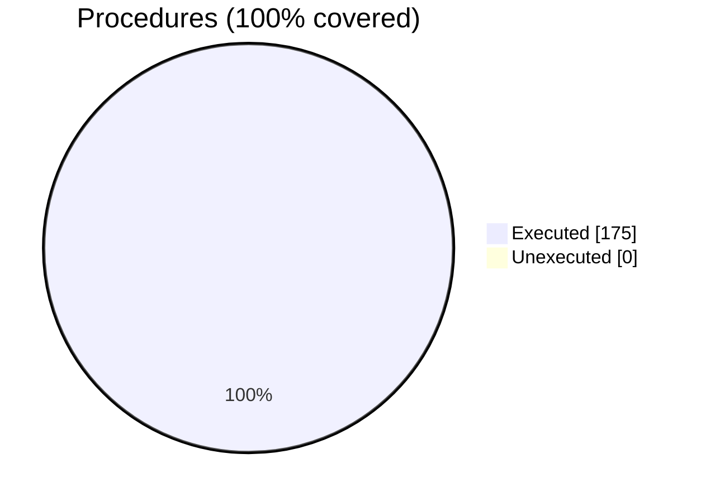

# Coverage Analysis

Coverage is measured with gcov via the FoBiS.py `coverage-analysis` rule:

```bash
FoBiS.py rule -ex coverage-analysis
```

## vecfor.F90

| Metric | Count | Coverage |
|--------|-------|----------|
| Executable lines | 721 | |
| Executed lines | 719 | 100% |
| Unexecuted lines | 2 | 0% |
| Average hits / executed line | 25 | |
| Procedures | 175 | |
| Executed procedures | 175 | 100% |
| Unexecuted procedures | 0 | 0% |
| Average hits / executed procedure | 23 | |




### Executed procedures (by hit count)

| Procedure | Kind | Hits |
|-----------|------|------|
| `normL2` | function | 777 |
| `assign_self` | subroutine | 728 |
| `str` | function | 573 |
| `print_vector_self` | subroutine | 191 |
| `self_sub_self` | function | 154 |
| `ScalI4P_mul_self` | function | 70 |
| `crossproduct` | function | 63 |
| `normalize` | function | 54 |
| `ScalR8P_mul_self` | function | 49 |
| `self_sum_self` | function | 49 |
| `dotproduct` | function | 42 |
| `negative_self` | function | 41 |
| `face_normal4` | function | 28 |
| `face_normal3` | function | 28 |
| `self_div_ScalR8P` | function | 21 |
| `assign_ScalI4P` | subroutine | 15 |
| `face_normal4_self` | subroutine | 14 |
| `face_normal3_self` | subroutine | 14 |
| `parallel` | function | 14 |
| `self_mul_self` | function | 14 |
| `self_div_self` | function | 14 |
| `load_vector_self` | subroutine | 12 |
| `save_vector_self` | subroutine | 12 |
| All remaining (scalar-kind variants) | function/subroutine | 7 each |

> Report generated by [FoBiS.py](https://github.com/szaghi/FoBiS)
