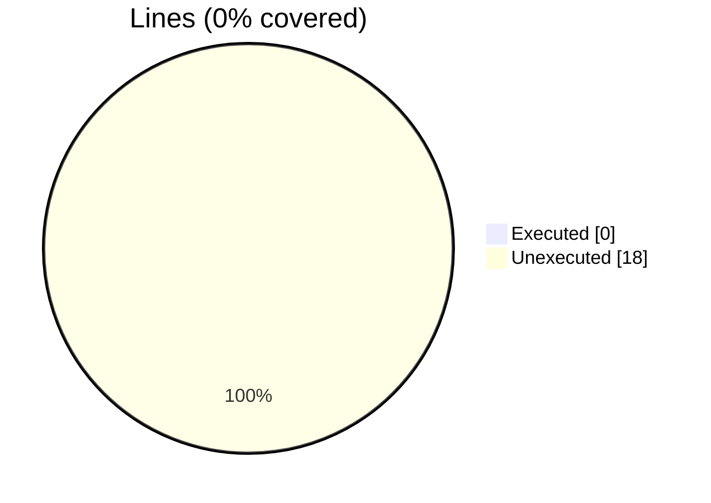
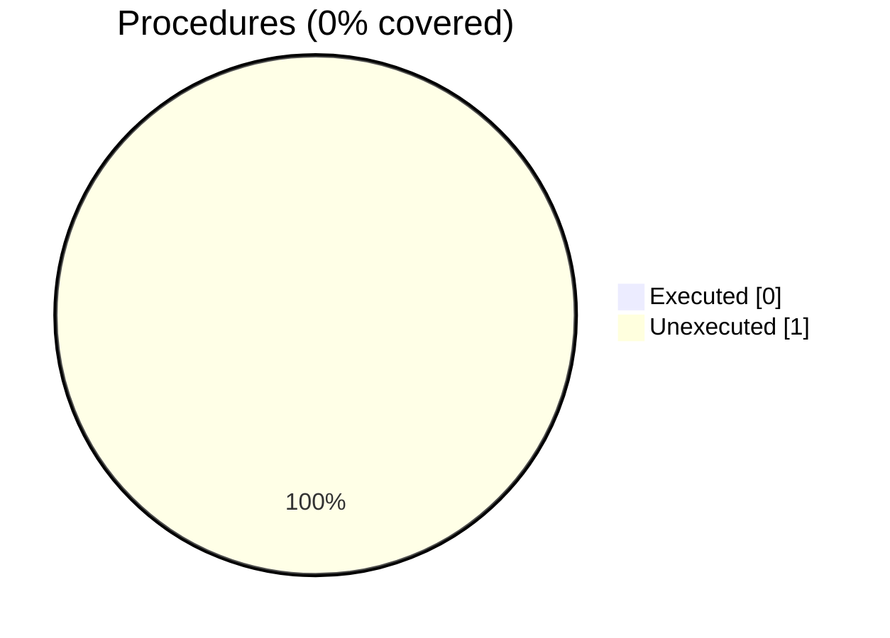
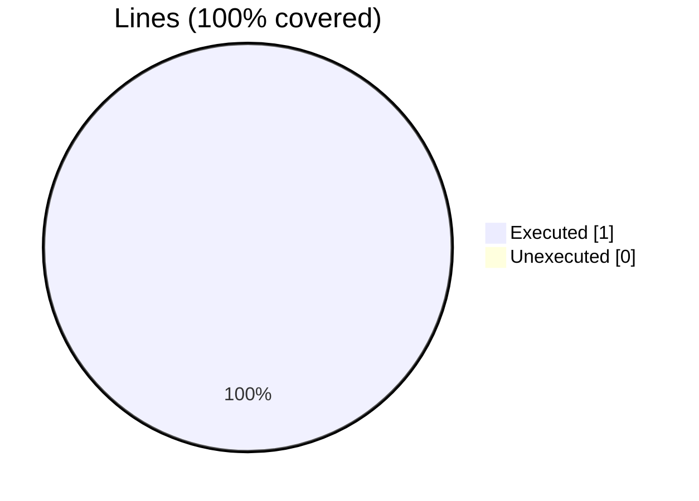

### coverage-analysis

#### [[vecfor_RPP.INC.gcov]]

|Lines| | |
| --- | --- | --- |
|Executable lines            |18| |
|Executed lines              |0|0%|
|Unexecuted lines            |18|100%|
|Average hits / executed     |0| |

|Procedures| | |
| --- | --- | --- |
|Total procedures            |1| |
|Executed procedures         |0|0%|
|Unexecuted procedures       |1|100%|
|Average hits / executed     |0| |

#### [[vecfor_R8P.F90.gcov]]

|Lines| | |
| --- | --- | --- |
|Executable lines            |1| |
|Executed lines              |1|100%|
|Unexecuted lines            |0|0%|
|Average hits / executed     |3.0| |

#### [[vecfor_R16P.F90.gcov]]

|Lines| | |
| --- | --- | --- |
|Executable lines            |1| |
|Executed lines              |1|100%|
|Unexecuted lines            |0|0%|
|Average hits / executed     |3.0| |

#### [[vecfor_RPP.F90.gcov]]

|Lines| | |
| --- | --- | --- |
|Executable lines            |1| |
|Executed lines              |1|100%|
|Unexecuted lines            |0|0%|
|Average hits / executed     |3.0| |

#### [[vecfor_R4P.F90.gcov]]

|Lines| | |
| --- | --- | --- |
|Executable lines            |1| |
|Executed lines              |1|100%|
|Unexecuted lines            |0|0%|
|Average hits / executed     |3.0| |

